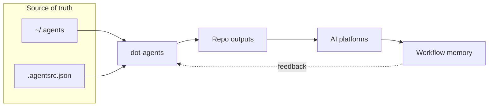
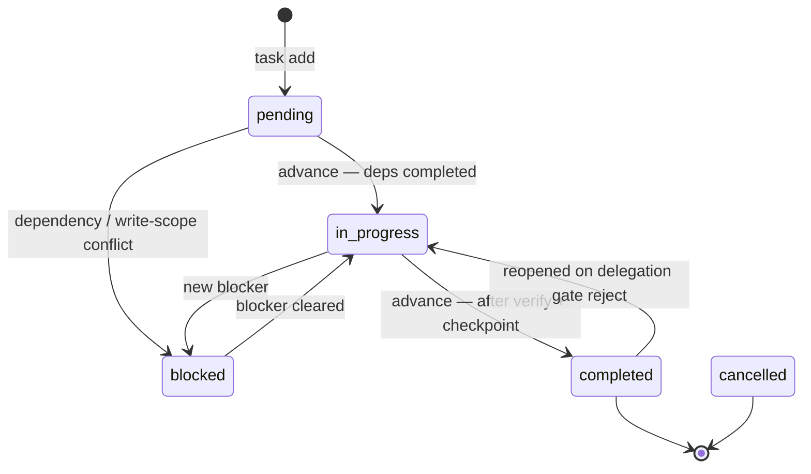
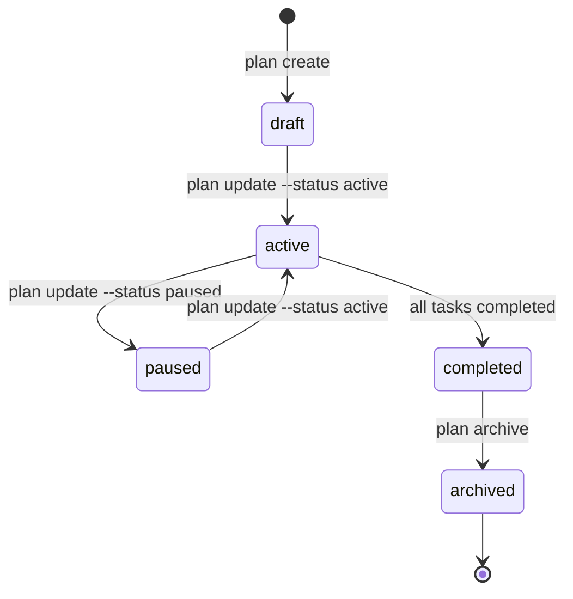
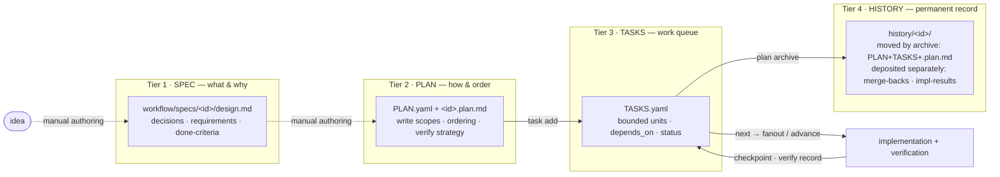
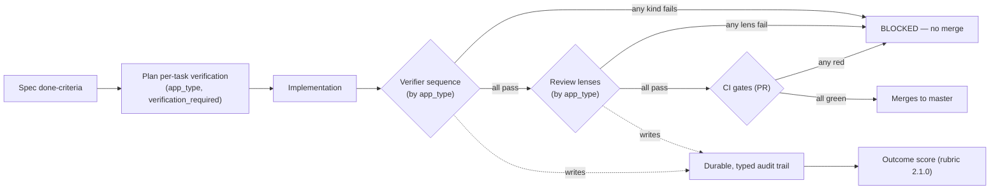

<!-- _class: lead -->

# dot-agents

## An agentic SDLC (ASDLC) with an auditable correctness spine

**Thesis ("aleph"): a unit of work is _correct-and-merges, or it does not merge_.**
No partial credit. Every gate is binary, every decision is recorded on disk, every artifact traces from a stated requirement to a verified, content-pinned result.

Built for architects in regulated contexts — PCI, PHI/HIPAA, CUI/FIPS/CMMC — where "the build went green" is not an audit answer.

<!-- Talk track: One CLI (`da`) projects one canonical config to six AI platforms AND runs a bounded, gated, durable workflow over the work agents produce. This deck shows the spine and walks one real feature through it. -->

---

# What "ASDLC" means here

- **Agents do the work; humans steer and review.** Every decision leaves a durable, inspectable artifact on disk — not transient chat context.
- **Three pillars, all shipping today** (`README.md`): config management (one source of truth at `~/.agents/`, layered + lock-pinned), workflow management (`da workflow` / `da review`), and a knowledge graph (`da kg`).
- **The differentiator is the verification spine** — binary, no-partial-credit merge gates with schema-validated decision records and a durable, retained audit trail.

> Sources for this deck are merged, accuracy-verified docs: `docs/PROJECT_DIAGRAMS.md` and `docs/concepts/{workflow-artifact-model,config-model,verification-and-scoring,platform-projection}.md`, plus the real `config-distribution-model` spec, `config-v2-migration` plan, and shipped code/tests.

---

<!-- _class: lead -->

# Part 1 — The shape, in four diagrams

(condensed from `docs/PROJECT_DIAGRAMS.md` and the merged concept docs — the sources carry more detail)

---

# The operator picture



<!-- -->
`~/.agents` is the shared source of truth; `.agentsrc.json` tells each repo what to install; `dot-agents` projects that into repo-native files; the platforms consume them; workflow memory closes the loop so the next session starts with context, not guesswork. *(`PROJECT_DIAGRAMS.md` §3)*

---

# The workflow engine lifecycle

```mermaid
flowchart LR
    idea([Idea])

    subgraph AUTHOR["1 - Authoring tier"]
        spec["Spec<br/>workflow/specs/&lt;id&gt;/design.md"]
        plan["Plan — workflow plan create / update<br/>PLAN.yaml + &lt;id&gt;.plan.md"]
        tasks["Tasks — workflow task add / update<br/>TASKS.yaml — depends_on, write_scope, app_type"]
    end

    subgraph SELECT["2 - Selection"]
        eligible["workflow eligible<br/>unblocked + write-scope conflict detection"]
        decide{"Direct or<br/>fanout?"}
    end

    subgraph EXEC["3 - Execution"]
        impl_d["Direct: implement in write_scope"]
        fanout["Fanout: bundle -> impl -> verifier(s) -> review"]
        gate["delegation gate<br/>accept / reject / escalate"]
    end

    subgraph CLOSE["4 - Iteration close"]
        verify["workflow verify record<br/>verification-log.jsonl"]
        checkpoint["workflow checkpoint<br/>iter-log/iter-N.yaml"]
        advance["workflow advance / closeout"]
    end

    archive["workflow plan archive<br/>history/&lt;id&gt;/"]
    done([Permanent record])

    idea --> spec --> plan --> tasks --> eligible --> decide
    decide -->|direct| impl_d --> verify
    decide -->|fanout| fanout --> gate
    gate -->|accept| verify
    gate -->|reject / escalate| fanout
    verify --> checkpoint --> advance
    advance -->|more tasks| eligible
    advance -->|all completed| archive --> done
```



<!-- -->
Four tiers, each box names the `da workflow` verb that produces or mutates it. Fanout = the delegation lifecycle (bundle → staged `impl → verifier → review` → gate). The shared tail is `verify → checkpoint → advance`. *(condensed from `PROJECT_DIAGRAMS.md` §5)*

---

<!-- _class: twodiagram -->

# Task + plan state machines





<!-- -->
Status is **never edited by hand** — every transition goes through the CLI, so each is attributable and journaled. *Eligibility* is a derived view (a `pending` task with all `depends_on` completed), not a status. *(`PROJECT_DIAGRAMS.md` §6)*

---

# The artifact tier model — spec → plan → tasks → history



<!-- -->
Each tier has a distinct owner and answers exactly one class of question. The cardinal rule: **do not collapse the tiers.** The plan's `success_criteria` traces to the spec's done-criteria — the load-bearing audit link. *(`concepts/workflow-artifact-model.md`)*

---

<!-- _class: lead -->

# Part 2 — The concepts an architect needs

Four merged concept references — the signal, then the link. The verification spine gets two slides; it's the differentiator.

---

# Concept 1 — The Workflow Artifact Model

**Four durable tiers between an idea and shipped code** — Spec → Plan → Tasks → History (the tier diagram in Part 1), each a committed file with a stable path and schema (`concepts/workflow-artifact-model.md`). Two properties make the chain auditable:

- **Bounded autonomy:** a delegation contract caps each sub-agent to a declared `write_scope`; the **parent gate** — not the worker — accepts the result.
- **Attributable state:** task status changes only through the CLI, and state-mutating commands append a typed event to a crash-survivable journal.
- → `./concepts/workflow-artifact-model`

---

# Concept 2 — The Layered Config Model

**Declared manifest + resolved, content-pinned lock** — the same shape as `uv` / `cargo` / `npm` (`concepts/config-model.md`):

- A project `.agentsrc.json` *declares* identity, named **sources** (`local · git · http · oci`), the layers it `extends`, and the `packages` it installs.
- `LayeredResolver.Resolve` fetches + **SHA-pins** each layer and writes `.agentsrc.lock` — `lock_version`, an `inputs_digest` over local scopes, and one `units` map, each entry pinned to a `sha256:` digest. The shipped lock holds **two unit kinds**: `layer` units (from `extends`, keyed by `source:path@version`) and `profile` units (keyed by a namespaced profile key). *(A third kind, `artifact`, is reserved in the model but not yet written — see Maturity.)*

> **The split that matters for audit: the manifest is _intent_, the lock is _fact_.** Staleness is **content-driven, never clock-driven** — a locked checkout re-resolves to the same bytes offline. `da config explain <field>` prints the winning layer + its locked digest.

→ `./concepts/config-model`

---

# Concept 3 — Verification & Scoring — **the aleph slide**



<!-- -->
Four planes compose into one pipeline; **correctness is the conjunction** — pass the agent gates but fail coverage, no merge. → `./concepts/verification-and-scoring`

---

# Concept 3 — the binary gates (no partial credit)

| Plane | Gate | Pass condition | Record |
|---|---|---|---|
| CI | Per-file coverage | every non-exempt file ≥ **95%** Go stmt coverage | CI job log |
| CI | Sonar new-issues | `new_violations == 0` in new-code | SonarCloud + CI |
| CI | fsguard | zero raw `os.*` fs-mutators outside allowlist | CI log |
| CI | Multi-OS tests | `go test` green on ubuntu **and** macos **and** windows | CI log |
| Agent | Verifier sequence | each verifier kind for the `app_type` returns `pass` | `…/verification/<task>/<kind>.result.yaml` |
| Agent | Review lenses | each lens `pass` (any BLOCKER/HIGH → `fail`) | `review-decision.yaml` |

- **Schema-enforced at write time:** `review-decision.yaml` is validated against `schemas/verification-decision.schema.json` (`schema_version const: 1`, `additionalProperties: false`) — a malformed record is *rejected*, not silently stored.
- **Honest limitation for auditors:** the Sonar gate is the only one with a **fail-open** path (a SonarCloud outage degrades it to a pass). Coverage / fsguard / multi-OS have **no** fail-open path.
- **Trail retained indefinitely by policy** — scoring re-derives from the original records.

---

# Concept 4 — Platform Projection

**Write once, refresh everywhere** (`concepts/platform-projection.md`). One canonical resource under `~/.agents/`; `da refresh` projects it into the layout **six** platforms expect (`platform.All()`): Claude Code, Cursor, Codex, OpenCode, GitHub Copilot, Antigravity.

> **The key design principle: _project where the format is uniform; render where it differs._**

- **Project (link):** skills, agents (except Codex), rules share a file format → managed symlinks/hard-links to one canonical file; edits propagate through the shared inode.
- **Render (write):** hooks and Codex agents have genuinely different per-platform formats → a small explicit per-platform renderer, with sha256 provenance in the render manifest.
- **Exact by default:** `da refresh` prunes managed outputs no longer wanted (surgical — only managed links into `~/.agents/`; user files never touched); `--inexact` opts out.
- → `./concepts/platform-projection`

---

<!-- _class: lead -->

# Part 3 — Worked example: config-v2

The layered config distribution model, end-to-end **through the verification audit trail**.

---

# config-v2 — spec → plan → code → gates

**The spec** (`.agents/workflow/specs/config-distribution-model/design.md`, "Config Distribution Model") — verifiable done-criteria, §15.5:

- *"A flat local-only project, after `da config sync`, has a `.agentsrc.lock` carrying `inputs_digest` + (empty-or-populated) `units` (R1)."*
- *"No clock-driven staleness anywhere; digests only (R2)."*
- *"`da config verify` reports local-scope drift … and per-unit cache integrity for git/http/local/oci uniformly (R3)."*

**Cross-machine** (`.agents/workflow/specs/home-config-portability/design.md`, DC1):

- *"A user scope is stood up on a second machine via `da init --from <home-source>` with **zero manual per-project absolute-path entry**."* DC3: machine-local state (binding table + cache) **never** appears in the synced tree.

---

# The plan — `config-v2-migration`

`.agents/workflow/plans/config-v2-migration/PLAN.yaml` — *"v1→v2 config-distribution-model migration"*. `success_criteria` (3): *".agentsrc.lock carries ONE units section keyed by `source:path@version` with a per-unit kind (layer|artifact) plus a top-level `inputs_digest`."*

> **Plan vs. shipped — read honestly:** the criterion reserves an `artifact` kind, but the lock that ships today pairs `layer` (from `extends`) + `profile` units; `artifact`/`packages[]` remain declared-not-written (see **Maturity**). The deck traces the *shipped* slice below, not the reserved one.

Representative tasks (`TASKS.yaml`) for the lock / cross-machine slice:

| Task id | Title |
|---|---|
| `p1-resolver-core-flat` / `p1b-resolver-extends-tier1` | resolver core + tier-1 `extends` (git+http+local layer fetch) |
| `p4f-units-lock-7a-wiring` | wire §7A units lock (`inputs_digest` + `units`) into resolve/sync; verify tracks local-scope drift |
| `p4h-agentslock-interprocess-lock` | agentslock interprocess lost-update protection (`.agentsrc.lock`) |
| `p4c-config-sync-lint` | `da config sync` + `da config lint` + `da config verify` |

---

# One slice, traced: criterion → task → code → test

**Slice: the SHA-pinned lock and its interprocess safety.**

| Layer | Evidence |
|---|---|
| **Spec criterion** | §15.5 R1/R2 — flat project gets a lock with `inputs_digest` + `units`; digests only, no clock |
| **Plan task** | `p4f-units-lock-7a-wiring`, `p4h-agentslock-interprocess-lock` |
| **Code** | `resolver.go` (`LayeredResolver.Resolve` → `writeUnitsLock`) · `lock_units.go` (`LockedUnit`, `WriteUnitsLock`, `UnitKindLayer/Profile`) · `agentslock/lockfile.go` (`AcquireFileLock`, `isDeletePendingLockErr`) |
| **Test** | `lockfile_test.go` — `TestConcurrentFlushPreservesSiblingSectionsAndInputsDigest`, `TestAcquireFileLockStaleReleaseDoesNotClobberNewHolder`, `TestFlushSucceedsAfterContendingReleaseMidWait` |
| **Gates cleared** | per-file coverage ≥95% · Sonar `new_violations==0` · fsguard · `go test` green on `[windows, macos, ubuntu]` |

---

# The audit trail — defense in depth (1/2)

Those gates cleared on the slice above — but "all gates green" is only as strong as what each gate can *see*. So here is the defense record across the whole config-v2 feature, each defect labeled by the layer that caught it.

**The beat is not "we catch everything" — it is _layered_ defense, each layer honest about its reach.** Binary CI gates block only what they can **detect**; the adversarial **cross-brain** review (a second model audits the diff) catches correctness bugs green tests miss. All rows are **real, merged** fixes:

| Defect (factual) | Caught by | Fix |
|---|---|---|
| Windows **delete-pending** lock race (a contender's `os.Mkdir` races the holder's `RemoveAll` → "Access is denied") | **CI gate (multi-OS)** — `TestEmitConcurrentNoTornLines` red on windows, green on mac/linux | `cb4cbd0a` (direct-to-master) |
| Windows transient **sharing-violation** on native remove | **CI gate (multi-OS)** — same test flaked red on windows only | `e4ac3872` (**PR #221**) |
| **False-green** e2e assertions that asserted nothing real | **Cross-brain review** — a green gate can't catch a test that passes by asserting nothing | `c9b16a98` (**PR #220**) |

<!-- Talk track: the multi-OS matrix DOES catch Windows races a mac/linux-green run hides — but only when a test exercises the path (delete-pending, sharing-violation went red on windows-latest). The adversarial cross-brain lens catches the false-greens that green tests structurally can't. Continues on the next slide. -->

---

# The audit trail (2/2) — and the one that **ESCAPED**

Two more the adversarial **cross-brain** lens caught that green gates structurally can't:

| Defect (factual) | Caught by | Fix |
|---|---|---|
| **Doc overclaims** about packages/lock/portability | Cross-brain review | `95279a0b` (**PR #228**) |
| **Non-atomic** home bootstrap + missing binding-drop + missing ambient-auth refusal | Cross-brain (codex) adversarial gate | `614904af` (**PR #198**) |

**The one that ESCAPED — the credibility moment.** Windows `agentslock` acquire failed for **every** Windows user (single-level `os.Mkdir`, parent absent on first run); `da config explain` / `install` broke at runtime. The multi-OS gate was **green and structurally incapable of catching it** — no test exercised the first-run precondition (RCA). The **process** caught it downstream, and the RCA then **hardened** the `verify.sh` P0 smoke to run a real first-run scenario, so the whole class is caught going forward.
→ RCA `.agents/history/rca-windows-agentslock-escape.md` · **PR #147** · shipped in 0.4.1

<!-- Talk track: the agentslock acquire race had NO test hitting its first-run precondition, so it passed a green multi-OS gate and ESCAPED — caught later by the process, after which the RCA hardened the smoke to catch the class. "Green tests" was necessary, never sufficient; defense in depth is what makes the chain auditable. -->

---

# Maturity — honest labeling (auditors respect accuracy)

Regulated auditors trust accurate scope more than a bigger claim. What is real **today**:

- **Shipped & CI-enforced:** per-file coverage gate, Sonar new-issues gate (fail-open on API error), fsguard, multi-OS matrix; verifier routing + 5 wired verifier kinds; 4 review lenses incl. cross-harness-adversarial; the per-kind `.result.yaml` and `review-decision.yaml` are schema-validated, while `verification-log.jsonl` is a typed, durable append log (not schema-validated at write time); outcome score (rubric 2.1.0, 7 signals).
- **Shipped, not wired here:** verifier kinds `api`/`batch`/`streaming`/`ui-e2e` ship as starter templates.
- **Design-stage only:** the `pr-ci` verifier; the universal §1.6 execution-telemetry envelope (ADR-0004 schema-seed). `packages[]` are *declared* but the shipped resolver does **not** write them into lock units today.
- **Known doc-vs-code drift, flagged in-doc:** older guidance says `extends` rejects `oci`; the shipped resolver accepts it.

> The deck does not assert beyond these merged sources.

---

<!-- _class: lead -->

# Part 4 — Getting started

---

# Onboarding — three setup paths

`da` (or the `onboard` skill) detects which path applies, then always verifies (`docs/GETTING_STARTED.md`):

```bash
# Install
brew tap AGOrcha/tap && brew install da

# A. Adopt a shared/team home config (a git URL)
da init --from <git-url>   # clone + adopt ~/.agents (zero project bindings)
da refresh                 # re-detect platforms + re-link
da add <project-path>      # rebind each project (identity travels, paths don't)

# B. Install an existing repo manifest (.agentsrc.json with sources/extends)
da install                 # resolve sources, materialize, link platforms
da config sync             # re-fetch declared layers + rewrite .agentsrc.lock

# C. Start fresh
da init                    # scaffold ~/.agents + link the active harness
da add <project-path>      # bind a project
```

**Verify (every path):** `da status --audit` · `da doctor`. `da init --from` refuses a non-empty home and refuses a credential-bearing URL (ambient git auth only).

---

<!-- _class: lead -->

# Close

## _Correct-and-merges, or it does not merge._

Binary gates · no partial credit · schema-validated decisions + a durable, retained audit trail · every artifact traced from requirement → bounded change → recorded evidence.

**Where to go on the docs site:**
- Concepts → Workflow Artifact Model · Config Model · **Verification & Scoring** · Platform Projection
- Reference → Outcome-Scoring Rubric · Verifier & Reviewer Templates · Release Verification
- Guides → Getting Started · Layered Configuration · Workflow Walkthrough

<!-- Talk track: the verification spine is the differentiator for regulated buyers — it turns "an AI changed the code" into a reconstructable, auditable chain. -->
