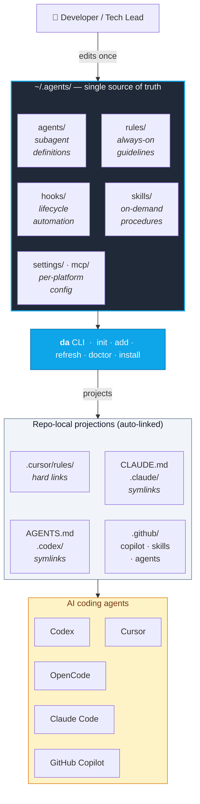
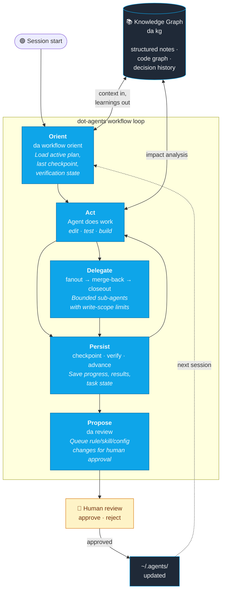

# dot-agents — Leadership Demo Diagrams

**Audience:** Leadership / tech leads evaluating an agent-platform investment.
**Companion docs:** [`DEMO_INDEX.md`](./DEMO_INDEX.md) ·
[`LOOP_ORCHESTRATION_SPEC.md`](./LOOP_ORCHESTRATION_SPEC.md) ·
[`RESOURCE_COMMAND_CONTRACT.md`](./RESOURCE_COMMAND_CONTRACT.md)

Two diagrams + talk tracks suitable for a 5–10 minute live walkthrough:

- **Diagram 1** — *what* dot-agents is: one canonical home that fans out to every
  AI coding agent the team uses.
- **Diagram 2** — *how* it automates development work: the orient → act → persist
  → delegate → propose loop that lets agents resume, verify, hand off, and
  propose their own improvements without losing context.

---

## 1. Architecture — one canonical home, every agent

### Talk track (≤60 seconds)

- Today, every AI coding agent has its own config format — Cursor uses
  `.cursor/rules/`, Claude Code uses `CLAUDE.md`, Codex uses `AGENTS.md`,
  Copilot uses `.github/`. Rules get duplicated per repo, drift across machines,
  and no one has a single source of truth.
- `dot-agents` consolidates all of it into **one canonical home** at
  `~/.agents/`. You write a rule, skill, or agent definition **once**.
- The **`da` CLI** projects it into every repo and every platform — hard links
  for Cursor (which can't follow symlinks) and symlinks for everything else.
  Edit the canonical file once and every project picks it up.
- Net effect: write a coding standard once, every agent in every repo enforces
  it. No more copy-paste, no more drift.

---

## 2. Workflow automation — the agent operating loop

### Talk track (≤90 seconds)

The loop turns AI coding agents into something closer to **operators** than chat
assistants:

1. **Orient** — Every session starts with `da workflow orient`. The agent loads
   the active plan, the last checkpoint, what's already been verified, and
   relevant context from the knowledge graph. **No more 30–40 minutes per
   session re-explaining yesterday's work.**
2. **Act** — The agent works against a canonical plan with explicit tasks. The
   knowledge graph's code graph tells it the **blast radius** of any change, so
   it knows what it's about to break before it breaks it.
3. **Persist** — Checkpoints, verification results, and task progress get
   written to repo-local state. The agent **stops rediscovering what's broken
   vs. what it just caused**.
4. **Delegate** — Large work fans out to sub-agents with bounded write scopes,
   then merges back with structured summaries. A `pr-ci` verifier profile owns
   the PR-readiness loop (CI + SonarQube auto-fix) so the impl agent exits
   cleanly at merge-back. Parent runs `workflow delegation closeout` to archive
   the artifact and auto-advance the task — no extra `workflow advance` needed.
5. **Propose** — When the agent notices a pattern worth codifying (a new rule,
   missing skill, config drift), it queues a proposal via `da review`. **Humans
   steer**; agents handle the mechanical work.

Approved proposals flow back into `~/.agents/`, so **the system gets smarter
every session**. The knowledge graph accumulates decisions, entities, and code
structure — making the next orient even faster.

### Business value at a glance

| Pain today | What dot-agents changes |
|---|---|
| 30–40 min/session re-explaining context | `orient` resumes in seconds from canonical state |
| Rules duplicated across N repos × M agents | Write once in `~/.agents/`, link everywhere |
| Agents rediscover what's broken every session | Verification state persists across sessions |
| No safe way to run parallel agents | Bounded `fanout` with explicit write-scopes |
| Tribal knowledge stays tribal | Knowledge graph captures decisions + code structure |
| Agents can't improve their own setup | `propose → review → approve` closes the loop |

---

## Demo script (5 minutes)

1. **`da status`** — show one repo already managed; point out linked files.
2. **`da workflow orient`** — show the structured context an agent gets at
   session start.
3. Edit a rule in `~/.agents/rules/global/` — show it instantly reflected in
   `.cursor/rules/` and `CLAUDE.md` via the link.
4. **`da workflow checkpoint`** + **`da workflow verify record`** — demonstrate
   persisted state.
5. **`da kg query --intent decision_lookup "why postgres"`** — show structured
   memory recall.
6. **`da workflow fanout` → `merge-back` → `delegation closeout`** — bounded
   sub-agent lifecycle in one minute (optional if time allows).
7. **`da review`** — show a pending proposal an agent queued, approve it, watch
   it land in `~/.agents/`.

Close with the roadmap slide: **agent-as-operator** — agents run `da`
themselves, surfacing only the decisions humans need to make. The current
design pass (see
[`codex-019e6245-examination-and-sequenced-plan`](../.agents/proposals/codex-019e6245-examination-and-sequenced-plan.md))
sequences the remaining work: typed staged dispatch, per-stage native agents,
two-tier config distribution, scope-routed `da review`.
