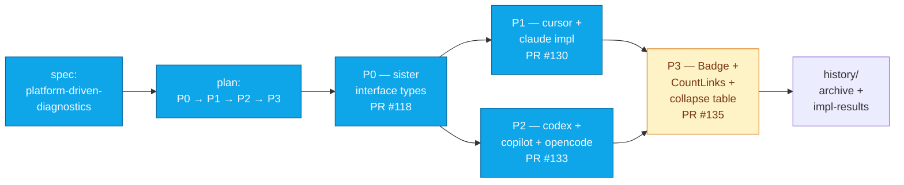
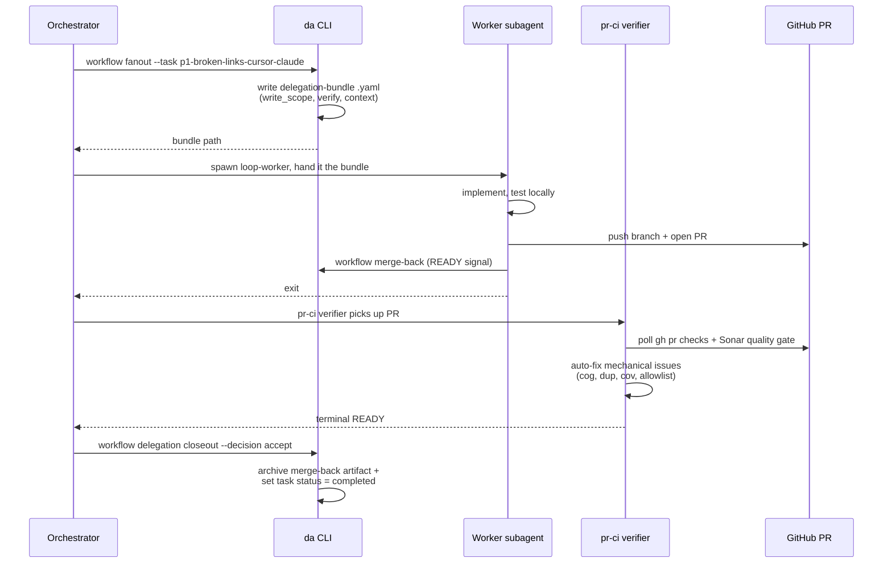

# dot-agents — Workflow Walkthrough: One Real Wave

> **Audience:** engineers and tech leads who want to see what a real wave looks
> like end-to-end — plan, fanout, workers, merge-back, closeout.
> **Source material:** the `platform-driven-diagnostics` plan (PRs #118, #130,
> #133, #135), which migrated per-platform diagnostics off a central
> lifecycle table into platform-owned sister interfaces.

This is not a contrived example. Every PR number, branch, and step below
actually happened on `master` in late May 2026.

---

## The wave at a glance



Phases ran sequentially because each later phase depended on the sister
interface types landing in P0; cursor/claude (P1) and codex+copilot+opencode
(P2) could have run in parallel but were sequenced for review-load reasons.

---

## Phase by phase

### P0 — sister interface types (PR #118)

**What changed.** Introduced `BrokenLinkReporter`, `StatusBadger`,
`LinkCounter` interfaces in `internal/platform/` — no behavioral change, just
the contract every later phase would implement.

**Operator commands.** (Compressed; in practice each step is one CLI invocation.)

```bash
# Plan exists from spec; tasks already created.
da workflow tasks --plan platform-driven-diagnostics
da workflow next --plan platform-driven-diagnostics
# → suggests p0-diag-types
```

**Why it shipped first.** Per the
[`bundle-scope-via-code-graph`](../.agents/lessons/bundle-scope-via-code-graph/LESSON.md)
lesson, the orchestrator pre-flighted the write_scope using the code-review
graph before fanout, so the interface surface was scoped to exactly the files
that would actually need to change.

### P1 — cursor + claude implement BrokenLinkReporter (PR #130)

**What changed.** Two platforms (`cursor`, `claude`) move their broken-link
classification off the central `commands/internal/lifecycle/doctor.go` table
and onto the new sister interface. `doctor.collectBrokenLinks` type-asserts
each platform from `platform.All()`; un-migrated platforms fall through to
the legacy table.

**Delegation lifecycle.**



**Key moves.** The impl subagent ships the code + tests + PR and **exits at
merge-back**. It does not babysit CI. That belongs to the `pr-ci` verifier
profile (lesson:
[`verifier-owns-ci-watch-shift-left`](../.agents/lessons/verifier-owns-ci-watch-shift-left/LESSON.md)).
This is the shift-left from the older `worker-owns-pr-readiness-loop` pattern.

**Fold-back.** The bundle originally asked the worker to also relocate
`HasMultipleHardLinks` from `commands/internal/lifecycle/linkcount_*.go` to
`internal/platform/claude_linkcount_*.go`. The worker noticed this would
expand the write scope beyond what P1 was contracted for, and emitted a
**fold-back artifact** instead of doing it inline. That fold-back became its
own task in P3 (see PR #135 commit `51654fa6 refactor(lifecycle): absorb
HasMultipleHardLinks relocation deferred from P1`). The discipline is: don't
exceed your bundle's scope — fold it back into the plan and let the
orchestrator schedule it.

### P2 — codex + copilot + opencode (PR #133)

**What changed.** The remaining three platforms implement `BrokenLinkReporter`.
The fall-through table in `doctor.go` is **deleted entirely** — `collectBrokenLinks`
is now a single `platform.All()` loop.

**Why this is interesting.** Look at the deletion. The lifecycle layer used to
have per-platform classification logic (`projectSingleFiles`,
`collectSingleFileBrokenLinks`). After P2, the lifecycle layer has zero
knowledge of which paths each platform owns. The platforms own that. This is
**Parnas-style information hiding** delivered through a sister-interface
migration — exactly the pattern the spec was designed to enable.

**Verification.** 17 new per-platform tests pin the migrated semantics
(empty-project sentinel, broken-symlink positive, plain-file negative,
healthy-symlink negative, interface conformance). The existing
`TestCollectBrokenLinks_*` assertions in `doctor_test.go` pass **byte-identical**
— behavior preserved verbatim.

### P3 — Badge + CountLinks + table collapse (PR #135, currently open)

**What changed.** All five platforms implement `StatusBadger.Badge` and
`LinkCounter.CountLinks`. The 5 `*TextBadge` helpers and the
`collectProjectPlatforms` ladder in `status.go` collapse to a single iterator
over `platform.All()`. `da status`, `da status --json`, and `da doctor --json`
produce **byte-identical output** before/after.

**Why this is the headline phase.** Three behaviors (broken-link reporting,
status badge, link count) that used to live in central lifecycle tables now
all live in their respective platform packages, accessed via interfaces. The
lifecycle layer became a thin orchestrator. Adding a 6th platform tomorrow
means implementing three interfaces — no edits to `lifecycle/`.

---

## What this wave demonstrates about dot-agents

| Capability | Where it showed up |
|---|---|
| **Canonical plan → tasks → slices** | All four phases came from one spec; each task had explicit `depends_on` + `write_scope`. |
| **Bounded fanout** | Each PR shows a single worker working a single bundle; cross-PR write scopes never overlapped. |
| **Pre-flight scope via code graph** | P0's interface surface was scoped using `mcp__code-review-graph__file_summary` before fanout. |
| **Verifier shift-left** | `pr-ci` profile owned the CI/Sonar fix loop; impl subagents exited at merge-back. |
| **Fold-back discipline** | P1 worker deferred `HasMultipleHardLinks` rather than silently expanding scope; P3 picked it up. |
| **Closeout auto-advance** | `workflow delegation closeout --decision accept` completes the task in one shot — no manual `workflow advance` needed. |
| **Archive + impl-results** | When the plan completes, `workflow plan archive` bundles PLAN.yaml, TASKS.yaml, merge-back artifacts, and the spec into `.agents/history/platform-driven-diagnostics/`. |

---

## Try the same shape yourself

```bash
# Inspect available plans + state
da workflow plan
da workflow tasks --plan <plan-id>
da workflow eligible --json

# Pick the next eligible task
da workflow next

# Materialize a delegation contract for direct (orchestrator-owned) work
da workflow contract create --task <task-id>

# Or fan out to a sub-agent with a bounded write scope
da workflow fanout --task <task-id>

# Sub-agent finishes, writes merge-back; parent closes out:
da workflow delegation closeout --task <task-id> --decision accept
```

For the full operating model, see
[`LOOP_ORCHESTRATION_SPEC.md`](./LOOP_ORCHESTRATION_SPEC.md) §"Command layer"
and §"Skill layer".

---

## Anti-patterns this wave dodged

- **Worker writes outside its bundle** — would have happened on P1 if the
  worker had silently absorbed `HasMultipleHardLinks`. See
  [`validate-bundle-against-head`](../.agents/lessons/validate-bundle-against-head/LESSON.md).
- **Two workers in one worktree** — each PR ran on its own branch + worktree
  per [`worktree-no-cd`](../.agents/lessons/worktree-no-cd/LESSON.md) and
  [`concurrent-workers-one-worktree`](../.agents/lessons/concurrent-workers-one-worktree/LESSON.md).
- **Impl agent re-learning the Sonar API every PR** — the `pr-ci` verifier
  profile encodes that knowledge once and reuses it across the wave.
- **Stale TASKS.yaml status driving fanout** — orchestrator verified status
  against `gh pr list --state merged` before each fanout per
  [`verify-task-status-vs-pr-history`](../.agents/lessons/verify-task-status-vs-pr-history/LESSON.md).
