# Project Diagrams

These diagrams are derived from the current repo docs and code structure, primarily:

- `README.md`
- `docs/WORKFLOW_AUTOMATION_PRODUCT_SPEC.md`
- `docs/LOOP_ORCHESTRATION_SPEC.md`
- `docs/PLUGIN_CONTRACT.md`
- `docs/CANONICAL_HOOKS_DESIGN.md`
- `commands/root.go`
- `internal/platform/`

Use the first diagram when you want to explain the product in a demo. Use the second when you want to explain how the current codebase is organized.

## 1. Demo Diagram: How dot-agents works

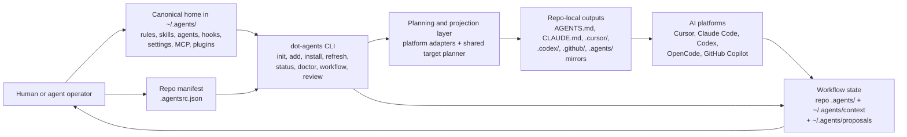

### Talk track

- `dot-agents` keeps one canonical source of truth in `~/.agents/` instead of hand-managing each platform separately.
- A repo-level `.agentsrc.json` declares what a project needs.
- The CLI reads canonical resources plus the manifest, plans the right outputs per platform, and projects them into the repo with links or rendered files.
- The AI tools consume those repo-local files natively.
- The workflow layer feeds context back through repo-local `.agents/` artifacts and user-local checkpoints and proposals.

## 2. Current Architecture Diagram

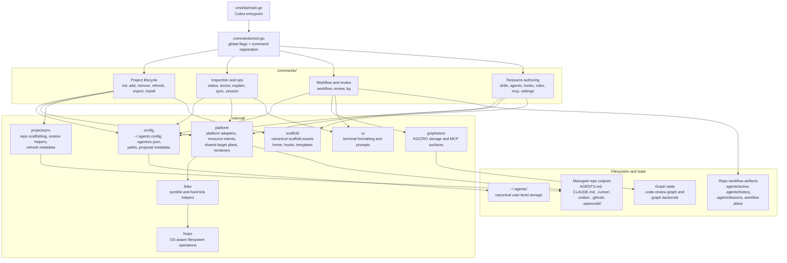

### Reading notes

- The CLI entrypoint is thin: `cmd/da/main.go` hands off to Cobra commands in `commands/`.
- `commands/` is the orchestration layer; most reusable behavior lives in `internal/`.
- `internal/platform` is the key projection layer. It knows platform adapters, shared-target intents, and how repo-local outputs get created.
- `internal/config` owns the user-level and repo-level configuration contracts.
- Workflow and knowledge-graph features are layered beside the core config-management path, not bolted into a separate binary.
- The command layer is decomposed into per-feature subpackages (`commands/workflow`, `commands/agents`, `commands/skills`, `commands/sync`, `commands/kg`, `commands/hooks`), with shared helpers in `commands/internal/cmdutil`.
- Test-infrastructure packages (`internal/globalflagcov`, `internal/linktest`, `internal/testutil`) and the auxiliary `cmd/globalflag-coverage` binary are omitted here for clarity.

## Practical use

- For a live demo, show diagram 1 first and narrate the operator story from left to right.
- For maintainers or contributors, switch to diagram 2 and explain the split between `commands/`, `internal/`, and filesystem state.
- If you need slide art later, these Mermaid blocks can be rendered directly in GitHub or copied into Mermaid Live and exported as SVG.

## 3. Slide-Friendly Demo Diagram

This version uses tighter labels and a cleaner presentation flow for demos.

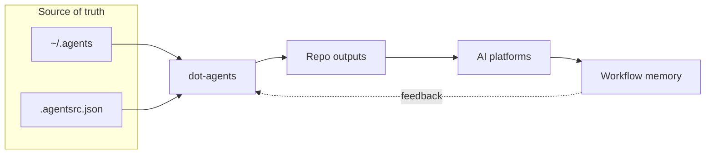

### Presenter note

- `~/.agents` is the shared source of truth.
- `.agentsrc.json` tells each repo what to install.
- `dot-agents` projects that into repo-native files.
- The platforms use those files directly.
- Workflow memory closes the loop so the next session starts with context instead of guesswork.

## 4. Slide-Friendly Current Architecture Diagram

This version is intended for architecture slides where the audience only needs the major layers.

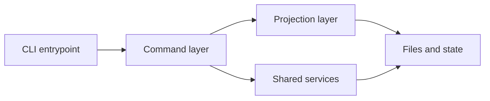

### Presenter note

- The binary entrypoint is thin.
- The command layer handles user-facing workflows.
- The projection layer turns canonical resources into platform-specific repo outputs.
- Shared services handle config, links, hooks, graph access, and project sync.
- Everything ultimately resolves into filesystem state that the tools and agents consume.

## 5. Workflow Engine Diagram

Derived from `commands/workflow/` (`cmd.go`, `types.go`, `plan_task.go`, `state.go`,
`delegation.go`, `bundle.go`, `iter_log.go`) and the workflow-artifact-model rule.
This shows the artifact lifecycle and the `da workflow` command surface that drives it.

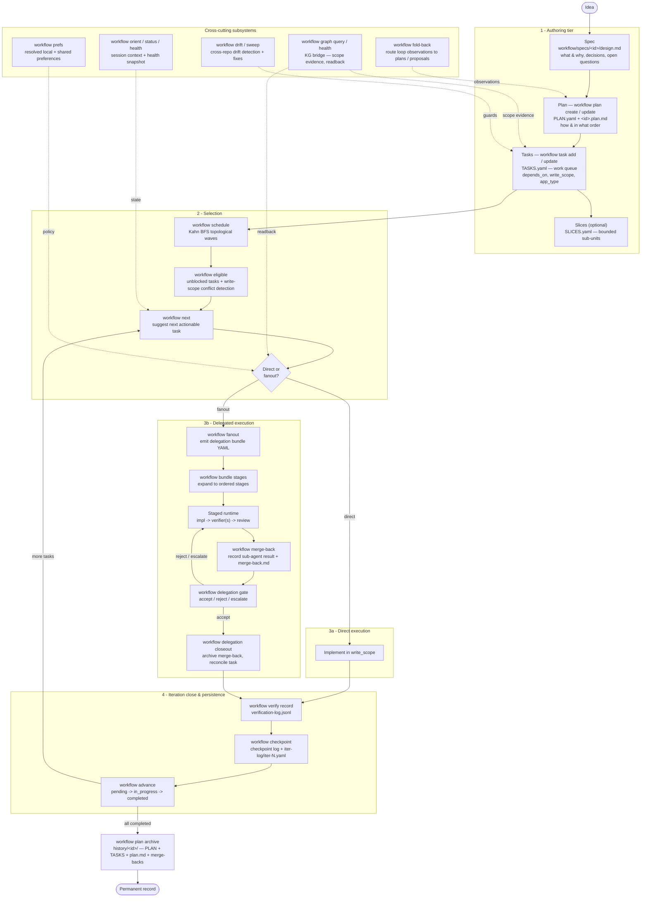

### Reading notes

- **Four artifact tiers** (spec -> plan -> tasks -> history) — each box names the CLI
  verb that produces or mutates that artifact.
- **Fanout path** is the delegation lifecycle: `fanout` emits a bundle YAML, `bundle
  stages` expands it into the `impl -> verifier(s) -> review` staged runtime, then
  `merge-back` -> `delegation gate` -> `closeout`. A rejected gate loops back.
- **Iteration close** (`verify -> checkpoint -> advance`) is the shared tail — direct
  work runs `advance`, delegated work runs `merge-back` first.
- **Cross-cutting subsystems** feed the core loop rather than sitting on the critical path.

## 6. Workflow State Diagram

Derived from `isValidTaskStatus` / `isValidPlanStatus` and `runWorkflowAdvance` in
`commands/workflow/plan_task.go`. Status transitions are driven by `da workflow advance`
(tasks) and `da workflow plan update --status` / `plan archive` (plans).

### Task status machine

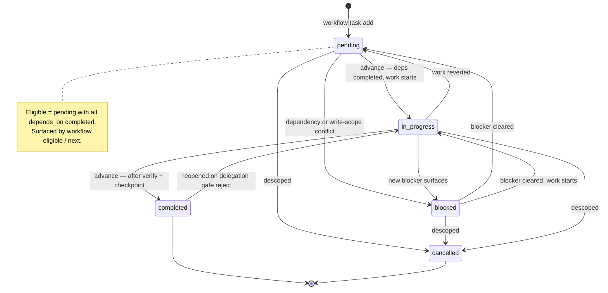

### Plan status machine

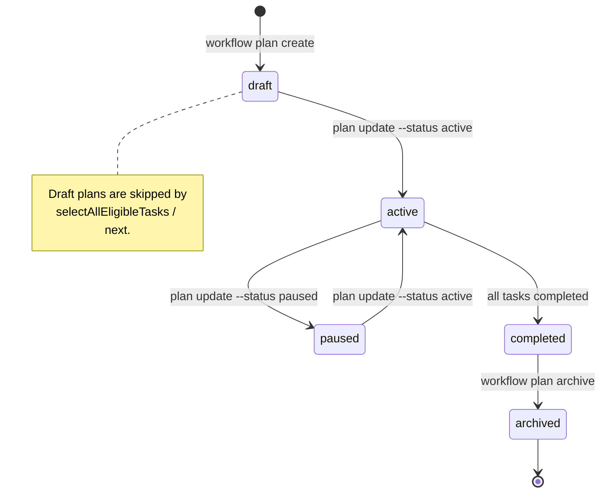

### Reading notes

- **Task verbs:** every task transition goes through `da workflow advance`; valid values
  are `pending`, `in_progress`, `blocked`, `completed`, `cancelled`.
- **Eligibility** is not a status — it is a derived view: a `pending` task whose
  `depends_on` are all `completed`.
- **Reopen edge:** `completed -> in_progress` happens when a delegation gate rejects a
  merge-back, sending the task back through the staged runtime.
- **Plan verbs:** plans move via `plan update --status` (`draft`, `active`, `paused`,
  `completed`, `archived`); `plan archive` performs the final `completed -> archived`
  step and bundles the history record.

## 7. Layered Config Distribution Model

This is the core architecture story: how a project declares what it needs, where that
content comes from, and how it gets pinned and projected. A project's `.agentsrc.json`
names a set of `sources[]` (by kind: `local`, `git`, `http`, `oci`), then pulls config
**layers** through `extends[]` and executable **packages** through `packages[]`.
Resolution merges those layers into an effective config, writes a SHA-pinned
`.agentsrc.lock`, and projects the result into each platform's repo-local files. Derived
from `internal/config/agentsrc.go` (`Source`, `LayerRef`, `PackageRef`),
`internal/config/resolver.go`, `internal/agentslock/lockfile.go`,
`internal/config/lock_units.go`, and `docs/LAYERED_CONFIG_GUIDE.md`.

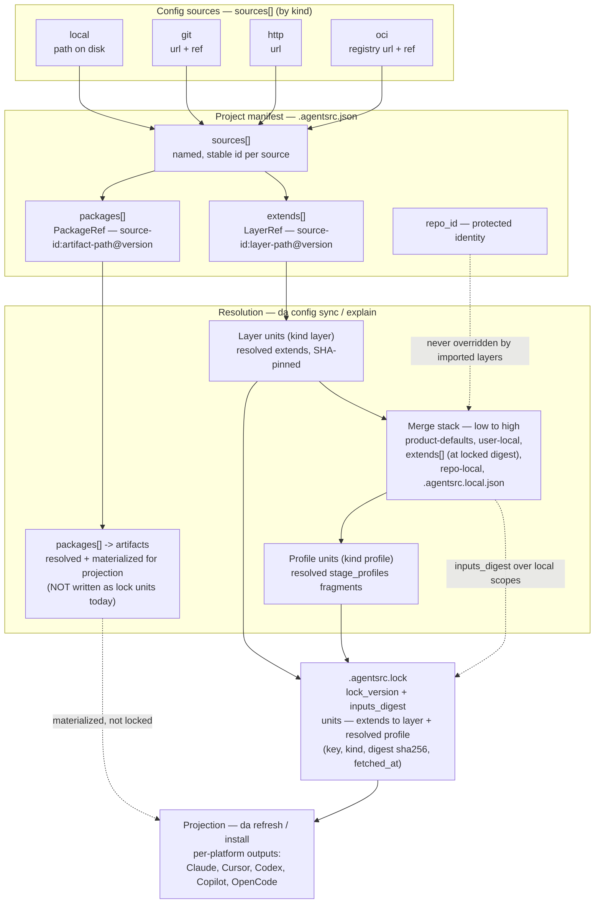

### Reading notes

- **What the lock records.** Every `sources[]` entry has a stable `id`. `extends[]`
  entries (`LayerRef`, form `source-id:layer-path@version`) resolve to `kind: layer` units;
  the resolver also records the merged `stage_profiles` fragments as `kind: profile` units.
  `packages[]` entries (`PackageRef`, `source-id:artifact-path@version`) resolve to artifacts
  that are materialized for projection — the `artifact` unit kind is reserved
  (legacy-section upgrade / forward-compat) but the current `LayeredResolver.Resolve` writes
  **no** artifact units into the lock. The source kind says *where to fetch*; the ref says
  *layer vs artifact*.
- **Merge stack, lowest precedence first:** product-defaults -> user-local
  (`~/.agents/.agentsrc.json`) -> imported `extends[]` (reconstructed from the lock at
  their locked digest) -> repo-local `.agentsrc.json` -> `.agentsrc.local.json`
  (uncommitted machine overlay). Higher layers win; `repo_id` is protected and no imported
  layer can change it. Merge is per-field by category (scalar last-wins; set-union for
  `skills`/`agents`/`rules`; map-merge for `features`/`kg`/`stage_profiles`;
  ordered-replace for `sources`/`extends`/`packages`).
- **The lock is content-addressed.** A single `LayeredResolver.Resolve` writes the
  authoritative §7A lock via `writeUnitsLock` (`internal/config/resolver.go`): `lock_version`,
  `inputs_digest` (hash of the local config scopes), and a `units` map keyed by
  `source:path@resolved-version` — one `kind: layer` unit per resolved `extends` entry plus
  the `kind: profile` units derived from the same snapshot. Each `LockedUnit` carries its
  `kind`, `digest` (`sha256:…` pin), and `fetched_at`. A flat/local-only project still gets a
  lock with a non-empty `inputs_digest` and an empty `units` map. Staleness is digest-driven,
  never clock-driven; `da refresh` / `da install` re-resolve only when the digest is stale.
- **OCI note (code vs doc drift):** `docs/LAYERED_CONFIG_GUIDE.md` still states `extends`
  rejects `oci` (git/http/local only). The current resolver (`resolver.go`, spec change
  "D13") allows **any** source kind — including `oci` — to supply a layer; an OCI layer is
  guarded by the config-layer media type inside its fetcher rather than rejected at the
  `extends` boundary. The diagram reflects the **code**; this drift is flagged for the doc
  owner.

## 8. Home Store, Portable User Scope, and Per-Machine Bindings

`dot-agents` separates **what travels** from **what is machine-local**. The `~/.agents`
home store holds the portable user scope (sources, layering policy/profiles, and a project
*identity* registry that records each managed project's id + portable key but **not** its
path). The id→absolute-path mapping is a per-machine binding table that is never synced or
projected. `da init --from <home-source>` bootstraps the user scope onto a fresh machine and
**drops every local binding** (each project is then known-but-unbound); `da add <path>` binds
each known project id to its machine-local path. `da refresh` only re-detects/links platforms
and skips any still-unbound project. Derived from
`internal/config/homeconfig_init.go`, `internal/config/lock_units.go`
(`UnitKindProjectSet`), and the `home-config-portability` spec.

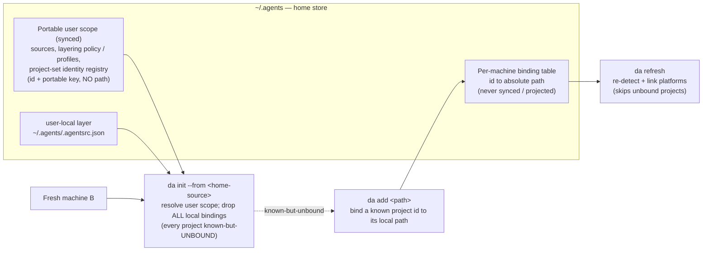

### Reading notes

- **Identity travels, paths do not.** `UnitKindProjectSet` is a first-class synced unit
  carrying portable project identity; the binding table (`id → absolute path`) is
  explicitly *not* a unit and never reaches sync/projection.
- **Cross-machine bootstrap.** Plain `da init` scaffolds a fresh local home from embedded
  starters; `da init --from` adds the clone/adopt path that resolves an existing user scope
  from a remote home source. Adoption **drops every local binding** (`rebindProjectSet` →
  `cfg.DropLocalBindings()` in `commands/internal/lifecycle/init_from.go`), so each project is
  known-but-**unbound** — no synced absolute path is ever trusted. `da add <path>` is what
  rebinds an id to its machine-local path; `da refresh` only re-detects/links platforms and
  **skips** any still-unbound project (`commands/refresh.go` → "run `da add <path>` to bind it").

## 9. Session-Handoff Recovery Flow

The journal layer makes a session crash-survivable. State-mutating `da workflow` / `kg` /
`review` commands append typed events to an off-tree, per-repo log. A `PreCompact` hook
captures a deterministic snapshot before the context window is compacted; a
`SessionStart(source=compact)` hook then replays snapshot+events and **re-verifies each item
against live reality** (gh, then git), tagging every fact on a trust gradient. The
`agent-handoff` skill consumes the verified view so the fresh session resumes on facts, not
prose. Derived from `internal/journal/` (`append.go`, `envelope.go`, `schema.go`,
`identity.go`, `snapshot.go`), `commands/workflow/journal.go`, the
`session-handoff-snapshot` / `session-handoff-recover` hooks, and the `session-handoff-journal`
spec.

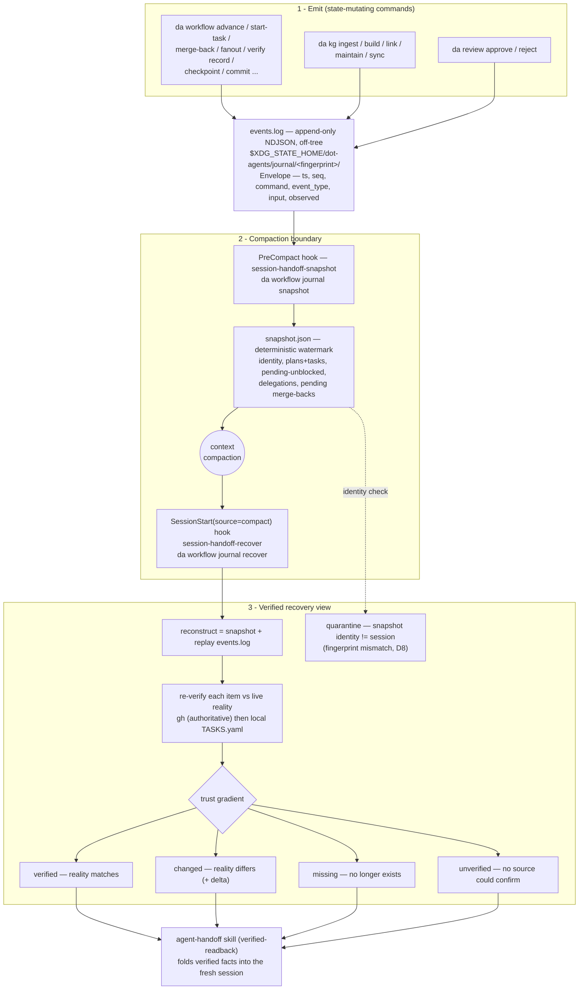

### Reading notes

- **Off-tree, per-repo, no bodies.** `events.log` lives under the XDG state dir keyed by a
  repo *fingerprint* (the trusted canonical repo id, else a path hash) — never in the git
  tree. Each `Envelope` records ids/statuses/dep edges and a 16 KiB-capped input/observed
  payload, never notes or summaries. Event types are `durable_delta`, `input_only`, and
  `failed`.
- **Snapshot is the watermark; events are the delta.** The `PreCompact` snapshot is built
  deterministically (sorted slices, byte-identical for identical state). `recover`
  reconstructs by replaying the log over the snapshot, then re-verifies.
- **Trust gradient (exact tags):** `verified` (reality matches), `changed` (differs, with an
  explicit `delta:`), `missing` (gone), `unverified` (no source could confirm — a
  hypothesis, never injected as fact). A parallel `trust=high|medium|low` records whether an
  authoritative (`gh`) or fallback (`local`) source answered, and a bundle-level
  `fresh|stale|orphaned` freshness label drives the D10 orphan quarantine.
- **Quarantine on identity mismatch.** If the snapshot's fingerprint differs from the
  resuming session's, the whole bundle is quarantined (D8) — identity mismatch takes
  precedence over freshness. This prevents resuming another repo's state into this one.

## 10. Full System Component Map

A maintainer-oriented map from the binary entrypoint down to filesystem state. The command
layer (`commands/`) is thin orchestration; reusable behavior lives in `internal/` services;
everything resolves into the home store, the project manifest/lock, platform repo dirs, and
off-tree state. Verified against the actual `internal/` tree.

```mermaid
flowchart TB
    main["cmd/da/main.go — Cobra entrypoint"]
    root["commands/root.go — global flags + registration"]

    subgraph CMD["commands/ (by area)"]
        lifecycle["lifecycle — init, add, remove, refresh, import, install"]
        inspect["inspect/ops — status, doctor, explain, sync, session, score"]
        wfcmd["workflow/ — plan, task, fanout, merge-back, verify, journal"]
        kgcmd["kg/ — ingest, query, serve, warm, build, impact"]
        authoring["authoring — skills, agents, hooks, rules, mcp, settings"]
        reviewcmd["review — proposal approve / reject"]
    end

    subgraph INT["internal/ services"]
        config["config — .agentsrc.json, layers, lock, paths"]
        platform["platform — adapters, intents, renderers"]
        links["links — symlink / hardlink helpers"]
        fsops["fsops — OS-aware fs ops, atomic writes"]
        projectsync["projectsync — scaffold/restore/refresh metadata"]
        scaffold["scaffold — embedded home/hooks/starter assets"]
        agentslock["agentslock — .agentsrc.lock + interprocess lock"]
        journal["journal — events.log + snapshot + recovery"]
        graphstore["graphstore — SQLite warm graph + MCP bridge"]
        kgsvc["kg — note model, dsl, registry"]
        ui["ui — terminal formatting + prompts"]
    end

    subgraph FS["Filesystem & state"]
        home["~/.agents — canonical home store"]
        rc[".agentsrc.json / .agentsrc.lock"]
        platdirs["platform repo dirs — .claude/ .cursor/<br/>.codex/ .opencode/ .github/ AGENTS.md"]
        state["XDG state — journal, render-manifest, KG warm db"]
        wfart[".agents/ — active, history, lessons, workflow plans"]
    end

    main --> root
    root --> lifecycle
    root --> inspect
    root --> wfcmd
    root --> kgcmd
    root --> authoring
    root --> reviewcmd

    lifecycle --> config
    lifecycle --> platform
    lifecycle --> projectsync
    lifecycle --> scaffold
    config --> agentslock
    platform --> links
    links --> fsops
    wfcmd --> journal
    wfcmd --> wfart
    kgcmd --> graphstore
    kgcmd --> kgsvc
    reviewcmd --> journal
    config --> rc
    config --> home
    platform --> platdirs
    journal --> state
    graphstore --> state
    inspect --> ui
```

### Reading notes

- **Featured services only.** The `internal/` tree also ships `adapters`, `credstore`,
  `docsaccess`, `eval`, `events`, `gitremote`, `gitwt`, `review`, `scoring`, `service`, and
  test-infra packages (`globalflagcov`, `linktest`, `testutil`) — omitted here for clarity.
- **State is split three ways:** the canonical home store (`~/.agents`), the per-project
  manifest + lock (`.agentsrc.json` / `.agentsrc.lock`) and platform repo dirs, and off-tree
  XDG state (the journal log/snapshot, the render manifest, and the KG warm SQLite db).

## 11. Platform-Projection Pipeline

How canonical resources become repo-native files. There are **two projection paths**. Each
platform's `CreateLinks` writes that platform's repo-native files directly — every platform
**symlinks** except Cursor, which **hard-links** `.cursor/rules/` (its rule system does not
follow symlinks) via `links.HardlinkReplacing`. Separately, every platform emits
`SharedTargetIntents` for the shared `.agents/skills` / `.agents/agents` buckets; the command
layer aggregates those into a single `ResourcePlan` that dedups shared targets and catches
conflicts, then executes each intent's transport. The `ResourcePlan` executor
(`executeResourceIntent`) supports **symlink** (dir/file) and **write/render** only —
`hardlink` is a defined `ResourceTransport` enum value but the executor has no branch for it,
so Cursor's hard links stay on the `CreateLinks` path, never the `ResourcePlan` transport.
Rendered files get sha256 provenance via the render manifest. Derived from
`internal/platform/platform.go` (`All()`), the per-platform adapters
(`cursor.go`/`claude.go`/`codex.go`/`opencode.go`/`copilot.go`), `resource_intent.go`,
`resource_plan.go` (`executeResourceIntent`), `render_manifest.go`, and `internal/links/links.go`.

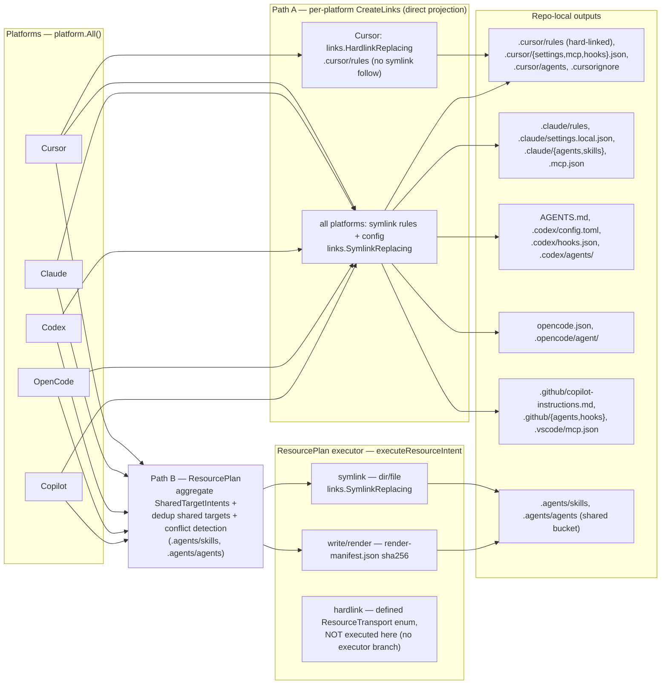

### Reading notes

- **Why Cursor hard-links (and where):** Cursor's rule system does not follow symlinks for
  `.cursor/rules/`, so `cursor.CreateLinks` hard-links them via `links.HardlinkReplacing`
  (shared inode, edits sync automatically). This is the **CreateLinks** path, NOT a
  `ResourcePlan` transport — `executeResourceIntent` (`resource_plan.go`) only executes
  `symlink` (dir/file) and `write`/render; the `hardlink` `ResourceTransport` enum value is
  defined and validated but has no executor branch. All other platforms symlink; on Windows
  the symlink path degrades to a junction (dirs) or hard link (files).
- **Shared buckets are deduped.** `.agents/skills` and `.agents/agents` are emitted as
  `SharedTargetIntents` by several platforms; the `ResourcePlan` collapses compatible shared
  targets into one planned resource before any write, so the same skill isn't projected five
  times. Shared-target dedup is the `ResourcePlan`'s job today; per-platform rule/config files
  are projected by each platform's `CreateLinks`.
- **Render provenance protects user edits.** For `write`/render shapes, a per-destination
  sha256 in `render-manifest.json` (under XDG state) means a managed rendered file is
  overwritten only if it still matches the last render; otherwise the user's edit is backed
  up first.

## 12. KG / Graphstore Architecture

Two distinct graph layers. `code-review-graph` is a separate Python, Tree-sitter tool that
parses the codebase into `.code-review-graph/graph.db` — the structural source of truth.
`internal/graphstore` is a Go SQLite **warm store** (a port of the CRG storage layer extended
with KG note tables) that holds both the imported code graph and the knowledge notes from
`internal/kg`. `CRGBridge` shells out to the Python CLI; `da kg serve` exposes the surface
over MCP (stdio JSON-RPC) for agents. Derived from `internal/graphstore/` (`store.go`,
`migrations.go`, `crg.go`, `mcp_server.go`), `internal/kg/`, and `commands/kg/`.

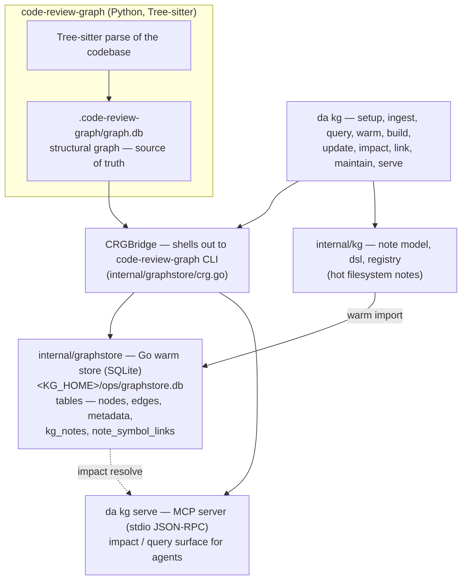

### Reading notes

- **Producer vs warm store.** `code-review-graph` (Python/Tree-sitter) *produces* the
  structural graph at `.code-review-graph/graph.db`. `internal/graphstore` is the Go warm
  store at `<KG_HOME>/ops/graphstore.db`; `da kg warm` imports code nodes/edges from CRG and
  also holds the KG knowledge notes (`kg_notes`, `note_symbol_links`).
- **One bridge, two consumers.** `CRGBridge` is the single seam to the Python CLI; both the
  warm-import path and the `da kg serve` MCP server go through it. The warm SQLite store
  resolves impact files for MCP queries and degrades to raw symbol lookup when unavailable.
- **Backend reality:** SQLite (`modernc.org/sqlite`, pure Go) is the operative warm backend
  today; a `PostgresStore` satisfies the same `Store` contract but the pooled-daemon path is
  not yet active.
