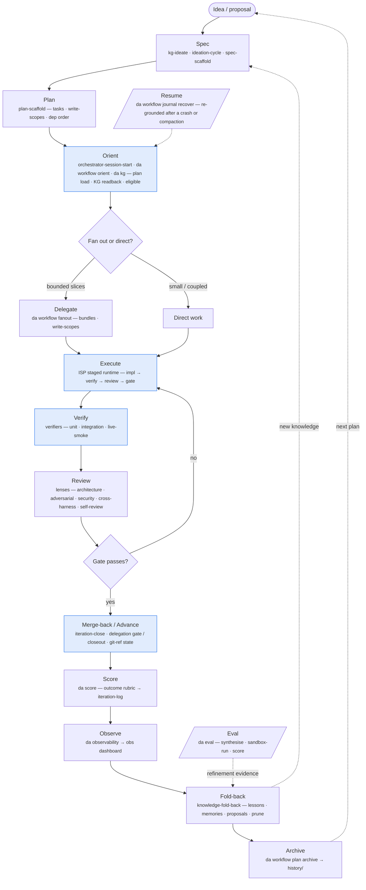

This is the whole loop dot-agents runs, at a glance: an idea becomes a spec, a
plan, bounded work, verified changes, scored outcomes, observed telemetry, and
folded-back knowledge that feeds the next idea. Every stage names the `da`
primitive (or skill) that drives it, so you can see *when* to reach for each one.

Two loops actually run over this one substrate — a **work loop** that ships
features and fixes, and a **refinement loop** that improves *how the work loop
works* (skills, prompts, profiles). The orchestrator schedules both; see
[Two loops: the meta-loop](#two-loops-the-meta-loop) below.

Start narrow — most sessions live in **Orient → Execute → Verify → Merge-back**.
A session that was interrupted re-enters through **Resume**
(`da workflow journal recover`) instead of re-grounding from scratch. The outer
ring (Ideate, Score, Observe, Fold-back, Archive) is what keeps the loop
compounding instead of just churning.

The four **highlighted** nodes are the inner loop you run every session. Everything
else is the compounding ring around it.

## Two loops: the meta-loop

dot-agents runs as a **meta-loop**: two loops over one substrate — the same
orchestrator, task-state machine, verifier/reviewer chain, and knowledge graph.

| | Work loop ("the what") | Refinement loop ("the how we work") |
|---|---|---|
| Object | features, fixes, docs — shipped artifacts | skills, prompts, `stage_profiles`, lessons, rules, hooks |
| Trigger | a plan/spec task becomes eligible | an observation: a recurring defect, a friction tax, a verifier gap |
| Shape | implement → verify → review → merge | dogfood → observe → refine |
| Done | the PR ships, the task completes | the operating mechanism is changed and re-dogfooded |

The refinement loop treats the work loop as its subject under test: you don't
improve the way you work by reasoning about it — you run it, watch where it
breaks, and fix the mechanism. The two are **separated, not isolated** — a
refinement change is a tracked task with its own profile, never smuggled into a
feature diff.

### Orchestrator vs worker

The loop has two roles, and keeping them distinct is what makes fan-out safe:

- The **orchestrator** (`orchestrator-session-start`, then `isp`) owns the
  cross-plan board. It orients, reconciles eligible work across *all* plans
  (`da workflow eligible`), decides fan-out vs. direct, and mutates task state
  only through `da workflow` — it never edits product code itself.
- A **worker** (`loop-worker` under `delegation-lifecycle`) is bounded to a
  single task's write-scope. It implements, verifies, and returns — it does not
  widen scope or refine the mechanism mid-task; friction it hits is *folded
  back* as an observation for the orchestrator to schedule.

### Bounded fan-out → merge-back → gate

When several eligible tasks have non-overlapping write-scopes, the orchestrator
fans them out in parallel:

1. **`da workflow fanout`** writes a delegation *bundle* (chosen plan/task,
   worker profile, context files, verification plan) and a *contract* declaring
   the bounded write-scope. A worker that writes outside its scope is out of
   contract.
2. The worker returns a **merge-back** artifact — *child output for parent
   review*, not child-owned closeout.
3. The parent **gate** decides: **`da workflow delegation gate`** evaluates the
   review evidence into accept / reject / escalate, and **`da workflow
   delegation closeout`** archives the merge-back and reconciles the canonical
   task — completing it on accept, blocking it with a note on reject. The parent
   gate/closeout is the single point that advances a delegated (or contracted)
   task; there is no second `advance`.

Bundle mechanics and the eligibility/conflict math sit in the
[Workflow artifact model](/concepts/workflow-artifact-model); the operator
command sequences are in
[Workflow Client Commands](/reference/workflow-client-commands).

### The iteration-close loop

Every worker (and every direct-mode iteration) closes the same way, driven by
the `iteration-close` skill: **verify → self-review → checkpoint → close**. Run
the task's verifiers, apply the `self-review` lens to your own diff *before*
offering it, write the checkpoint + iteration-log entry, then close. Closing
scores the iteration — `da workflow close-task` expands to `checkpoint
--log-to-iter → da score iteration → advance → next-focus → commit`, so the
operator sees *"iteration N → score 0.7 → next focus"* while the context is
still hot. Delegated workers stop at **merge-back** instead of `advance`; direct
work advances the canonical task directly.

## Where each capability fits

Beyond the core loop, several shipped capabilities plug into specific stages:

- **Session-journal recovery — `da workflow journal`** (Resume → Orient).
  State-mutating workflow commands append a typed event to a crash-survivable,
  off-tree journal. `da workflow journal recover` rebuilds a **verified** resume
  view — reconstruct from the snapshot + event replay, then re-verify each item
  against current reality — so a session resumed after a crash or context
  compaction re-enters the loop from durable state rather than re-grounding from
  scratch. See
  [Workflow Client Commands](/reference/workflow-client-commands).
- **Knowledge-graph orient — `da kg`** (Orient / Ideate). The KG holds
  structured notes plus a Tree-sitter code graph. Orientation reads it back
  (`decision_lookup`, `impact`, `changes`) so a session carries prior decisions
  and blast-radius context, not grep output; ideation grounds new specs against
  it. See the [command reference](/reference/commands).
- **Outcome scoring — `da score`** (Score). The telemetry each iteration already
  captured feeds an explainable, versioned outcome score (seven weighted
  signals; correctness dominates). It answers *"how good was the run?"* —
  distinct from the merge gates' *"is the artifact correct?"* See
  [Verification & scoring](/concepts/verification-and-scoring) and the
  [Scoring guide](/guides/score).
- **Observability dashboard — `da observability`** (Observe). Iteration/score
  telemetry publishes crash-safely (queued in an outbox) to the dashboard
  backend, turning per-run scores into a longitudinal view of where the loop
  regresses. See the
  [Observability dashboard guide](/guides/observability-dashboard).
- **Eval harness — `da eval`** (refinement evidence → Fold-back / Ideate).
  `da eval` synthesises a reproducible TaskSpec from the knowledge graph, runs
  it in an isolated sandbox, and scores the outcome against the **same** rubric
  `da score` uses. It is how the refinement loop gets evidence that a change to
  *how we work* actually helped, rather than anecdote. See the
  [command reference](/reference/commands).

## Stages → primitives

| Stage | What happens | Driven by |
|---|---|---|
| Ideate | Idea/proposal → spec, grounded in KG + research | `kg-ideate`, `ideation-cycle`, `spec-scaffold`, [`da kg`](/reference/commands) |
| Plan | Spec → tasks with write-scopes + dependency order | `plan-scaffold`, `da workflow plan create` |
| Resume | Re-enter an interrupted session from durable state | [`da workflow journal recover`](/reference/workflow-client-commands) |
| Orient | Load plan, KG readback, list eligible/unblocked work | `orchestrator-session-start`, `da workflow orient` / `eligible`, [`da kg`](/reference/commands) |
| Decide | Fan out bounded slices vs. do it directly | `delegation-lifecycle`, `isp` |
| Execute | Staged impl → verify → review → gate, in write-scopes | `isp`, `da workflow fanout` / `checkpoint` |
| Verify | Run the verifier sequence for the task's `app_type` | verifiers (unit · integration · live-smoke) |
| Review | Independent lenses, incl. cross-harness; self-review before offering | review lenses, `self-review` |
| Merge-back | Closeout, advance status, land the PR | `da workflow merge-back` / `advance`, `delegation gate` / `closeout`, `iteration-close` |
| Score | Rubric-score the iteration | [`da score`](/guides/score) → `iteration-log` |
| Observe | Publish telemetry to the live dashboard | [`da observability`](/guides/observability-dashboard) |
| Fold-back | Route findings to lessons/memories/proposals; prune stale | `knowledge-fold-back`, `da workflow fold-back`, [`da eval`](/reference/commands) |
| Archive | Retire the completed plan | `da workflow plan archive` → `history/` |

## Drill deeper

The diagrams and graphs that expand each part of the loop:

- **[Tier model](/diagrams/tier-model)** — how resources (skills, agents, config) are scoped across tiers.
- **[Review lens dispatch](/diagrams/lens-dispatch)** — how the *Review* stage picks its lenses by `app_type`.
- **[Verifier registry](/diagrams/verifier-registry)** — the verifier profiles the *Verify* stage runs.
- **[Resource graph: da](/graphs/da-resources)** · **[workflow](/graphs/workflow-resources)** · **[workspace state](/graphs/workspace-state)** — the live structural graphs.

Concept references:

- [Workflow artifact model](/concepts/workflow-artifact-model) — plans, tasks, checkpoints, merge-backs, fold-back.
- [Config model](/concepts/config-model) — `.agentsrc.json`, `extends`, the lockfile, `app_type` profiles.
- [Verification & scoring](/concepts/verification-and-scoring) — verifiers, lenses, the rubric, and the outcome score.
- [Platform projection](/concepts/platform-projection) — how one canonical config emits per-editor config.
- [Project diagrams](/concepts/project-diagrams) — the engine-lifecycle view (Authoring → Selection → Execution → Close → Archive).

Guides & reference:

- [Workflow client commands](/reference/workflow-client-commands) — `start-task` / `close-task`, the session journal, and the primitive pipelines they compose.
- [Scoring guide](/guides/score) — the task-oriented `da score` walkthrough.
- [Observability dashboard](/guides/observability-dashboard) — publishing and reading iteration/score telemetry.
- [Command reference](/reference/commands) — the full `da` surface, including `da kg` and `da eval`.

New here? Start at **[Install & onboard](/guides/install)**, then come back to this map.
