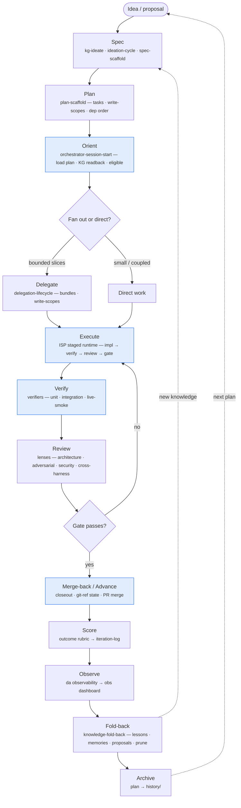

This is the whole loop dot-agents runs, at a glance: an idea becomes a spec, a
plan, bounded work, verified changes, scored outcomes, observed telemetry, and
folded-back knowledge that feeds the next idea. Every stage names the `da`
primitive (or skill) that drives it, so you can see *when* to reach for each one.

Start narrow — most sessions live in **Orient → Execute → Verify → Merge-back**.
The outer ring (Ideate, Score, Observe, Fold-back, Archive) is what keeps the loop
compounding instead of just churning.

The four **highlighted** nodes are the inner loop you run every session. Everything
else is the compounding ring around it.

## Stages → primitives

| Stage | What happens | Driven by |
|---|---|---|
| Ideate | Idea/proposal → spec, grounded in KG + research | `kg-ideate`, `ideation-cycle`, `spec-scaffold` |
| Plan | Spec → tasks with write-scopes + dependency order | `plan-scaffold`, `da workflow plan create` |
| Orient | Load plan, KG readback, list eligible/unblocked work | `orchestrator-session-start`, `da workflow orient` / `eligible` |
| Decide | Fan out bounded slices vs. do it directly | `delegation-lifecycle` |
| Execute | Staged impl → verify → review → gate, in write-scopes | `isp`, `da workflow fanout` / `checkpoint` |
| Verify | Run the verifier sequence for the task's `app_type` | verifiers (unit · integration · live-smoke) |
| Review | Independent lenses, incl. cross-harness | review lenses |
| Merge-back | Closeout, advance status, land the PR | `da workflow merge-back` / `advance`, `da review` |
| Score | Rubric-score the iteration | outcome rubric → `iteration-log` |
| Observe | Publish telemetry to the live dashboard | `da observability sync`, obs dashboard |
| Fold-back | Route findings to lessons/memories/proposals; prune stale | `knowledge-fold-back` |
| Archive | Retire the completed plan | `da workflow plan archive` → `history/` |

## Drill deeper

The diagrams and graphs that expand each part of the loop:

- **[Tier model](/diagrams/tier-model)** — how resources (skills, agents, config) are scoped across tiers.
- **[Review lens dispatch](/diagrams/lens-dispatch)** — how the *Review* stage picks its lenses by `app_type`.
- **[Verifier registry](/diagrams/verifier-registry)** — the verifier profiles the *Verify* stage runs.
- **[Resource graph: da](/graphs/da-resources)** · **[workflow](/graphs/workflow-resources)** · **[workspace state](/graphs/workspace-state)** — the live structural graphs.

Concept references:

- [Workflow artifact model](/concepts/workflow-artifact-model) — plans, tasks, checkpoints, merge-backs.
- [Config model](/concepts/config-model) — `.agentsrc.json`, `extends`, the lockfile, `app_type` profiles.
- [Verification & scoring](/concepts/verification-and-scoring) — verifiers, lenses, and the rubric.
- [Platform projection](/concepts/platform-projection) — how one canonical config emits per-editor config.

New here? Start at **[Install & onboard](/guides/install)**, then come back to this map.
