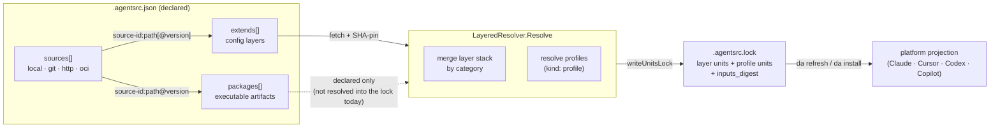

# The Config Model

This is the **mental-model page** for how `dot-agents` distributes configuration: where the
canonical resources live, how a repo declares the layers it pulls in, and how every machine
re-derives the *same* effective config from a committed, content-pinned lock. It is the concept
that the [Layered Configuration](./LAYERED_CONFIG_GUIDE.md) guide operationalizes — read this for
the *why and the shape*, read the guide for the field-by-field *how-to*.

If you operate under PCI / PHI / HIPAA / CUI / FIPS / CMMC controls, the load-bearing properties
are: **the resolved config is content-addressed and pinned** (every imported layer is a
`sha256:` digest in a committed lock), **resolution is deterministic and offline-reproducible**
(staleness is content-driven, never clock-driven), and **provenance is auditable** (every effective
field traces to the exact layer that set it). The model is built around those guarantees, not
bolted onto them.

---

## Overview

`dot-agents` resolves a project's effective configuration from a **stack of layers**, not a single
file — the same declared-manifest + resolved-lockfile shape as `uv`, `cargo`, and `npm`. Three
ideas compose into the whole picture:

1. A **home store** (`~/.agents`) holds the canonical, reusable resources — layers, packages,
   skills, hooks, the user-scope manifest — that this machine can serve to any project.
2. A per-project **manifest** (`.agentsrc.json`) *declares* identity, named **sources**, the
   layers it `extends`, and the executable `packages` it installs.
3. A **resolved lock** (`.agentsrc.lock`) records what that declaration *resolved to* — every layer
   and profile pinned by content digest — so a fresh checkout on a fresh machine projects an
   identical effective config without re-deciding anything.

You edit the manifest; `dot-agents` writes the lock. Both are committed.

---

## The two-tier picture

| Tier | Artifact | Role | Committed? |
|---|---|---|---|
| **Home store** | `~/.agents/` | The machine's canonical resource store: the user-scope manifest (`~/.agents/.agentsrc.json`), the content-addressed layer/package cache (`~/.agents/cache/`), and the machine-local binding table (`~/.agents/local/`). | n/a (managed) |
| **Project manifest** | `./.agentsrc.json` | What the repo **declares** — `repo_id`, `sources`, `extends`, `packages`, `features`, `execution_profile`. | Yes |
| **Resolved lock** | `./.agentsrc.lock` | What the declaration **resolved to** — layer units + profile units pinned by `sha256:` digest, plus an `inputs_digest` over local scopes. | Yes |
| **Local overlay** | `./.agentsrc.local.json` | Optional machine-local override, highest precedence. | No (gitignored) |

The split that matters for audit: **the manifest is intent, the lock is fact.** The manifest says
"extend the org baseline at `main`"; the lock says "the org baseline resolved to
`sha256:1a4b…`, fetched at `2026-06-22T18:04:11Z`." A reviewer audits the lock, not the network.

---

## How a declaration resolves



`sources` name *where* content comes from; `extends` and `packages` reference content *inside* those
sources. The shipped resolver (`LayeredResolver.Resolve`) fetches and SHA-pins the `extends` layers,
merges them, and writes the lock; `packages` are *declared* in the manifest but are **not** resolved
into the lock by the resolver today (the packages-to-lock path is not wired — see *Extends vs
packages*). `da refresh` / `da install` project the locked config into each platform's native files.
Nothing downstream re-decides — it all flows from the pinned lock.

---

## Sources

A **source** names *where* layers and packages are fetched from. The `type` selects the transport
(`internal/config/agentsrc.go`, `Source` struct):

| `type` | Transport | Cache key default |
|---|---|---|
| `local` | A path on disk | commit + working-tree content (uncommitted edits are a distinct key) |
| `git` | A git repo (`url` + `ref`) | the resolved commit (immutable) |
| `http` | An HTTPS endpoint (TLS enforced) | upstream ETag / Last-Modified, falling back to a content digest |
| `oci` | An OCI registry (content-addressed) | the manifest digest |

Each source carries a stable `id` (required for any source referenced by `extends`/`packages`), an
optional `cache_ttl` (a *review nudge*, never a hard expiry), an opaque pass-through `auth` block,
and an optional `cache_keys` override that changes what content pins the unit. `--refresh` forces a
single unit to re-validate upstream regardless of its cached digest.

---

## Extends vs packages

Both `extends` and `packages` reference content inside a declared source, but they denote two
different **kinds of resource** (and, in the lock model, two different unit kinds):

- **`extends` → `layer` units** (`kind: layer`). A layer is a JSON field-bundle that **merges** into
  the effective config underneath the repo's own settings. A layer may itself declare further
  `extends` (transitive). Ref form: `source-id:layer-path[@version]`. An entry may be the object
  form `{ "ref": "...", "optional": true }` to make a failed fetch non-fatal.
- **`packages` → executable artifacts** (model unit kind `artifact`). A package is an executable
  bundle (agents/skills) meant to be **installed discretely** into the asset store and invoked — it
  does **not** merge into config. Ref form: `source-id:layer-path@version`. **Current shipped state:**
  `packages` are *declared* in the manifest, but the shipped resolver does **not** resolve them into
  lock units. The `artifact` kind exists in the lock model (`internal/config/lock_units.go`) — it is
  produced only by the legacy-v1-lock migration path (a pre-existing `packages` lock section) — but
  no resolver path writes manifest `packages` → `artifact` units today.

### Every source type is valid for both — including `oci` for extends

There is **no source/kind asymmetry**. `SelectFetcher` (`internal/config/fetcher.go`) returns a
fetcher for `git`, `http`, `local`, **and `oci`** for config layers, just as it does for packages.
An OCI config layer is pulled over the same content-addressed plumbing as an OCI artifact, guarded
by a config-layer media type (`ociLayerFetcher`), so the `layer` vs `artifact` distinction stays
meaningful while the transport is shared.

> **Doc-vs-code note.** Older guidance (and some of the prose still in
> [Layered Configuration](./LAYERED_CONFIG_GUIDE.md)) states that `extends` *rejects* `oci`. That
> reflects an earlier design; the shipped resolver (§15 D13) **accepts `oci` for `extends`**. Follow
> the code: an `oci` source is a valid layer source today.

### Merge: per-field, by category

Layers do not blunt-replace each other; each field merges by its category:

| Category | Behavior | Applies to |
|---|---|---|
| **scalar** | Highest layer with a value wins | most scalar fields |
| **set-union** | Arrays merged as a deduped set | `skills`, `agents`, `rules` |
| **map-merge** | Object maps merged by key, recursing | `features`, `kg`, `stage_profiles`, `execution_profile` |
| **ordered-replace** | Array taken wholesale from the winning layer | `sources`, `extends`, `packages`, verifier sequences |

The precedence stack, lowest to highest:

```
[1] product-defaults                      (built-in)
[2] user-local      (~/.agents/.agentsrc.json)
[.] imported extends (reconstructed from the lock at each locked digest)
[n] repo-local      (./.agentsrc.json)
[+] .agentsrc.local.json                  (uncommitted overlay, if present)
```

`repo_id` is a **protected** field: an imported layer can never set or change a repo's identity.

---

## The lock — the determinism and audit surface

`.agentsrc.lock` is the resolved-state contract. It exists for **every** resolved project, including
flat local-only ones with no remote `extends`. Three pieces carry the guarantees a regulated reader
cares about (`internal/agentslock/lockfile.go`, `internal/config` resolver `writeUnitsLock`):

- **`lock_version`** — the lockfile schema version (currently `1`).
- **`inputs_digest`** — a hash over all local config scopes. This is how local-scope drift is
  detected without a network call.
- **`units`** — one unified map keyed by `source:path@version`. Each value pins the resolved
  **content `digest`** (`sha256:…`), `fetched_at`, `last_checked_at`, `cache_key`, and the unit
  `kind`. The shipped resolver (`writeUnitsLock`) writes `layer` units (from `extends`) here; the
  `kind: profile` units (below) fold into the same map. The model reserves an `artifact` kind for
  packages, but the resolver does not populate it (see *Extends vs packages*) — so in practice this
  map holds layer + profile units, in one section rather than a split config/packages shape.
- **profile units** (`kind: profile`) — the resolved `execution_profile` fragments are recorded as
  first-class lock units alongside the layers, derived from the *same* snapshot the resolve produced,
  so a profile resolution reproduces from the lock without re-resolving.

Sibling sections owned by other subsystems (e.g. `adapters`) are preserved untouched on rewrite.

### Determinism is content-driven, not clock-driven

A project is **fresh** if and only if all three hold:

1. the freshly-computed `inputs_digest` matches the lock's recorded value,
2. the declared `extends`/`packages` ref set is unchanged, and
3. every recorded per-unit `digest` matches.

If any differs, the project is stale and the next resolving command re-resolves. `cache_ttl` and
`last_checked_at` are **review nudges only** — `doctor`/`explain` may *suggest* `da config sync`,
but nothing silently re-fetches or invalidates the lock on a timer. **A locked checkout re-resolves
to the same bytes offline.** That is the reproducibility property: pin the lock, and the effective
config is a function of committed content alone.

### Provenance is auditable

`da config explain <field>` prints the effective value of a field plus the **full layer stack** that
produced it — which layers had a value, and which one won (exactly one is `active`). This is the
single effective-config truth surface; `--all` annotates the entire effective config with
provenance. For an audit, "why is `kg.backend` postgres here?" has a deterministic, machine-readable
answer that names the winning layer and its locked digest.

---

## Profiles and relevance

`execution_profile` is itself a mergeable config layer (`kind: layer`, with the resolved fragments
landing as `kind: profile` units in the lock). It routes a task's *workflow execution shape* —
units, topology, lenses, graph, lessons — by `app_type`, and it merges by the same scope precedence
as the rest of the config. It is purely additive: an unlisted `app_type` is not an error, and
nothing is ever silently dropped from a working set.

The full facet contract, the `da config relevance` command family, and the noise-filter / topology
semantics live in their own canonical reference — see [Config Relevance](./CONFIG_RELEVANCE.md).
`da config lint` validates each declared layer (including profile-bearing ones) against the
canonical `schemas/agentsrc.schema.json`.

---

## Machine-local scope and portable setup

The model separates **portable identity** from **machine-local paths**, which is what makes a setup
reproducible across machines without leaking one host's filesystem layout into another.

- The **user scope** (`~/.agents/.agentsrc.json` + its referenced source-set and bound policy) is
  portable: it is what travels between machines.
- The **binding table** (`~/.agents/local/`) and the **content cache** (`~/.agents/cache/`) are
  machine-local: they hold this host's project→path bindings and fetched bytes, and are excluded
  from anything that travels (`stagedMachineLocalDirs` in `commands/internal/lifecycle/init_from.go`).

**`da init --from <git-url>`** is the cross-machine adoption path. On a fresh machine it clones a
remote home into a same-filesystem staging dir, resolves and rebinds against it, and renames it into
`~/.agents` only after the whole flow succeeds (atomic — a clone-then-fail never bricks a retry). It
**refuses a non-empty home** (never clobbers — that is `--force`'s job) and enforces ambient-only git
auth (a credential-bearing URL is refused, never echoed, never persisted). Crucially, it joins the
synced portable identity registry to *this* machine's binding table **starting from zero bindings**:
every project is known-but-unbound, because **identity travels, paths don't.**

**`da add <path>`** then rebinds a project on the new machine — registering it with `da` and setting
up its configuration links against this host's paths. Together these are the code-level mechanism
that keeps portable identity separate from machine-local paths: `init --from` imports zero bindings,
refuses a non-empty home, and refuses a credential-bearing URL; `da add` performs the per-host
rebind. (Each of those behaviors is exercised by tests against
`commands/internal/lifecycle/init_from.go`.)

---

## Schema and validation

The repo ships a **schema family under `schemas/`** (resources embedded via `schemas/schemas.go`,
JSON Schema draft 2020-12). The project manifest's contract is `schemas/agentsrc.schema.json`: it is
aligned with the Go `AgentsRC` struct, carries a `$schema` / `$id` so editor YAML/JSON language
servers validate `.agentsrc.json` live, and sets `additionalProperties: false` so an unknown
top-level field is caught rather than silently ignored. The manifest references it via
`"$schema": "https://dot-agents.dev/schemas/agentsrc.json"`.

The original schema inventory (manifest, hook, plugin, workflow-plan, workflow-tasks, delegation
bundle) has since grown to include verification and dashboard schemas — the family is the canonical
validation source, kept in sync with the Go structs.

> **Shipped vs planned.** The schema files, the embed/`Validate` plumbing, and editor-time
> validation ship today. **Runtime enforcement of `.agentsrc.json` inside the Go loader**
> (`config.Load` validating raw bytes against `AgentsRCSchema` before unmarshaling) is the
> validate-then-unmarshal pattern described in
> [Schema Follow-Ups](./SCHEMA_FOLLOWUPS.md) — wired for some manifest loaders (e.g. plugin specs)
> but not yet for `.agentsrc.json` itself. Treat manifest schema enforcement as editor-level today,
> with loader-level enforcement tracked as follow-up.

---

## The CLI surface

| Command | Role |
|---|---|
| `da config explain [field]` | Effective value + full provenance stack. Auto-locks: rewrites a stale/absent lock, else reads it back read-only. |
| `da config sync` | Explicit upstream re-check — re-fetches every layer regardless of TTL and rewrites the lock. `--dry-run` previews. |
| `da config lint` | Validate the manifest + each declared layer against `schemas/agentsrc.schema.json`. |
| `da config verify` | Offline setup-contract check — manifest parses, sources resolve offline, locked layers present in cache at their digest. |
| `da config relevance` | Resolve a task's execution profile by `app_type` (see [Config Relevance](./CONFIG_RELEVANCE.md)). |
| `da config migrate` | Opt-in rewrite of a legacy v1 manifest into v2 (backs up to `.v1.bak`). |
| `da install` | Project the locked config into platform-native outputs (re-resolves only if the lock is stale). |
| `da init [--from <git-url>]` | Scaffold a project; `--from` bootstraps `~/.agents` from a remote home (cross-machine adoption). |
| `da add <path>` | Register and bind a project on this machine. |
| `da refresh` | Re-link / re-project the locked config for the active platform (re-resolves only if stale). |

Every config command takes `--json` for machine-readable output. For the worked walkthrough of each,
see [Layered Configuration](./LAYERED_CONFIG_GUIDE.md).

---

## See also

- [Layered Configuration](./LAYERED_CONFIG_GUIDE.md) — the field-by-field how-to: manifest fields,
  merge precedence, the lockfile, and the full `da config` worked example.
- [Config Relevance](./CONFIG_RELEVANCE.md) — the execution-profile layer (units / topology / lenses
  / graph / lessons) and the `da config relevance` family.
- [Schema Follow-Ups](./SCHEMA_FOLLOWUPS.md) — the schema inventory and the runtime-validation plan.
