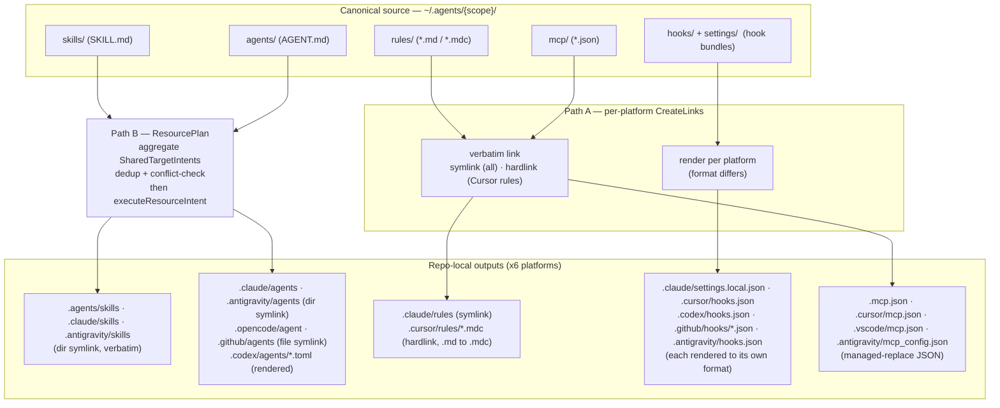

# The Platform Projection Model

`dot-agents` keeps **one canonical copy** of every agent resource — skills, agents, rules,
hooks, MCP config, settings — under `~/.agents/`, and **projects** that single source into the
layout each AI coding platform expects to read. You author a skill once; `da refresh` renders it
into Claude Code's tree, Cursor's tree, Codex's tree, and the shared compatibility buckets the
rest of the ecosystem reads. **Write once, refresh everywhere.**

This is the resource-distribution complement to [Layered Configuration](./LAYERED_CONFIG_GUIDE.md):
that guide explains how the *config* (`.agentsrc.json`) resolves down a layer stack into one
effective value; this guide explains how *resources* fan out from one canonical store into N
platform renderings. The authoritative per-platform path table is
[Platform Resource Locations](./PLATFORM_DIRS_DOCS.md) — this concept doc complements that matrix
with the model and the why, and does not restate every path.

---

## The core model: one source, N renderings

```
~/.agents/{skills,agents,rules,hooks,mcp,settings}/{scope}/...   ← canonical source of truth
        │
        │  da install / da add / da refresh   (projection)
        ▼
   per-platform repo-local outputs  ×  6 platforms
```

The canonical store is scoped — `~/.agents/<bucket>/<scope>/...`, where `<scope>` is a project
id or `global`. A resource declared `global` projects into every managed repo; a project-scoped
resource projects only into that repo. Projection is **idempotent and re-runnable**: it is the
job of `da refresh`, which recomputes the wanted set and reconciles the repo tree to match — so a
canonical edit, a new platform install, or a deleted resource all converge on the next refresh.

Critically, projection is **not** a copy. Outputs are managed *links* (symlinks, or hard links
where a platform's loader won't follow symlinks) back to the canonical file wherever the format is
identical, and *rendered files* (with provenance) only where a platform's format diverges. That
distinction is the whole design — see [the key principle](#the-key-design-principle) below.

---

## The platforms and their real targets

`platform.All()` (`internal/platform/platform.go`) returns **six** platforms today. Each owns a
distinct set of repo-local (and some user-home) outputs:

| Platform | Key repo-local outputs (verified against the adapter) |
|---|---|
| **Claude Code** (`claude.go`) | `.claude/rules/`, `.claude/settings.local.json` (hooks, **rendered**), `.mcp.json`, `.claude/agents/`, `.claude/skills/` **and** `.agents/skills/`; user-home `~/.claude/CLAUDE.md`, `~/.claude/settings.json`, `~/.claude/agents/`, `~/.claude/skills/` |
| **Cursor** (`cursor.go`) | `.cursor/rules/*.mdc` (**hard-linked**), `.cursor/settings.json`, `.cursor/mcp.json`, `.cursor/hooks.json`, `.cursorignore`; agents via the shared plan into `.claude/agents/`; user-home `~/.cursor/hooks.json` |
| **Codex** (`codex.go`) | `AGENTS.md`, `.codex/config.toml`, `.codex/agents/*.toml` (**rendered** from `AGENT.md`), `.codex/hooks.json`, `.agents/skills/`; user-home `~/.codex/hooks.json` |
| **OpenCode** (`opencode.go`) | `opencode.json`, `.opencode/agent/*.md` (file symlink, extension rename), `.opencode/plugins/`, `.agents/skills/` |
| **GitHub Copilot** (`copilot.go`) | `.github/copilot-instructions.md`, `.github/agents/*.agent.md`, `.github/hooks/*.json`, `.vscode/mcp.json`, `.claude/settings.local.json` (hooks compat), `.agents/skills/`; user-home `~/.copilot/hooks/` |
| **Antigravity** (`antigravity.go`) | `.antigravity/settings.json` and `.antigravity/mcp_config.json` (**hard-linked**, managed-replace), `.antigravity/hooks.json` (**rendered**), `.antigravity/skills/`, `.antigravity/agents/`; user-home `~/.antigravity/hooks.json` |

Note the **shared compatibility buckets**: **five** platforms mirror skills via
`BuildSharedSkillMirrorIntents`. Four of them — Claude, Codex, OpenCode, and Copilot — mirror into
`.agents/skills/` (their `claudeAgentsBucketDir` / `codexAgentsDir` / `opencodeAgentsDir` /
`copilotAgentsDir` all resolve to `.agents`), and Claude additionally mirrors into `.claude/skills/`;
**Antigravity** mirrors into its own dedicated `.antigravity/skills/` (its `SharedTargetIntents`
calls `BuildSharedSkillMirrorIntents(project, ".antigravity/skills")`). **Cursor is the only
platform that does not mirror skills at all** — its `SharedTargetIntents` returns only
`BuildSharedAgentMirrorIntents(.claude/agents)`, so it reuses Claude's `.claude/agents/` rather than
emitting a skills mirror of its own. These overlaps are deliberate — one canonical skill becomes one
deduped planned output per distinct target, not a copy per platform (see
[the two paths](#the-two-projection-paths)).

> **Antigravity is the sixth shipped projection target.** Added in
> `internal/platform/antigravity.go` (merged 2026-06-29 as the F4/DC0 "real harness" probe for the
> multi-harness-extensibility spec), it is in `platform.All()` and carries rows in
> `PLATFORM_DIRS_DOCS.md`. It projects into a dedicated `.antigravity/` repo-local root — rather than
> the vendor-adjacent `~/.gemini/` home tree or the `.agents/` umbrella, since `.agents/` is also
> dot-agents' own canonical source root and would collide with it. The probe follows the same model
> as the other harnesses: `.antigravity/settings.json` and `.antigravity/mcp_config.json` are
> managed-replace hard links, `.antigravity/hooks.json` is rendered, and `.antigravity/skills/` /
> `.antigravity/agents/` are verbatim symlink mirrors. Its native on-disk layout is still sparsely
> documented by the vendor, so those paths describe the `dot-agents` probe projection rather than
> confirmed official locations.

---

## The two projection paths

Projection runs along **two distinct code paths**. They are not interchangeable, and the
transport a resource takes depends on which path owns it.

### Path A — per-platform `CreateLinks` (direct projection)

Each platform's `CreateLinks(project, repoPath)` writes that platform's own repo-native files:
rules, settings, MCP config, hooks, ignore files, user-home links. The transport is chosen by the
platform:

- **Cursor hard-links** `.cursor/rules/*.mdc` (and `.cursor/settings.json`, `.cursor/mcp.json`,
  `.cursorignore`) via `links.HardlinkReplacing` — Cursor's rule loader does not follow symlinks, so
  a shared inode is required for edits to propagate. Its `.cursor/hooks.json` is the exception: that
  file is **rendered** through `renderCursorHookConfig` (a managed write, via `emitPreferredHookFile`),
  with a hard link used only as the legacy single-file-spec fallback.
- **Every other platform symlinks** its direct outputs via `links.SymlinkReplacing` (on Windows
  the symlink degrades to a junction for dirs / hard link for files).

Both variants use the *managed-replace* contract: a stale managed link is idempotently re-pointed,
while a genuine user-authored file at the same path is preserved as `<name>.dot-agents-backup`
rather than clobbered.

### Path B — the `ResourcePlan` executor (shared buckets)

Resources that land in **shared, cross-platform** targets (`.agents/skills/`, `.claude/skills/`,
`.claude/agents/`, `.codex/agents/`, `.opencode/agent/`, `.github/agents/`) are not written
directly. Instead each platform declares `SharedTargetIntents(project)`; the command layer
aggregates **all** platforms' intents into a single `ResourcePlan` (`BuildResourcePlan`) that
**dedups compatible intents** and **fails on conflicting ones** before any filesystem write. The
plan then executes each intent through `executeResourceIntent` (`resource_plan.go`).

The executor supports exactly these shape/transport combinations:

| Shape | Transport | Executor branch | Used for |
|---|---|---|---|
| `direct_dir` | `symlink` | `ensureDirSymlinkIntent` | skill dirs, agent dirs, and OpenCode plugin dirs (`.agents/skills`, `.claude/agents`, `.opencode/plugins` via `BuildSharedPluginBundleIntents`) |
| `direct_file` | `symlink` | `ensureFileSymlinkIntent` | per-file agent symlinks (`.opencode/agent/*.md`, `.github/agents/*.agent.md`) |
| `render_single` | `write` | `executeRenderSingleWrite` | rendered files (`.codex/agents/*.toml`) |
| *anything else* | — | **error** (`unsupported intent shape/transport`) | — |

> **`hardlink` does not route through `ResourcePlan`.** `ResourceTransportHardlink` is a defined,
> *validated* enum value (`resource_intent.go`), but `executeResourceIntent` has **no branch for
> it** — a hardlink intent would hit the `default` error case. Cursor's hard links are therefore a
> **Path A** behavior only. Do not describe shared-bucket projection as "hard-linking."

The exact/prune driver (`RunSharedTargetProjectionExact`) wraps Path B — see
[exact vs additive](#exact-vs-additive-pruning) below.



---

## Exact vs additive pruning

`da refresh` / `da install` drive the shared-target projection in **exact** mode by default
(`RunSharedTargetProjectionExact` with `exact=true`):

- **Exact (default).** Project the resolved wanted set **and prune** managed outputs that are no
  longer in it, so the repo tree converges to *exactly* what the plan declares. Pruning is
  surgical: it scans only directories that own a `ResourcePruneTarget` intent, and removes only
  entries that are (a) not wanted and (b) managed links pointing into `~/.agents/`. User-authored
  files and links pointing elsewhere are never touched.
- **Additive (`--inexact`).** Write the wanted set but **leave** stale managed outputs in place.
  This is the older non-pruning behavior, kept as an opt-out via the `--inexact` flag.

Projection also **re-detects newly-installed platforms**: `reportEnabledPlatforms` calls
`DetectAndEnableNewPlatforms(cfg)` at the top of every refresh, so an editor installed *after*
`da init` becomes managed and gets projected on the very next refresh rather than staying
`enabled:false` forever.

---

## Per-resource projection

How each resource type is projected, and why — this is where the design principle becomes
concrete.

- **Skills** — **verbatim directory symlink mirror.** A skill is a `SKILL.md`-rooted directory in
  the same format on every platform, so it is projected as a plain `direct_dir`/`symlink` intent
  into `.agents/skills/` (Claude, Codex, OpenCode, Copilot — not Cursor), `.claude/skills/` (Claude),
  and `.antigravity/skills/` (Antigravity). No transform. One canonical skill dedups to one planned
  output per distinct target.
- **Agents** — **symlink mirror, with one rendered exception.** `.claude/agents/` (Claude, Cursor)
  and `.antigravity/agents/` (Antigravity) are verbatim `direct_dir` symlinks; `.opencode/agent/*.md`
  and `.github/agents/*.agent.md` are verbatim `direct_file` symlinks of the canonical `AGENT.md`
  (only the filename/extension differs). **Codex is the exception:** it has no markdown agent format,
  so `AGENT.md` is
  **rendered** into `.codex/agents/*.toml` (`render_single`/`write`, the `codex-agent-toml`
  materializer).
- **Rules** — **at most an extension rename.** Claude links `~/.agents/rules/<scope>/<name>` into
  `.claude/rules/<scope>--<name>.md` (symlink); Cursor hard-links the same source into
  `.cursor/rules/<scope>--<name>.mdc`, renaming `.md → .mdc` (`toMDC`). The rule *content* is
  never transformed.
- **Hooks** — **rendered per platform, because the hook format genuinely differs.** Each platform
  has its own renderer (`renderClaudeHookSettings`, `renderCodexHookConfig`,
  `renderCursorHookConfig`, `renderCopilotHookFile`, `renderAntigravityHookConfig`) and its own
  canonical→native event-name table (`claudeEventTable`, `codexEventTable`, `cursorEventTable`,
  `copilotEventTable`, `antigravityEventTable`). A single canonical `HookSpec.When` value like `stop`
  maps to `Stop` (Claude/Codex/Antigravity), `stop` (Cursor), and `agentStop` (Copilot). See
  [Hooks](./HOOKS.md) for the full model.
- **Settings / MCP** — **managed-replace JSON.** MCP config is a managed-replace link, and each
  platform resolves its **own preferred canonical source name first, falling back to the shared
  `mcp.json`** (`resolveScopedFile` tries the names in order, per scope): Claude resolves
  `claude.json` → `mcp.json`, Cursor resolves `cursor.json` → `mcp.json`, Copilot resolves
  `copilot.json` → `mcp.json`. The repo-local target differs per platform too — Claude symlinks
  `.mcp.json`, Cursor hard-links `.cursor/mcp.json`, Copilot targets `.vscode/mcp.json`. Claude's
  `settings.local.json` is the hook-rendered settings file.

### The key design principle

> **Project where the format is uniform; render where it differs.**

Skills, agents (except Codex), and rules share a file format across platforms, so they are
projected as **links** to one canonical file — zero translation, edits propagate instantly through
the shared inode, and the canonical store stays the single source of truth. Hooks (and Codex
agents) have genuinely **different per-platform formats**, so they are **rendered** by a
platform-specific emitter, with sha256 provenance recorded in the render manifest so a later
refresh can tell its own output from a user edit.

This is why there is no universal "translation layer": most resource types never need one, and the
ones that do get a small, explicit, per-platform renderer rather than a lossy
lowest-common-denominator format.

---

## Where plugins fit: an upstream bundle, not a projection target

A **plugin** is an installable **bundle of canonical resources** — agents, skills, commands,
hooks, and MCP config — packaged with ownership metadata in a `PLUGIN.yaml` manifest. It lives in
the canonical store under `~/.agents/plugins/<scope>/<name>/` (`resources/{agents,skills,commands,hooks,mcp}/`,
plus `files/` for native OpenCode source and `platforms/<id>/` passthrough), using the **same scope
model** — `global` or a project id — as every other canonical bucket. See the
[Plugin Contract](./PLUGIN_CONTRACT.md) for the full manifest schema and storage layout.

The key point for this projection model: **plugins are a storage/ownership layer that sits
*upstream* of projection, not a per-platform render target.** A plugin does not add a new output
shape. Instead, once a bundle is in the canonical store, the resources it carries are canonical
resources like any other, and they project into each platform's layout through the exact same two
paths described above. Bundles arrive upstream two ways: authored directly under
`~/.agents/plugins/`, or via `da import`, which detects orphaned platform plugin artifacts
(`.cursor-plugin/plugin.json`, `.claude-plugin/plugin.json`, `.opencode/plugins/<name>/`, …) and
scaffolds a canonical `PLUGIN.yaml` from them.

Ownership is single-writer: the canonical bundle is owned once (`shared_repo`), and every
platform-local plugin output is a **projection owned by the platform adapter** (`platform_repo`) —
the same ownership split that governs the rest of this model. The `plugins` bucket routes through
the **shared planner/executor** (Path B): a platform emits plugin bundles by calling
`BuildSharedPluginBundleIntents` from its `SharedTargetIntents` with its own native target path.
**Today only OpenCode wires this up** (`.opencode/plugins/`, the `direct_dir`/`symlink` intent in
[the executor table](#path-b--the-resourceplan-executor-shared-buckets)); the other
package-manifest platforms declare plugin support in the contract but have no emitter yet, so they
simply omit the call.

There is **no `da plugins` command family** and no per-platform "plugins target" step: plugins are
resolved through import and the canonical store, then projected as ordinary canonical resources.

## See also

- [Platform Resource Locations](./PLATFORM_DIRS_DOCS.md) — the authoritative per-platform path
  matrix (official vendor locations + the current `dot-agents` implementation audit).
- [Hooks](./HOOKS.md) — the canonical hook model and the per-platform event tables.
- [Layered Configuration](./LAYERED_CONFIG_GUIDE.md) — the config-layer complement: how
  `.agentsrc.json` resolves down a layer stack.
- [Plugin Contract](./PLUGIN_CONTRACT.md) — the plugin bundle storage/ownership contract: the
  upstream layer that packages canonical resources before they project.
