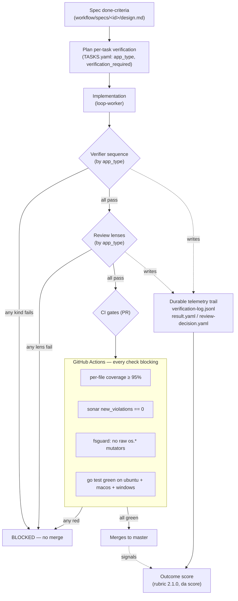

# Verification and Scoring

`dot-agents` treats a unit of work as **correct-and-merges or it does not merge** — there is no
"mostly passing." Every change an agent produces runs a gauntlet of **binary gates**: each one
returns pass or fail, each failure blocks the merge, and each decision is written to a durable,
schema-validated record. This is deliberate. For a regulated context — PCI, PHI/HIPAA, CUI,
FIPS, CMMC — "the build went green" is not enough; you need to show *which* checks ran, *what*
each one decided, and *where* the decision is recorded. This document is the architect-facing
reference for that methodology.

The model has four planes, and they compose into one pipeline:

1. **Mechanical CI gates** — the GitHub Actions checks that block a merge on the PR (coverage,
   Sonar new-issues, fsguard, multi-OS test matrix). No human, no model, no partial credit.
2. **Agent verification gates** — a verifier dispatched per **app_type** runs an ordered sequence
   of verifier kinds (unit, cli-runner, schema-check, …), each emitting a schema-validated result.
3. **Adversarial review lenses** — a multi-lens reviewer dispatched per **app_type** reviews the
   change through independent lenses (architecture-standards, acceptance-invariants, adversarial,
   and a second-harness cross-adversarial lens), each emitting a binary `pass | fail` verdict.
4. **The telemetry + score** — every verification and review decision is appended to a durable
   trail; an explainable, versioned **outcome score** is computed from that trail.

> **Scope.** This is a *concept* doc: it explains how the planes fit together and what is actually
> shipped today. The authoritative references it cites — the
> [Outcome-Scoring Rubric](./OUTCOME_SCORING_RUBRIC.md), the
> [Verifier & Reviewer Templates](./VERIFIER_REVIEWER_TEMPLATES.md), the
> [Scoring Guide](./SCORE_GUIDE.md), and [Release Verification](./RELEASE_VERIFICATION.md) — own the
> field-level detail.

---

## Overview

A change reaches `master` only after **every** gate below is green. The table is the whole thesis
in one view: each row is binary, each blocks the merge, and each leaves an auditable record.

| Plane | Gate | Pass condition (no partial credit) | Where enforced | Record |
|---|---|---|---|---|
| CI | Per-file coverage | every non-exempt file ≥ 95% Go statement coverage | `scripts/coverage-gate.sh` | CI job log |
| CI | Sonar new-issues | `new_violations == 0` in the new-code period | `scripts/sonar-new-issues-gate.sh` | SonarCloud + CI log |
| CI | fsguard | zero raw `os.*` fs-mutators outside the allowlist | `tools/fsguard` | CI log |
| CI | Multi-OS tests | `go test` green on ubuntu **and** macos **and** windows | `.github/workflows/test.yml` matrix | CI log |
| Agent | Verifier sequence | each verifier kind for the app_type returns `pass` | `da workflow verify record` | `…/verification/<task>/<kind>.result.yaml` |
| Agent | Review lenses | each lens returns `pass` (any BLOCKER/HIGH → `fail`) | `da workflow verify record --kind review` | `…/verification/<task>/review-decision.yaml` |

The two planes are independent and both mandatory. The CI gates are mechanical and run in GitHub
Actions on the pull request. The agent gates run inside the orchestration loop, *before* the work
is offered for merge, and are dispatched by the task's declared **app_type**. A change that passes
the agent gates but fails coverage does not merge; a change that passes CI but a review lens marks
`fail` does not merge. Correctness is the conjunction.



---

## The Model

### Plane 1 — the mechanical CI gates

These run in `.github/workflows/test.yml`, which triggers on every pull request. None of the four
gate steps carry `continue-on-error`: a red gate fails the job and blocks the merge.

**Per-file coverage (`scripts/coverage-gate.sh`).** Every non-exempt Go file must hit **95%**
statement coverage (the comparison allows a 0.05pp tolerance, so a file fails below 94.95%). It is
a *per-file* enforce gate, not a project-average — averaging lets a well-covered file mask an
untested one, which is exactly the masking a regulated audit cannot accept. Two bounded escape
hatches exist and both are reviewable: a pattern exclusion list (`cmd/*`, test scaffolding,
generated platform files) and a rationale'd allowlist (`scripts/coverage-exceptions.txt`) under a
**ratchet** — every allowlist entry must carry a `# rationale`, and a `# ratchet-max-entries:` cap
fails the gate if the list grows past it. The gate runs over the **merged** multi-OS coverage
profile, so platform-tagged files (`*_windows.go`) are scored on the OS that actually compiles them.

**Sonar new-issues (`scripts/sonar-new-issues-gate.sh`).** Queries SonarCloud for unresolved
issues introduced in the PR's new-code period and fails if the count is **not zero**
(`new_violations must be 0`). This is a true zero-tolerance gate on *new* debt — it does not
require paying down the entire backlog, only that the change introduces none.

> **Honest limitation for auditors.** The Sonar gate is the only one of the four with a
> *fail-open* path: if the API query or response parse fails it treats the result as zero new
> issues and passes. In CI the `SONAR_TOKEN` secret is present so the gate runs for real, but a
> SonarCloud outage degrades it to a pass rather than a block. The coverage, fsguard, and
> multi-OS gates have **no** fail-open path in CI. If your control framework requires the static-
> analysis gate to fail-closed, that is the one to harden.

**fsguard (`tools/fsguard`).** A purpose-built AST checker that fails CI if any production Go code
outside `internal/fsops` calls one of six raw filesystem **mutators** — `os.Mkdir`, `os.MkdirAll`,
`os.Remove`, `os.RemoveAll`, `os.Rename`, `os.WriteFile` — unless that exact call site is
allowlisted. Reads (`os.Open`, `os.Stat`, `os.ReadFile`) are not policed; only mutations are. The
allowlist is two-tier: precise `file:line` entries and whole-package *grandfathered* entries (each
with a reason), and it only ever tightens — a new raw mutator in a non-grandfathered package fails
the build. fsguard runs inside the test matrix on **every** OS.

**Multi-OS test matrix.** The `test` job runs `go test` on `windows-latest`, `macos-latest`, and
`ubuntu-latest` with `fail-fast: false`, so a POSIX/Windows divergence cannot slip through on the
strength of one platform being green. The per-OS coverage profiles are merged (`gocovmerge`) and
fed to the coverage gate, which then runs once over the union.

### Plane 2 — verifier profiles dispatched by app_type

Before a change is offered for merge, an orchestrated **verifier** proves it does what it claims.
The verifier is **not** a standing agent — it is a *composed prompt* the orchestrator dispatches,
whose contract lives in `prompts/verifiers/verifier.base.md`: *"You are a bounded verifier. You
prove a delegated change does what it claims — you do not implement or fix product code. If the
change is broken, your job is to fail the verification with clear evidence, not to repair it."*

Routing is two-faceted and lives in `.agentsrc.json`:

- **`execution_profile.by_app_type.<app_type>.topology.verifier_sequence`** — the ordered list of
  verifier *kinds* to run for a task of that app_type.
- **`stage_profiles.verifier.<kind>`** — the registered profile for each kind: a `label` and the
  base-first `prompt_files` composition (`verifier.base.md` → `<kind>.md` → `<kind>.project.md`).

A task carries an `app_type` (in `TASKS.yaml`, falling back to the plan's `default_app_type`); the
loop resolves that to the sequence. As shipped in this repo (dot-agents dogfooding itself):

| app_type | verifier_sequence (in order) |
|---|---|
| `go-cli` | `unit` → `cli-runner` |
| `ideation` | `schema-check` → `citation-check` → `task-schedule` |
| `docs` | `schema-check` → `citation-check` → `cli-runner` |

Each verifier records its outcome with `da workflow verify record --kind <test\|lint\|build\|format\|custom>
--verifier-type <kind> --status <pass\|fail\|partial\|unknown> --task <id>`, writing a
schema-validated `.agents/active/verification/<task_id>/<kind>.result.yaml`. A verifier never fixes
the code; a broken change is a *failed verification with evidence*, classified against a fixed
taxonomy (`ok`, `ok-warning`, `impl-bug`, `tool-bug`, `missing-feature`, `blocked`).

> **Shipped vs not.** Five verifier kinds are wired live in this repo's `stage_profiles.verifier`:
> `unit`, `cli-runner`, `schema-check`, `citation-check`, `task-schedule`. Four more —
> `api`, `batch`, `streaming`, `ui-e2e` — ship as starter prompt templates for **consuming**
> projects to wire, but are not in this repo's registry. A `pr-ci` verifier is **design-stage
> only** (a proposal, no shipped prompt or registry entry) — do not assume it runs.

You can inspect exactly which files compose a profile, and which scope each resolves from, with
`da workflow resolve-prompt --kind verifier --slug <kind>` — the same seam the orchestrator calls
when it dispatches. See [Verifier & Reviewer Templates](./VERIFIER_REVIEWER_TEMPLATES.md).

### Plane 3 — adversarial review lenses

Verification proves *behavior*; review proves *soundness*. A change is reviewed through several
independent **lenses**, each a single-purpose reviewer worker (one target, one lens — never all
lenses in one pass). The lens set is selected by app_type via
`execution_profile.by_app_type.<app_type>.lenses.lens_set`. Four lenses ship, each as both a prompt
(`prompts/reviewers/<lens>.md`) and an agent (`agents/global/<lens>-reviewer/AGENT.md`):

- **architecture-standards** — design coherence, module boundaries, interface and data-shape
  design, separation of concerns, naming, layout.
- **acceptance-invariants** — does the work satisfy the task's *business intent and acceptance
  criteria* (not merely "tests green"), and do platform invariants survive design → implemented work?
- **adversarial** — red-team: assume the change is wrong until proven right (security, broken
  invariants, concurrency, swallowed errors, data-loss/clobber, POSIX/Windows divergence).
- **cross-harness-adversarial** — the *second-brain* gate. Instead of reviewing with its own model,
  it routes the adversarial pass to a **different agent harness than the one running the session**.

Each lens emits a single verdict line — **`verdict: pass | fail`** — and `fail` is *required* if
any BLOCKER or HIGH finding is present. The lens writes its findings to
`.agents/active/review/<task_id>-<lens>.md` and records the verdict for the audit trail with
`da workflow verify record --kind review`. As shipped:

| app_type | lens_set | lens_concurrency |
|---|---|---|
| `go-cli` | architecture-standards, acceptance-invariants, adversarial, cross-harness-adversarial | `gated` |
| `ideation` | architecture-standards, acceptance-invariants, adversarial | `parallel` |
| `docs` | architecture-standards, acceptance-invariants | `parallel` |

The **cross-harness** lens is the one most worth understanding for an adversarial-assurance
posture. It detects the host engine from environment markers (`CLAUDECODE`, `CURSOR_SESSION_ID`,
`CODEX_SESSION_ID`, …), enumerates the *other* agent CLIs available on `PATH`
(`codex > cursor > opencode > copilot > claude`), and dispatches a read-only adversarial brief to
the first available one — *"you do not review with your own brain… the value is the disagreement."*
The running reviewer then reconciles the second engine's findings and owns the final `pass | fail`.
If no alternate harness is installed it emits a single explicit skip note and a non-blocking
`pass … [SKIPPED: no alternate harness]` rather than fabricating a result — a graceful degrade that
is itself recorded.

> **No SOUND/NOT-SOUND.** The verdict vocabulary across every lens — cross-harness included — is
> binary `pass | fail`. (A separate `SOUND`/`NOT-SOUND` verdict exists only in the unrelated
> research-ideation subsystem; it is not the review verdict.)

### Plane 4 — the auditable telemetry trail

This is the part a regulated audit cares about most: not just that gates ran, but a **durable,
schema-validated record of every decision**. Two records ship today, and one envelope is seeded for
the future.

**Shipped — the verification log (`verification-log.jsonl`).** Every `da workflow verify record`
appends one JSONL line: `schema_version`, `timestamp`, `kind`, `status`, `command`, `scope`,
`summary`, `artifacts`, `recorded_by`. Append-only; one line per verification act.

**Shipped — the review decision (`review-decision.yaml`).** For `--kind review`, the writer
consolidates the per-phase decisions (pessimistically: any reject → reject, else any escalate →
escalate, else accept) and writes a `review-decision.yaml` validated against
`schemas/verification-decision.schema.json`. The shipped schema is strict — `schema_version` is
pinned (`const: 1`) and `additionalProperties: false` — so a malformed or extended record is
*rejected at write time*, not silently stored. The record carries `task_id`, `parent_plan_id`,
`phase_1_decision`, `phase_2_decision`, `overall_decision`, `failed_gates`, `escalation_reason`,
`reviewer_notes`, and `recorded_at` / `recorded_by`. That is one auditable artifact per delegated
task's review, on disk, schema-enforced.

**Seeded, not yet shipped — the universal execution-telemetry envelope.**
[ADR-0004](./adr/0004-execution-telemetry-schema-seed.md) *designates* `review-decision.yaml` as
the first concrete instance of a broader per-resource trace envelope (`resource_type` /
`resource_id` / `invoked_at` / `invoked_by` / `outcome` / `post_invocation` /
`improvement_signals`) that hooks, subagents, rules, and skills would each emit on invocation —
"one auditable record per resource invocation." That broader envelope is **design-stage**: the
ADR titles itself a *schema-seed*, the on-disk schema does not yet carry those top-level fields
(and, being `additionalProperties: false`, actively rejects them today), and no shipped writer
emits them. Treat the universal envelope as the documented destination, and the
`review-decision.yaml` + `verification-log.jsonl` pair as the audit trail you actually have now.

The trail is **retained indefinitely by policy** — scoring re-derives signals from the original
records under whatever rubric version is current, so pruning history would silently turn "rescored
under a new rubric" into "absent signal." That retention is the property longitudinal audit
depends on.

### Plane 4 (cont.) — the outcome score

The trail is not just for forensics; it feeds an **explainable, versioned outcome score**. The
[Outcome-Scoring Rubric](./OUTCOME_SCORING_RUBRIC.md) is the canonical contract, and it has a Go
twin (`internal/scoring/rubric.go`, `RubricVersion = "2.1.0"`) that the rubric document and the
code must agree on in the same commit. The score answers a different question than the gates: the
gates answer *"is this artifact correct?"*; the score answers *"how good was the run that produced
it?"* — measured from telemetry the run already captured.

It combines **seven signals**, each mapped to a sub-score in `[0,1]` and weighted:

| Signal | Weight | Kind | Objective source |
|---|--:|---|---|
| `landed` | 0.20 | correctness | commit reachable from `master`, not reverted |
| `verifier` | 0.18 | correctness | `verifiers[].status` (pass/partial/fail) |
| `tests` | 0.17 | correctness | verification artifact test result |
| `correction_pressure` | 0.13 | process | retries + user corrections + tool error rate |
| `scope` | 0.13 | process | changed files vs declared `write_scope` |
| `hook_outcomes` | 0.10 | process | hook-gate records (allow/advise/remediate) |
| `token_efficiency` | 0.09 | efficiency | cache hit rate |

The combination is **`weighted_mean_renormalized`**: absent signals drop out of *both* sums so a
missing telemetry field neither inflates nor deflates the score, and if every signal is absent the
run is `unscored` — the rubric never invents a number. Correctness signals dominate (0.55 of the
weight): a run is judged first on whether it worked and landed. Every score records the
`RubricVersion` it was computed under, and the breakdown is explainable by construction — each
signal reports present/absent, sub-score, effective weight, and contribution, and the contributions
sum exactly to the final score.

Where a signal has both a self-reported and an objective source, the rubric scores from the
**objective** source and records the *claimed-vs-observed delta* as a separate **integrity** track —
a per-role honesty profile that never touches the numeric score. That separation matters for audit:
"was the run good?" and "was the agent's self-report honest?" are answered by different numbers.

---

## The commands

The verification and scoring surface, end to end:

```
da workflow resolve-prompt --kind verifier --slug <kind>   Show a profile's composed prompt + scope
da workflow verify record --kind <kind> --status <s> ...    Record a verifier/review outcome (durable)
da workflow verify log [--all]                              Read back the verification log
da score run                                                Compute + persist per-iter/per-session scores
da score iteration <N> [--recompute]                        Read (or recompute) one iteration's breakdown
da score session <id>                                       Read one session's roll-up
```

All accept the global `--json` flag. The scoring sidecars (`iter-N.score.yaml`,
`session-<id>.score.yaml`) live alongside the iteration log and record their rubric version, so a
historical score is never silently invalidated by a later rubric change. See the
[Scoring Guide](./SCORE_GUIDE.md) for the full `da score` surface.

---

## Worked example: spec → plan → gates → trail → score

Follow a single `go-cli` task from contract to auditable outcome.

**1. The spec sets done-criteria.** `workflow/specs/<id>/design.md` states a verifiable done
criterion — e.g. *"`da config sync --dry-run` previews without writing the lock."* The spec owns
*what* correct means; it names no files.

**2. The plan turns it into a per-task verification strategy.** The task lands in `TASKS.yaml` with
`app_type: go-cli` and `verification_required: true`. That app_type *is* the routing key: it selects
the `unit → cli-runner` verifier sequence and the four-lens `gated` review set.

**3. The verifier sequence runs — each kind binary.** The `unit` verifier proves the new behavior
with tests and records `pass`; the `cli-runner` verifier builds the binary and smoke-runs
`da config sync --dry-run`, confirms the lock is untouched, and records `pass`. Each writes a
schema-validated `…/verification/<task>/<kind>.result.yaml`. Had either failed, the task is blocked
with evidence — not 90% done, blocked.

**4. The review lenses run — each binary.** architecture-standards, acceptance-invariants,
adversarial, and the cross-harness lens (routed to `codex` because the session runs on `claude`)
each return `verdict: pass`. The acceptance-invariants lens specifically checks the change against
the spec's done criterion, not just "tests green." The consolidated `review-decision.yaml` records
`overall_decision: accept` with empty `failed_gates`.

**5. CI confirms mechanically.** On the PR, the merged-profile coverage gate confirms the new files
are ≥ 95%, the Sonar gate confirms zero new issues, fsguard confirms no raw `os.*` mutators crept
in, and `go test` is green on all three OSes. Any red here still blocks the merge.

**6. The merge produces ground truth, and the score reads it.** Once the commit is reachable from
`master`, `da score run` computes the iteration's score: `landed = 1.0`, `verifier = 1.0`,
`tests = 1.0`, clean `correction_pressure`, on-target `scope` — an **excellent** band, with the
full per-signal breakdown persisted under the rubric version it was scored against.

The result is a chain a reviewer or auditor can walk backward: the score points at the iteration
record, which points at the `review-decision.yaml` and the per-kind `result.yaml` files, which point
at the gates that ran and what each decided — every step binary, every decision on disk.

---

## What is shipped today (honesty matters more than completeness)

| Capability | Status |
|---|---|
| Per-file coverage gate (≥95%, ratcheted allowlist) | **Shipped**, CI-enforced |
| Sonar new-issues gate (`new_violations == 0`) | **Shipped**, CI-enforced (fail-open on API error) |
| fsguard (raw `os.*` mutator guard) | **Shipped**, CI-enforced on every OS |
| Multi-OS test matrix (ubuntu/macos/windows) | **Shipped**, CI-enforced |
| Verifier routing (`execution_profile` + `stage_profiles`) | **Shipped** |
| Verifier kinds `unit`, `cli-runner`, `schema-check`, `citation-check`, `task-schedule` | **Shipped & wired** here |
| Verifier kinds `api`, `batch`, `streaming`, `ui-e2e` | **Shipped** as starter templates; not wired in this repo |
| Verifier kind `pr-ci` | **Design-stage only** (proposal) |
| Verifier as a standing agent | **Does not exist** — verifier is a composed prompt |
| Review lenses (4, incl. cross-harness-adversarial) | **Shipped & wired** per app_type |
| `da workflow resolve-prompt`, `da workflow verify`, `da score` | **Shipped** |
| `review-decision.yaml` + `verification-log.jsonl` (schema-validated) | **Shipped** |
| Outcome score (rubric 2.1.0, 7 signals, explainable) | **Shipped** |
| Universal §1.6 execution-telemetry envelope (every resource invocation) | **Seeded / design-stage** (ADR-0004) |

> The config keys `verifier_profiles` / `reviewer_profiles` / `app_type_verifier_map` appear in some
> older docs. They are the **deprecated** spelling — the loader folds them into `stage_profiles` and
> `execution_profile` on read and never re-emits them. New work should read and write the
> `stage_profiles` / `execution_profile` form.

---

## Reference

### See also

- [Outcome-Scoring Rubric](./OUTCOME_SCORING_RUBRIC.md) — the canonical, versioned signal/weight/
  combination contract (with its Go twin `internal/scoring/rubric.go`).
- [Verifier & Reviewer Templates](./VERIFIER_REVIEWER_TEMPLATES.md) — how verifier and reviewer
  prompts compose (base → per-type → repo overlay) and `da workflow resolve-prompt`.
- [Scoring Guide](./SCORE_GUIDE.md) — the task-oriented `da score` walkthrough.
- [Release Verification](./RELEASE_VERIFICATION.md) — Cosign keyless signing + Rekor transparency
  log for verifying a release *binary* before install (the supply-chain bookend to this pipeline).
- [ADR-0004](./adr/0004-execution-telemetry-schema-seed.md) — the execution-telemetry envelope
  designation that `review-decision.yaml` seeds.
