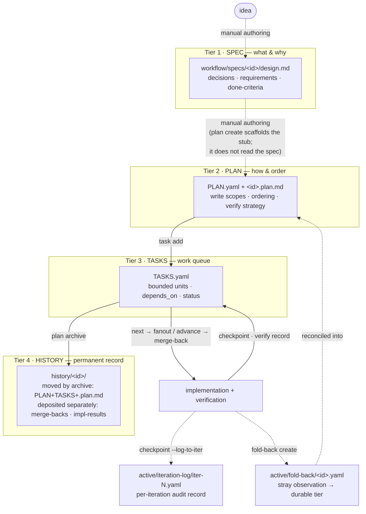

# The Workflow Artifact Model

`dot-agents` runs an **agentic software-development lifecycle (ASDLC)**: agents do the work,
humans steer and review, and every decision leaves a durable, inspectable artifact on disk. The
artifact model is the backbone of that lifecycle. It defines **four tiers** of canonical
artifact between an idea and shipped code — spec, plan, tasks, history — plus a small set of
cross-cutting records (delegation/merge-back, iteration-log, fold-back) that capture *who did
what, against which contract, and with what evidence*.

This document is the architect's reference for that model. It is written for readers evaluating
`dot-agents` for **regulated or audit-sensitive environments**, where "an AI changed the code"
is only acceptable if the change traces back to a stated requirement, a bounded write scope, and
a recorded verification result. Each tier below has a distinct **owner, scope, and lifecycle**,
and each transition is driven by a verified `da workflow` command — not by convention or memory.

> **Scope.** This is the *artifact* layer — the files that record intent, work, and evidence.
> The orchestration *runtime* that decides what to build next (selection, fanout, staged
> verification) sits above it; for the operator-facing command sequences see
> [Workflow Client Commands](./WORKFLOW_CLIENT_COMMANDS.md), and for one real end-to-end wave see
> the [Workflow Walkthrough](./DEMO_WORKFLOW_WALKTHROUGH.md).

---

## Overview

A canonical plan's artifacts live in two places: the **active** tree (`.agents/workflow/`,
`.agents/active/`) while work is in flight, and the **history** tree (`.agents/history/`) once a
plan is archived.

| Tier | Canonical path | Owns | Lifecycle |
|---|---|---|---|
| **1 · Spec** | `.agents/workflow/specs/<id>/design.md` | The **what and why** — decisions, requirements, done-criteria. | Authored before implementation; frozen as the contract the plan answers to. |
| **2 · Plan** | `.agents/workflow/plans/<id>/PLAN.yaml` + `<id>.plan.md` | The **how and in what order** — file scopes, task ordering, verification strategy. | Written once the spec is stable enough to implement. |
| **3 · Tasks** | `.agents/workflow/plans/<id>/TASKS.yaml` | The **work queue** — bounded units, dependencies, status. | Generated from the plan; mutated by the CLI as work progresses. |
| **4 · History** | `.agents/history/<id>/` | The **permanent record** — the plan dir (`PLAN.yaml` + `TASKS.yaml` + `<id>.plan.md`) *moved* by `plan archive`, **plus** artifacts deposited *separately*: merge-back archives (by `delegation closeout`) and `impl-results.md` (written by the agent). The spec is **not** copied in. | Plan dir moves on `plan archive`; the other artifacts land earlier, each by its own command. |

The cardinal rule: **do not collapse the tiers.** A spec that grows file paths and task lists has
become a plan; a plan that carries open questions has skipped its spec. Keeping the boundary sharp
is what makes the chain auditable — each artifact answers exactly one class of question.

---

## The Four Tiers

### 1 · Spec — the contract

The spec owns the **what and why**, and is authored *before* any code. It carries the problem
statement and goals, explicit decisions **with rationale** (what was chosen and why the
alternatives were rejected), behavioral requirements, open questions to resolve before or during
implementation, **verifiable done-criteria**, and explicitly deferred (out-of-scope) items.

A spec does **not** contain file paths, function names, dependency ordering, or task breakdowns —
those belong in the plan. The spec *is the contract the plan is accountable to*: if
implementation drifts, the spec is the authority. In a real `PLAN.yaml`, `success_criteria`
states this trace explicitly — e.g. *"Traces to the spec's five Done criteria: (1) …"*.

### 2 · Plan — the bridge to code

The plan owns the **how and in what order**. It is written only once enough is known to implement
without guessing. It records every decision needed to write the code (function names, file
locations, interfaces, data shapes, edge-case handling), a task breakdown with explicit
dependency ordering, a **write scope per task** (which files each task may touch), and a
**verification strategy per task**.

The plan is three files: `PLAN.yaml` (canonical structured state — `status`, `owner`,
`current_focus_task`, `success_criteria`, `verification_strategy`), `TASKS.yaml` (the queue, see
below), and an optional `<id>.plan.md` human narrative. A plan **references** the spec; it does
not duplicate it. Its `success_criteria` must trace back to the spec's done-criteria — that trace
is the load-bearing audit link.

### 3 · Tasks — the work queue

`TASKS.yaml` owns the **work queue**: concrete, bounded units of work, each with explicit
`depends_on` relationships, a `status` (`pending → in_progress → completed`), a write scope, and
verification flags. Dependencies may be **cross-plan** — a dep string containing `/` (e.g.
`plan-archive-command/p0-extract-fs-helpers`) refers to a task in another plan.

Task status is **not edited by hand** — it changes only through the CLI, so every transition is
attributable and the journal can record it. The path differs by work mode. For **plain direct
work with no contract**, `da workflow advance` moves the canonical task status. For **delegated**
work (and any direct-mode *contract*) the steps are split: `merge-back` records the worker's return artifact and marks the
*delegation contract* completed — **not** the canonical task — and `delegation closeout` is what
reconciles the canonical task to `completed` on accept. `complete` is a read-only **probe** of
plan-completion state; it mutates nothing.

### 4 · History — the permanent record

When a plan completes, it is **archived** out of the active tree into `.agents/history/<id>/`.
`da workflow plan archive` moves (or merges, when a history dir already exists) the plan
directory — `.agents/workflow/plans/<id>/` — into `.agents/history/<id>/`: the final `PLAN.yaml`
+ `TASKS.yaml` and the `<id>.plan.md` narrative. That is all archive itself does — it does **not**
copy the spec and does **not** generate a results file. Two related artifacts reach history by
other means: delegation **merge-back** archives are deposited under
`delegate-merge-back-archive/<date>/<task>/` earlier, by `delegation closeout` (not by archive);
and `impl-results.md`, when present, is written by the agent per the workflow rules — for direct
work with no merge-backs, or when a single cross-task narrative adds context the per-task records
miss — never produced by the archive command.

This keeps `.agents/workflow/plans/` reserved for **live** plans and makes
`.agents/history/<id>/` the durable record of completed work — the thing an auditor reads.

---

## The Lifecycle

The artifacts are not static documents; they advance through a defined lifecycle. The **solid**
arrows below are each driven by a `da workflow` command; the **dashed** ones (idea → spec → plan)
are manual, human-authored steps — there is no single command that consumes the prior artifact to
emit the next, so they are not labeled with one.



> This diagram is **tier-focused** — it follows the artifacts. It is complementary to the
> *engine-lifecycle* view in [Project Diagrams](./PROJECT_DIAGRAMS.md) §5, which slices the same
> workflow by execution stage (Authoring → Selection → Execution → Close → Archive). One answers
> *"which artifact owns this?"*; the other answers *"when in the iteration does this run?"*.

In prose:

```
idea
  → spec (design.md)          what & why · decisions · open questions
  → plan (PLAN.yaml + tasks)  how & in what order · write scopes
  → implementation            code + tests, inside the task's write scope
  → verification              tests pass · review recorded
  → archive (history/)        permanent, immutable record
```

Four rules keep the chain honest: **spec before plan** (a plan with no spec is a plan with no
contract); **plans answer the questions specs leave open** (open questions are resolved in task
notes, not deferred into code); **specs do not grow into plans** (move file paths and task lists
out the moment they appear); and **done-criteria live in the spec** (the plan's verification
strategy references them rather than inventing competing ones).

---

## Cross-Cutting Records

Three records cut across the tiers. They are what make the lifecycle **auditable** rather than
merely organized.

### Delegation contract + delegation bundle + merge-back

When the orchestrator hands a bounded task to a sub-agent ("fanout"), three artifacts persist the
handoff so it can be reproduced and reviewed — not reconstructed from chat:

- **Delegation contract** — `.agents/active/delegation/<task-id>.yaml`. Declares the **write
  scope** (which files the worker may touch) and the closeout obligations. The bounded write scope
  is the core safety property: a worker that writes outside it is out of contract.
- **Delegation bundle** — `.agents/active/delegation-bundles/<delegation-id>.yaml`, written by
  `da workflow fanout` and validated against an embedded schema. It is the inspectable handoff
  payload: chosen plan/task, owner + worker profile, prompt/context files, and the verification
  plan (feedback goal, scenario tags, evidence policy).
- **Merge-back** — `.agents/active/merge-back/<task-id>.md`. The worker's **return artifact** —
  what was built and what to verify. A merge-back is *child output for parent review*, not
  child-owned closeout: the parent gate accepts or rejects it. On accept, the task is completed
  and the merge-back is archived under history; on reject, the task is blocked with a note.

### Iteration-log — the per-iteration audit record

`.agents/active/iteration-log/iter-N.yaml` is the **canonical per-iteration record**. Each closed
iteration writes one entry — commit SHA, files/lines changed, tests added, a summary, scenario
tags, and a structured `self_assessment` block (tests positive-and-negative, persisted via
workflow commands, stayed under scope, no destructive commands, …). A sibling `iter-N.score.yaml`
records the computed iteration score. This is the durable trail an auditor follows to answer *"what
changed in this iteration, was it verified, and did it stay within discipline?"* — and it is
written by the CLI, not narrated by the agent.

### Fold-back — routing stray observations to a durable tier

Loop agents surface observations that should not stay stranded in chat. `da workflow fold-back
create` writes a staging artifact (`.agents/active/fold-back/<id>.yaml`) and routes the observation
into one of three durable destinations: an inline **`TASKS.yaml` note** (when `--task` is given),
the **plan summary** (a plan-level note, when no task is named), or — with `--propose` — a
**proposal file** under `~/.agents/proposals/*.md` for the review queue (`da review`), which
requires explicit human approval before it becomes durable. The discipline the walkthrough
demonstrates: when a worker notices work beyond its bundle scope, it **folds it back** rather than
silently expanding scope.

---

## How an Agent (or Human) Drives the CLI

The artifact tiers are operated almost entirely through `da workflow` subcommands. Every command
below ships today. The recurring operating loop — **orient → select → delegate/verify → checkpoint
→ advance/merge-back → archive** — is what the orchestration skills automate, but each step is a
plain CLI call you can run by hand.

### Authoring (Tier 1 → Tier 3)

```bash
da workflow plan create <plan-id> --title "…"   # scaffold PLAN.yaml + TASKS.yaml stubs
da workflow plan update <plan-id> --status active --focus <task>
da workflow task add <plan-id> --id <task-id> --title "…" [--app-type go-http-service]
```

`task add --app-type` writes the verifier-routing key onto the task (with a plan-wide
`default_app_type` fallback) so the runtime can select the right verifier chain. The routing key is
part of the project's execution profile — see [Config Relevance](./CONFIG_RELEVANCE.md).

### Orientation and selection (Tier 3)

```bash
da workflow orient                          # session context: active plans, last checkpoint, next action
da workflow eligible --json                 # the annotated eligible-task set (max_batch, evidence confidence)
da workflow next [--plan <id>[,<id>...]]     # the single next actionable task (or null when drained)
da workflow complete --json --plan <id>      # scoped completion probe: actionable | locked | paused | drained
da workflow plan graph                       # derive the plan/task/blocker dependency graph
```

Selection reads canonical task state, **not** stale checkpoint text: it skips tasks with active
delegations and tasks whose dependencies are unmet, and prefers canonical tasks over a checkpoint's
`next_action`.

### Delegation and verification (Tier 3 → implementation)

```bash
da workflow contract create --plan <plan-id> --task <task-id>   # direct-mode contract (orchestrator owns the work); same merge-back → closeout → auto-advance pipeline as fanout
da workflow fanout --plan <id> --task <task-id> \      # delegate a bounded slice to a sub-agent
  --owner <name> --write-scope "commands/,internal/platform/"
da workflow verify record --kind test --status pass --summary "go test ./..."
da workflow checkpoint --log-to-iter <N> --role impl   # persist progress + write the iter-log entry
```

`verify record` accepts `--kind test | lint | build | format | custom | review`. The impl agent
ships code + tests and **stops at merge-back**; it does not babysit CI — that is the verifier's
job (a deliberate shift-left).

### Closeout (Tier 3 → Tier 4)

```bash
# Delegated work — the worker returns, the parent gate decides:
da workflow merge-back --task <task-id> --summary "…"         # worker's return artifact
da workflow delegation closeout --plan <plan-id> --task <task-id> --decision accept   # parent: accept → completes the task

# Direct work with NO contract — move the canonical task status directly:
da workflow advance <plan-id> --task <task-id> --status completed

# Plan is fully complete:
da workflow plan archive --plan <plan-id>                     # move the plan dir → history/<plan-id>/ (does not copy the spec or generate results)
```

Accepted delegated work — **and** any **direct-mode contract** (`contract create`) — is completed
by the **parent-run** `delegation closeout`, which auto-advances the canonical task; there is no
second `advance`. Plain `advance` is for **direct work with no contract** only. The dividing line
is the *contract*, not delegated-vs-direct: anything carrying a contract closes through
merge-back → closeout. Mixing a contract with a manual `advance` is the classic double-completion
bug the contract is designed to prevent.

### The composed sequences

Two **client commands** wrap the start-of-iteration and end-of-iteration sequences so operators
(and skills) don't re-type the primitive pipeline each cycle:

```bash
da workflow start-task <plan-id> --task <task-id>   # = plan update --status active → --focus → derive-scope → commit
da workflow close-task <plan-id> --task <task-id>   # = checkpoint --log-to-iter → score → advance → next-focus → commit
```

These are convenience molecules over the atoms above; see
[Workflow Client Commands](./WORKFLOW_CLIENT_COMMANDS.md) for the exact expansions. The
`iteration-close`, `orchestrator-session-start`, `isp`, and `delegation-lifecycle` **skills** are
the higher-level compounds that chain these commands into a repeatable loop — the skills are the
"how we run it", the commands are the contract.

---

## Why This Matters for Regulated and Audit-Sensitive Work

The artifact model is designed so that an agent operating the lifecycle still produces a record a
human auditor can stand behind:

- **Every tier is durable and on disk.** Spec, plan, tasks, and history are committed (or
  project-scoped) files with stable paths and schemas — not transient chat context. Re-entry, audit,
  and hand-off all read the same artifacts.
- **Traceability is structural, not aspirational.** The plan's `success_criteria` traces to the
  spec's done-criteria; each task carries an explicit write scope and `depends_on`; the
  iteration-log links a commit SHA to its tests and self-assessment. The chain from *requirement →
  bounded change → recorded evidence* is reconstructable from files alone.
- **State transitions are attributable.** Task status changes only through the CLI, and
  state-mutating commands append a typed event to the session-handoff
  [journal](./WORKFLOW_CLIENT_COMMANDS.md) — a crash-survivable, append-only log kept off the git
  tree. *Who advanced what, when* is recoverable even after a crash or context compaction.
- **Bounded autonomy.** Delegation contracts cap each sub-agent to a declared write scope; the
  parent gate — not the worker — accepts the result; and shared-behavior changes (rules, skills,
  hooks) are forced through the human-reviewed proposal queue rather than auto-applied. The blast
  radius of any single agent is contained and reviewable.
- **The iteration-log is the per-iteration audit record.** It is the canonical evidence unit. Do
  not duplicate it as prose; cite it.

---

## Reference

### Artifact paths

| Artifact | Path |
|---|---|
| Spec | `.agents/workflow/specs/<id>/design.md` |
| Plan (structured) | `.agents/workflow/plans/<id>/PLAN.yaml` |
| Plan (narrative) | `.agents/workflow/plans/<id>/<id>.plan.md` |
| Tasks | `.agents/workflow/plans/<id>/TASKS.yaml` |
| Delegation contract | `.agents/active/delegation/<task-id>.yaml` |
| Delegation bundle | `.agents/active/delegation-bundles/<delegation-id>.yaml` |
| Merge-back | `.agents/active/merge-back/<task-id>.md` |
| Iteration-log | `.agents/active/iteration-log/iter-N.yaml` (+ `iter-N.score.yaml`) |
| Fold-back | `.agents/active/fold-back/<id>.yaml` |
| History | `.agents/history/<id>/` — plan/tasks/`.plan.md` *moved* by `plan archive`; archived merge-backs (by `delegation closeout`) + `impl-results.md` (by the agent) deposited *separately*; spec **not** copied |

### Command quick reference

| Stage | Command |
|---|---|
| Author plan | `da workflow plan create <id>` · `plan update <id>` · `task add <id>` |
| Orient / select | `da workflow orient` · `eligible --json` · `next` · `complete` · `plan graph` |
| Delegate | `da workflow contract create` · `fanout` |
| Verify / persist | `da workflow verify record --kind …` · `checkpoint --log-to-iter <N> --role …` |
| Close out | `da workflow merge-back` · `delegation closeout --decision accept` · `advance` |
| Reconcile / archive | `da workflow fold-back create` · `plan archive --plan <id>` |
| Composed sequences | `da workflow start-task <id>` · `close-task <id>` |

### See also

- [Workflow Client Commands](./WORKFLOW_CLIENT_COMMANDS.md) — the `start-task` / `close-task`
  client commands and their primitive expansions; the session-handoff journal.
- [Workflow Walkthrough](./DEMO_WORKFLOW_WALKTHROUGH.md) — one real wave end-to-end (plan → fanout →
  workers → merge-back → closeout → archive).
- [Project Diagrams](./PROJECT_DIAGRAMS.md) §5 — the complementary engine-lifecycle view of the
  same workflow.
- [Config Relevance](./CONFIG_RELEVANCE.md) — the execution profile (verifier chains by `app_type`)
  that the workflow runtime selects per task.
