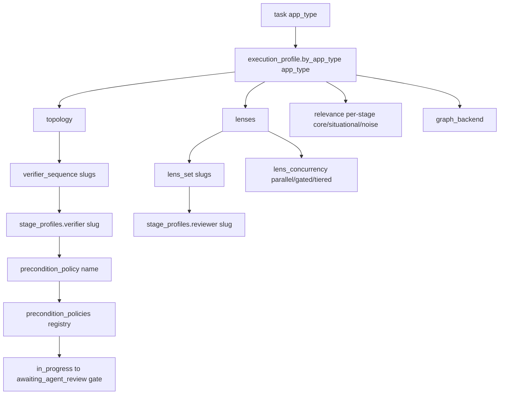

# `da` Config System + Execution/Stage/Verifier/Reviewer-Lens Profiles — Exhaustive Reference

> Source of record: `~/proj-docs/dot-agents` (module `github.com/AGOrcha/dot-agents`).
> Installed binary: **`da version 0.4.2`** (`/opt/homebrew/bin/da`). Repo HEAD is ahead of the
> shipped binary in places (see **§13 Binary vs source divergences**).
> Every claim below is cited to `path:line`, the exact struct/field, or the exact
> `da … --help` / live command output captured against this repo.

This file documents (a) the layered config system and (b) the **execution profile / stage
profiles / verifier-sequence / reviewer lens-set / precondition-policy** model that the swarm's
impl→verify→review→gate stages are meant to mirror. The heart is **§8–§11**.

---

## 0. TL;DR mental model (what the swarm mirrors)



- A **task names an `app_type`** (`go-cli`, `ideation`, `docs`, …).
- `app_type` → `execution_profile.by_app_type[app_type]` → four facets:
  **relevance** (noise filter), **topology** (executor:verifier:reviewer fan-out + `verifier_sequence`),
  **lenses** (`lens_set` + `lens_concurrency`), **graph_backend**.
- Each **verifier slug** in `topology.verifier_sequence` resolves to a `stage_profiles.verifier.<slug>`
  entry (label + `prompt_files` + optional `precondition_policy`).
- The **first verifier profile that names a `precondition_policy`** selects the gate that opens the
  `in_progress → awaiting_agent_review` transition; unset ⇒ built-in **`default`** gate.
- Each **lens slug** in `lenses.lens_set` resolves to a `stage_profiles.reviewer.<slug>` entry;
  `lens_concurrency` says how they run.
- All of this is resolved through the **layered resolver** (product → user → org → team → repo →
  project-local), scope-mergeable via `CategoryMapMerge`, lock-backed (`.agentsrc.lock`), and read
  offline by `da config explain` / `da config relevance` / verifier dispatch.

---

## 1. `da` config command tree (recursed help)

```
da config                       Inspect effective .agentsrc.json config (operator-facing introspection surface)
├── explain [field-path]        Effective value of one field + full layer stack; AUTO-LOCKS on run (like `uv tree`)
├── sync                        Re-fetch ALL declared layers regardless of TTL, re-resolve, rewrite lock ("uv --upgrade")
├── lint                        Validate repo-local + each `extends` layer against schemas/agentsrc.schema.json
├── verify                      Offline repo setup contract checks (NO layer re-fetch)
├── relevance                   Resolve a task's execution-profile FACETS by app_type (the profile inspection surface)
└── migrate                     Rewrite a legacy v1 .agentsrc.json into v2 (opt-in, backs up original)
```

Global flags on every `da` command (`da --help`): `-n/--dry-run`, `-f/--force`, `--json`,
`-v/--verbose`, `-y/--yes`.

### 1.1 `da config explain [field-path]`
Prints the effective value of one dot-path field plus the full layer stack that produced it.
- **AUTO-LOCKS on run**: consumes the committed units lock; when stale/absent it re-resolves and
  rewrites the lock; when fresh it reads it back read-only (help text; impl `commands/config/explain.go`,
  seam `resolveLayered = cfg.NewLayeredResolver().ResolveLocked(projectPath)` at `explain.go:120-122`).
- Layer stack printed (lowest precedence first):
  `[1] product-defaults` → `[2] user-local (~/.agents/.agentsrc.json)` → `[.] imported extends (at locked SHA)` → `[n] repo-local (./.agentsrc.json)`.
- Flags: `--all` (whole effective config w/ provenance), `--flags` (features.* resolution),
  `--origin-only` (winning layer id), `--value-only` (value, JSON for non-scalars), and the
  **profile-context** flags: `--app-type`, `--stage`, `--role`, `--harness` (resolve the effective
  profile *bundle* — see §11.2).

### 1.2 `da config sync`
Explicit upstream re-check (the `uv --upgrade` analog): forces every source's effective cache key
to revalidate, re-resolves the full stack, updates each layer's resolved SHA + fetch timestamp in
`.agentsrc.lock`. `--layer source-id:path` scopes the *report* (full stack still re-resolved). With
global `-n/--dry-run` it previews without touching the lock. Distinct from `da refresh` (which only
re-projects local outputs). Impl `commands/config/sync.go`; resolver
`cfg.NewLayeredResolver().WithRefresh(true)` (`sync.go:168`).

### 1.3 `da config lint`
Validates repo-local `.agentsrc.json` + each declared `extends` layer against
`schemas/agentsrc.schema.json`. Local layers read from disk; a locked remote layer validated against
cached bytes at its lock SHA; an unlocked/uncached remote is **skipped** (run `da config sync` first).
Exits non-zero if any layer invalid; skips don't fail. Impl `commands/config/lint.go`.

### 1.4 `da config verify`
Offline setup-contract checks, **no fetch** (`commands/config/verify.go`). Checks:
`manifest` (present + parses), `config-layers` (each source resolves offline; local paths exist),
`locked-layers` (each `extends` layer pinned in lock; remote assets present in cache at locked SHA),
`binary` (optional integrations ready — code-review-graph). Exits non-zero on failure; warnings
(optional integration absent, remote layer unconfirmable offline) don't fail. Narrower than `da doctor`.

### 1.5 `da config relevance` — the profile facet resolver (THE profile inspection surface)
Resolves the effective `execution_profile` layer for a task and prints the requested facet.
`--filter` slices: `units | topology | lenses | graph | lessons | all` (default `all`).
App_type selection precedence (§11.1): `--task`'s own app_type → plan `default_app_type` → `--app-type`.
An app_type with no profile entry is **not an error** — defaults/empty facets render (`matched:false`).
`--recompute` (+`--write`) switches to the explicit driver-event path that proposes core/situational/
noise class changes from the scored iteration corpus — never auto-applies, no clock. Flags:
`--app-type`, `--filter`, `--stage`, `--task <plan-id>/<task-id>`, `--package` (repeatable),
`--path` (repeatable), `--recompute`, `--write`. `--json` emits a stable envelope (`relevanceResult`).

### 1.6 `da config migrate`
Rewrites a legacy **v1** manifest to **v2**. Detects legacy shape (old `version`, or the deprecated
keys `verifier_profiles`/`reviewer_profiles`/`app_type_verifier_map`), backs up original to
`.agentsrc.json.v1.bak`, folds the legacy keys into the unified `stage_profiles`/`execution_profile`
model (same fold the loader already does), bumps `version`. Idempotent (clean v2 = no-op). Per-repo.
Impl `commands/config/migrate.go`.

### 1.7 `da explain [topic]` (concept docs, NOT live repo state)
Prints operator-facing concept docs. Topics: `manifest`, `links`, `platforms`, `structure` (bare
`da explain` prints the overview + topic list). Deliberately separate from `da config` (which reports
*live* repo state). **Gotcha:** `da explain --json` still prints the human overview (the `--json`
flag is effectively ignored for the overview page — observed live).

---

## 2. The `.agentsrc.json` manifest model (`AgentsRC`)

The committed repo manifest. Struct `AgentsRC` — `internal/config/agentsrc.go:266-372`. Schema versions
(doc comment `agentsrc.go:255-264`): **v1** legacy (only the original surface meaningful); **v2** activates
the additive fields; every v2 field is `omitempty` so a v1 file round-trips byte-for-byte.
`AgentsRCFile = ".agentsrc.json"` (`agentsrc.go:916`). Schema `version` enum is `[1,2]`
(`schemas/agentsrc.schema.json:15-18`).

```go
// internal/config/agentsrc.go:266
type AgentsRC struct {
    Schema   string        `json:"$schema,omitempty"`
    Version  int           `json:"version"`
    Project  string        `json:"project,omitempty"`
    Skills   []string      `json:"skills,omitempty"`
    Rules    []string      `json:"rules,omitempty"`
    Agents   []string      `json:"agents,omitempty"`
    Hooks    StringsOrBool `json:"hooks"`
    MCP      StringsOrBool `json:"mcp"`
    Settings bool          `json:"settings"`
    Sources  []Source      `json:"sources"`
    KG       *AgentsRCKG   `json:"kg,omitempty"`

    // --- v2 additive (config-distribution-model §3) ---
    RepoID   string            `json:"repo_id,omitempty"`   // canonical repo identity; PROTECTED (imports can't override)
    Extends  []LayerRef        `json:"extends,omitempty"`   // "source-id:layer-path[@version]"; git|http|local tiers only
    Packages []PackageRef      `json:"packages,omitempty"`  // "source-id:artifact-path@version-spec"; any source kind
    Features map[string]string `json:"features,omitempty"`  // feature-flag overrides

    ExecutionProfile *ExecutionProfile `json:"execution_profile,omitempty"` // §8 — the routing layer
    PRSource         *AgentsRCPRSource `json:"pr_source,omitempty"`         // config-driven PR event producer

    StageProfiles map[string]map[string]StageProfile `json:"stage_profiles,omitempty"` // stage -> slug -> profile (§10)
    PreconditionPolicies map[string]PreconditionPolicySpec `json:"precondition_policies,omitempty"` // named gate registry (§10.2)

    Locks           *PolicyLockSpec              `json:"locks,omitempty"`            // §4 authority-axis locks
    AuthorityGrants map[string]AuthorityScope    `json:"authority_grants,omitempty"` // §4 source-authority registry
    LayeringPolicy  *LayeringPolicy              `json:"layering_policy,omitempty"`  // §5 Phase-1 governance
    Manifests       map[string]ManifestSpec      `json:"manifests,omitempty"`        // distributable config manifest units (L2)

    ExtraFields map[string]json.RawMessage `json:"-"` // unknown keys round-tripped on Save()
    LegacyKeys  []string                   `json:"-"` // deprecated v1 keys observed (for init/doctor warnings)
}
```

- **`StringsOrBool`** (`agentsrc.go:159-236`): marshals as `true`(all) / `false`(none) / `["name",…]`(named).
- **`Source`** (`agentsrc.go:888-914`): `type` = `local|git|http|oci`; `path`/`url`/`ref`; v2 adds
  `id` (referenced by extends/packages), `cache_ttl` (tier-1 TTL; ignored for oci), `auth`
  (opaque pass-through), `cache_keys` (kind-default content cache-key override).
- **`LayerRef`** (`agentsrc.go:502-513`): bare string `"acme:org/base"` OR object `{"ref":"…","optional":true}`.
- **`PackageRef`** (`agentsrc.go:552-558`): string ref, object form accepted forward-compat.
- **Legacy fold on load** (`agentsrc.go:1132-1182`, schema `deprecated:true` at `:220-231`): the deprecated
  keys `verifier_profiles` → `stage_profiles.verifier`, `reviewer_profiles` → `stage_profiles.reviewer`,
  `app_type_verifier_map` → `execution_profile.by_app_type.<t>.topology.verifier_sequence`. New keys win;
  legacy only fills gaps; folded keys are never re-emitted.
- **Load/Save**: `LoadAgentsRC(projectPath)` (`agentsrc.go:918`), `(*AgentsRC).Save` (`agentsrc.go:937`).
- **Merge categories** (top-level key → how it combines across layers) `resolver.go:59-73`:

  | key | category |
  |---|---|
  | `skills`, `agents`, `rules` | `CategorySetUnion` (union, stable order, dedup) |
  | `stage_profiles`, `verifier_profiles`, `reviewer_profiles`, `app_type_verifier_map`, `execution_profile`, `features`, `kg` | `CategoryMapMerge` (deep merge by key, recurse nested maps) |
  | `sources`, `extends`, `packages` | `CategoryOrderedReplace` (whole array replaced by highest writer) |
  | anything else | `CategoryScalar` (last writer wins) — default |

  `CategoryMapMerge` on `execution_profile` is what makes facet overrides **facet-independent**: a
  higher layer that sets only `relevance` deep-merges over the base so `topology`/`lenses` are
  preserved (`resolver.go:42-46`).

---

## 3. The layered resolver (product → user → org → team → repo → project-local)

Interface `Resolver` (`resolver.go:21-26`). Two implementations:
- **`FlatResolver`** (`resolver.go:88-96`): built-in product defaults → user-local (`~/.agents/.agentsrc.json`,
  optional) → repo-local (`./.agentsrc.json`, required). No network/git; `extends` recorded but not followed.
- **`LayeredResolver`** (`resolver.go:514-538`): extends the flat set with tier-1 `extends` imports
  (spec §6 pass 1): `product-defaults → user-local → extends[] (left→right, git/http/local/oci) → repo-local`.
  Fetches + caches each layer content-addressed by SHA, validates against the layer schema, records SHAs to
  `.agentsrc.lock`. Concurrency-bounded parallel fetch; single serialized lock write (`resolver.go:803-887`).

### 3.1 Layer identifiers & precedence
`snapshot.go:15-20`: `LayerProductDefaults = "product-defaults"`, `LayerUserLocal = "user-local"`,
`LayerRepoLocal = "repo-local"` (+ `LayerProjectLocal`). Effective stack ordering (value-precedence,
lowest first) — from `TestLayeredResolver…` fixtures & `overlay_test.go:105`:
`product-defaults, [imported extends…], repo-local, project-local`.

- **Product defaults are EMPTY at the CLI level.** `NewFlatResolver()` seeds `ProductDefaults: map[string]any{}`
  (`resolver.go:100-102`); the config/workflow commands construct `cfg.NewLayeredResolver()` **without**
  `WithProductDefaults(...)` (`explain.go:120-122`, `app_types.go:25-27`). ⇒ **`da` ships no built-in
  app_types/profiles.** Every app_type in a repo comes from that repo's `.agentsrc.json` (+ user-local +
  any `extends` layers). (For the swarm: there is no hidden default profile catalog — you resolve exactly
  what the repo declares.)

### 3.2 Protected fields
`snapshot.go:24-30`: `var ProtectedFields = []string{"repo_id", "project"}` — an imported (non-repo-local)
layer must **not** override these; an attempt is dropped and recorded as a non-fatal `ProvenanceWarning`.

### 3.3 Lockfile (`.agentsrc.lock`)
`AgentsLockFile = ".agentsrc.lock"` sibling of the manifest (`resolver.go:387,404-406`). Owned sections:
config resolver writes `config` + a `packages` stub; §7A **units** section is the steady state
(`readLockedLayersFromUnits`, `resolver.go:470-510`). `LockedLayer` (`resolver.go:408-428`) records resolved
SHA + cache TTL window + cache key. **Offline** mode serves the last resolved SHA from the lock and never
contacts the source (`WithOffline`, `fetchLayer` at `resolver.go:935-987`). `ResolveLocked` is the read-only,
lock-backed path all inspection consumes; for a flat project (no `extends`) it degrades to the FLAT layer set
(`resolve_locked.go:36-55`).

### 3.4 Snapshot & provenance
`resolveSnapshot` (`resolver.go:168-221`) merges ordered layers into a `Snapshot{Effective AgentsRC,
Layers, Provenance, Warnings, …}`. `populateProvenance` fills the per-field layer stack; protected fields
credit only repo-local. This is what `da config explain --json` renders (per-field `FieldExplanation`).

---

## 4. The AUTHORITY axis (org > team > repo > user)

`internal/config/authority.go`. Distinct from **value precedence** — §15 D1a deliberately splits two axes.

```go
// authority.go:37-64  — the authority-rank scope constants
AuthProduct      AuthorityScope = "product"        // floor: ships defaults, ZERO authority
AuthPublic       AuthorityScope = "public"         // value-only, zero authority; default authority of an UNGRANTED extends layer
AuthRuntime      AuthorityScope = "runtime"        // highest value-precedence, zero authority (sets values, never locks)
AuthProjectLocal AuthorityScope = "project-local"  // uncommitted per-project overlay; value-only, zero authority
AuthUser         AuthorityScope = "user"           // LOWEST authority rung (below repo)
AuthRepo         AuthorityScope = "repo"           // shared committed scope; below team
AuthTeam         AuthorityScope = "team"           // above repo, below org
AuthOrg          AuthorityScope = "org"            // highest authority; locks/caps absolute over all lower
```

- **`AuthorityRankOf`** (`authority.go:70`): `org=4 > team=3 > repo=2 > user=1`; every value-only scope
  (product/public/runtime/project-local) = `0` (may set values, never emit a binding lock). Higher rank binds lower.
- **`CanonicalScopeOrdering()`** (`authority.go:103-109`) — a fixed code constant, **not manifest-overridable**:
  - `AuthorityRank: [org, team, repo, user]`
  - `ValuePrecedence: [product, user, org, team, repo, project-local, runtime]`
- **Locks** (`AgentsRC.Locks` → `PolicyLockSpec`, schema `:105-129`): `value_locks` (pin a field, reject
  lower-scope writes), `deny_locks` (subtract a set member, deny-overrides). **`force_allow` is ALWAYS invalid**
  and aborts the resolve. A lock binds only scopes ranked below its owner.
- **Authority grants** (`AgentsRC.AuthorityGrants`, schema `:131-137`): per-source allowlist
  `source-id → scope it may carry`; honored only if written by a layer whose own authority ≥ conferred scope
  (no self-blessing). `resolveAuthorityGrants` at `authority.go:238`.

For the swarm: authority is the mechanism by which an **org layer can force** a verifier gate / lens set that
a repo cannot weaken. The swarm need not emit locks, but must not assume it can override a locked facet.

---

## 5. The profile engine (unified-config-profiles, L1) — how facets actually resolve

`internal/config/profile.go` + `profile_resolver.go`. The **one shared two-phase selector-merge engine** all
profile kinds resolve through, on top of the §4 authority substrate. There are **ZERO profile→profile edges**
(no extends/inherits — the anti-dependency-hell decision).

- **`ProfileKind`** (`profile.go:26-38`): `app_type` (re-expresses `execution_profile.by_app_type` entries,
  deep-map-merge), `stage` (re-expresses `stage_profiles`, deep-map-merge), `agent-capability` (new: runtime-role
  tool/skill/hook/mcp bundles; additive sets union, deny subtracts).
- **`ProfileSelector`** (`profile.go:57-62`): closed key set `{role, app_type, stage, harness}`; each present key
  matched EXACTLY, absent = wildcard; unknown key = validation error.
- **`ConfigProfile`** (`profile.go:125-157`): `Ref` (`<source>:<name>`), `Kind`, `Scope` (SOURCE-derived authority,
  never self-declared), `Order` (value-axis merge position), `Selector`, `Bundle` (kind-agnostic object), `Authored`.
- **`LayeringPolicy`** (`profile.go:306-319`): `Precedence []AuthorityScope`, `Locks []ProfileLock`,
  `OverridePermissions` (three-state: nil=omitted, `{}`=lockdown, map=allowlist), `Mode` (`narrow`|`replace`).
- **Two phases** (`profile_resolver.go:10-21`): Phase 1 `resolveEffectivePolicy` merges every in-chain layering
  policy low-authority first (higher narrows lower unless `replace`); Phase 2 `ResolveProfile` selector-merges the
  matching fragments ordered by Phase-1 precedence, governed by permissions + locks. **Order-independent (H1).**
- **Value vs authority** (`profile_resolver.go:308-333`): values follow **ValuePrecedence** (repo wins over a
  granted org's *values*); only the lock/grant pass uses **authority-rank**. Imported (extends) fragments merge
  BELOW repo for values.
- **`ResolvedProfile`** (`profile_resolver.go:56-80`) is the Phase-2 output — surfaced by
  `da config explain --app-type/--stage/…` (see §11.2): `{bundle, contributing_refs, locks, policy_mode, digest, …}`.
- Legacy `execution_profile`/`stage_profiles` are re-expressed into derived profiles by
  `profile_migration.go` and proven byte-identical to the legacy `CategoryMapMerge`.

---

## 8. THE EXECUTION PROFILE model (structs) — the heart

`internal/config/execution_profile.go`. The config-v2 §15-shaped, scope-mergeable layer that routes a task's
workflow execution shape by `app_type`. Purely additive `kind=layer` fragment; merges org→team→repo→project-local
via `CategoryMapMerge`.

```go
// execution_profile.go:18
type ExecutionProfile struct {
    ByAppType    map[string]AppTypeProfile `json:"by_app_type,omitempty"` // app_type -> execution shape
    DefaultClass string                    `json:"default_class,omitempty"` // class for unlisted units; default "situational"
}

// execution_profile.go:32  — per-app_type shape: four independently scope-overridable facets
type AppTypeProfile struct {
    Relevance    map[string]RelevanceClasses `json:"relevance,omitempty"`     // facet 1: per-stage noise filter (key = stage)
    Topology     Topology                    `json:"topology,omitempty"`      // facet 2: exec:verifier:reviewer fan-out
    Lenses       Lenses                      `json:"lenses,omitempty"`        // facet 3: review-lens config
    GraphBackend string                      `json:"graph_backend,omitempty"` // facet 4: graph adapter-ref (open, not enum)
}

// execution_profile.go:66  — facet 1
type RelevanceClasses struct {
    Core        []string `json:"core,omitempty"`        // always-relevant working set for this stage
    Situational []string `json:"situational,omitempty"` // conditionally useful; also the default for unlisted units
    Noise       []string `json:"noise,omitempty"`       // suppressed (reversible view, not delete)
}

// execution_profile.go:80  — facet 2
type Topology struct {
    Executors            int      `json:"executors,omitempty"`              // parallel executor workers
    VerifiersPerExecutor int      `json:"verifiers_per_executor,omitempty"` // n exec -> VerifiersPerExecutor*n verifiers
    Reviewers            string   `json:"reviewers,omitempty"`              // "per_verifier" | "per_executor" | stringified int
    VerifierSequence     []string `json:"verifier_sequence,omitempty"`      // ordered stage_profiles.verifier slugs
}

// execution_profile.go:97  — facet 3
type Lenses struct {
    LensSet         []string `json:"lens_set,omitempty"`         // ordered review-lens slugs (stage_profiles.reviewer keys)
    LensConcurrency string   `json:"lens_concurrency,omitempty"` // "parallel" | "gated" | "tiered"
}
```

### 8.1 Relevance-class resolution (the noise filter)
- `DefaultRelevanceClass = "situational"` (`execution_profile.go:109`) — an **unlisted** unit is never silently dropped.
- `EffectiveDefaultClass()` (`:115`) falls back to `"situational"` when `default_class` unset (nil-safe).
- `ClassOf(appType, stage, unit)` (`:131`): explicit-list-first; if a unit is (mis)listed in more than one class,
  the **most conservative wins — noise > situational > core** (so an operator suppression is never overridden by a
  stale core listing).
- `SuppressNoise(appType, stage, candidates) → WorkingSet` (`:201`): reversible view; `Kept()` = core+situational
  (+unlisted default), `Suppressed()` = noise, `Candidates()` = losslessly reconstructed input. JSON round-trip safe.
- `GraphBackend`/`GraphBackendRef()` (`:59-61`): empty ⇒ inherit pipeline default (`crg`). Ref form
  `dotagents-builtin:graph/<name>@<constraint>` or bare `<name>`; resolved against the graph-backend adapter registry.

### 8.2 Schema mirror
`schemas/agentsrc.schema.json`: `execution_profile` (`:271-289`), `appTypeProfile` def (`:657-681`),
`relevanceClasses` (`:682-697`), `topology` (`:698-723`), `lenses` (`:724-739`). `default_class` enum
`["core","situational","noise"]`; `lens_concurrency` enum `["parallel","gated","tiered"]`;
`reviewers` free string (`"per_verifier"`, `"per_executor"`, or int); `graph_backend` open string, omit ⇒ `crg`.

---

## 9. `stage_profiles` + `precondition_policies` (the verifier/reviewer prompt + gate registry)

### 9.1 `StageProfile`
`stage_profiles` is `map[stage]map[slug]StageProfile` where stage ∈ `{executor, verifier, reviewer, orchestrator}`
(`agentsrc.go:308-317`). Same type serves every stage — the stage is the outer key.

```go
// agentsrc.go:661
type StageProfile struct {
    Label              string          `json:"label,omitempty"`               // human-readable name
    PromptFiles        []PromptFileRef `json:"prompt_files,omitempty"`        // base-first ordered composition
    PreconditionPolicy string          `json:"precondition_policy,omitempty"` // registry key gating in_progress->awaiting_agent_review; unset => "default"
}
```
- **`PromptFileRef`** (`agentsrc.go:596-605`): typed `{source, path, version}` object; bare-string legacy form
  (`"verifiers/unit.md"`) still accepted on read (= `{path:"…"}`). `source` empty ⇒ resolved relative to local
  repo/home search path.

### 9.2 `precondition_policies` registry + predicates
```go
// agentsrc.go:386
type PreconditionPolicySpec struct { Predicates []PredicateSpec `json:"predicates"` }
// agentsrc.go:378
type PredicateSpec struct {
    Signal string            `json:"signal"`         // registered kind, e.g. "event.pr.open", "gate.quality.sonar"
    Args   map[string]string `json:"args,omitempty"` // kind-specific, e.g. {"equals":"green"}
}
```
Schema: `precondition_policies` (`:98-104`), `preconditionPolicy` def (`:381-395`), `predicateSpec` (`:396-415`).

### 9.3 Precondition resolution chain (verifier gate)
`internal/config/precondition_resolve.go`. `ResolvePreconditionPolicy(projectPath, appType)` reads the **LOCKED**
effective config (`NewLayeredResolver().ResolveLocked`, never raw `.agentsrc.json`) so it sees the same merged config
as `da config explain`. Chain (`:52-78`, `preconditionPolicyName` `:104-116`, `verifierSequenceFor` `:121-130`):

```
app_type
  -> execution_profile.by_app_type[app_type].topology.verifier_sequence (slugs)
  -> the FIRST verifier stage profile in that sequence naming a precondition_policy
  -> that name's entry in the top-level precondition_policies registry
  -> ResolvedPreconditionPolicy{Name, Predicates}
```
- Unset name OR absent registry entry ⇒ built-in **`default`** (`Name:"default"`, empty predicates) — never an error,
  never open by omission (`:63-71`, `defaultPolicyName = "default"` `:46`).
- Config-side mirrors: `ResolvedPredicate` (`:23-28`), `ResolvedPreconditionPolicy` (`:34-40`) — the workflow package
  converts them to its own types (import-cycle avoidance, `:13-18`).

### 9.4 The built-in `default` gate (what unset resolves to)
`commands/workflow/preconditions.go:180-188` — `defaultPreconditionPolicy` (the historical PR/go-cli gate):
```go
Predicates: [
  {Signal: "event.pr.open"},                                      // PR must be open for the task branch
  {Signal: "signal.ci.rollup", Args: {"equals": events.RollupGreen}}, // CI rollup == green
  {Signal: "gate.quality.sonar"},                                 // Sonar quality gate passes
  {Signal: "metric.new_code_issues", Args: {"equals": "0"}},      // zero new-code issues
]
```
Signal kind constants `preconditions.go:60-63`. `evaluatePolicy` (`:195-209`): empty policy ⇒ evaluates the default;
first failing predicate's reason is surfaced; an unregistered signal kind is **fail-closed unsatisfied** (never
silently passes).

---

## 10. Per-`app_type` table (as shipped in this repo)

**Provenance:** the dot-agents repo's own `./.agentsrc.json` (`version: 1`, but uses the new `execution_profile`
+ `stage_profiles` keys, not the deprecated legacy keys). Confirmed live via `da workflow app-types --json`
and `da config relevance --json`. Because product defaults are empty (§3.1), THIS repo manifest is the only source
of these three app_types.

| app_type | topology (exec / vpe / reviewers) | verifier_sequence | reviewer lens_set | lens_concurrency | graph_backend | precondition_policy |
|---|---|---|---|---|---|---|
| **go-cli** | 1 / 2 / `per_verifier` | `unit`, `cli-runner` | `architecture-standards`, `acceptance-invariants`, `adversarial`, `cross-harness-adversarial` | `gated` | (unset ⇒ crg) | none declared ⇒ built-in **`default`** gate |
| **ideation** | 3 / 3 / `per_executor` | `schema-check`, `citation-check`, `task-schedule` | `architecture-standards`, `acceptance-invariants`, `adversarial` | `parallel` | (unset ⇒ crg) | none declared ⇒ **`default`** |
| **docs** | 1 / 1 / `per_executor` | `schema-check`, `citation-check`, `cli-runner` | `architecture-standards`, `acceptance-invariants` | `parallel` | (unset ⇒ crg) | none declared ⇒ **`default`** |

**Per-app_type `relevance` (per-stage core/situational/noise), as shipped:**

- **go-cli**
  - `orchestrate`: core `[orchestrator-session-start, plan-wave-picker, loop-worker]`; noise `[article-extract, playwright]`
  - `verify`: core `[verifier, test-runner]`
  - `review`: core `[thermo-nuclear-code-quality-review, review-pr]`; situational `[self-review, review-delta]`
- **ideation**
  - `orchestrate`: core `[kg-ideate, deep-research, plan-wave-picker]`; situational `[article-extract]`; noise `[test-runner, loop-worker]`
  - `verify`: core `[verifier]`
  - `review`: core `[architecture-standards, acceptance-invariants, adversarial]`
- **docs**
  - `verify`: core `[verifier]`
  - `review`: core `[architecture-standards, acceptance-invariants]`
- `default_class`: `situational` (repo-wide).

**Repo `stage_profiles` as shipped (slug → label → prompt_files), none carry a `precondition_policy`:**

`stage_profiles.verifier`:
- `unit` — "Unit (Go)" → `verifiers/verifier.base.md`, `verifiers/unit.md`, `verifiers/unit.project.md`
- `cli-runner` — "CLI runner (built-binary smoke)" → `…/verifier.base.md`, `verifiers/cli-runner.md`, `verifiers/cli-runner.project.md`
- `schema-check` — "Schema check (artifacts validate)" → base, `verifiers/schema-check.md`, `…schema-check.project.md`
- `citation-check` — "Citation check (references resolve)" → base, `verifiers/citation-check.md`, `…citation-check.project.md`
- `task-schedule` — "Task schedule (DAG sound)" → base, `verifiers/task-schedule.md`, `…task-schedule.project.md`

`stage_profiles.reviewer` (the lens slugs):
- `acceptance-invariants` — "Acceptance-invariants lens" → `reviewers/reviewer.base.md`, `reviewers/acceptance-invariants.md`, `…acceptance-invariants.project.md`
- `adversarial` — "Adversarial lens" → base, `reviewers/adversarial.md`, `…adversarial.project.md`
- `architecture-standards` — "Architecture-standards lens" → base, `reviewers/architecture-standards.md`, `…architecture-standards.project.md`
- `cross-harness-adversarial` — "Cross-harness adversarial lens" → base, `reviewers/cross-harness-adversarial.md`, `…cross-harness-adversarial.project.md`

**Shipped prompt catalog** (the superset a swarm can wire slugs to):
- `internal/scaffold/home/starter/prompts/verifiers/`: `verifier.base.md`, `unit.md`, `cli-runner.md`,
  `schema-check.md`, `citation-check.md`, `task-schedule.md`, `api.md`, `batch.md`, `streaming.md`, `ui-e2e.md`.
- `internal/scaffold/home/starter/prompts/reviewers/`: `reviewer.base.md`, `acceptance-invariants.md`,
  `adversarial.md`, `cross-harness-adversarial.md` (+ `references/cross-harness-routing.md`).
- Repo project-overlay prompts (`.agents/prompts/`): `verifiers/{unit,cli-runner,schema-check,citation-check,task-schedule}.project.md`,
  `reviewers/{acceptance-invariants,adversarial,architecture-standards,cross-harness-adversarial}.project.md`,
  plus `impl-agent.project.md`, `review-agent.project.md`, `isp.prompt.md`.
- The starter home manifest `internal/scaffold/home/starter/.agentsrc.json` ships **only** the four `reviewer`
  stage profiles (base+lens prompt_files) — NO `execution_profile`, NO verifier profiles. So a freshly-onboarded
  repo has reviewer lens prompts but must author its own app_types/verifier_sequence.

> **Note (design vs shipped):** `.agents/workflow/specs/app-type-profiles/design.md` sketches a richer *future*
> profile YAML (`composes:`, `write_scope_kind`, `impl_output_kind`, `verifier_chain` with semver ranges,
> `review_kind`/`review_skill`). That is **draft**; the SHIPPED implementation is the `execution_profile` +
> `stage_profiles` model above (design.md §7 "config-architecture readiness: this spec's foundation has SHIPPED").
> The design's `verifier_chain`→`topology.verifier_sequence`, `review_kind`→`lenses.lens_set`,
> `graph_backend`→`graph_backend`, `write_scope_kind`→handled by fanout `--write-scope`.

---

## 11. How `da config relevance` / `explain` consume the profiles

### 11.1 `da config relevance` — facet inspection
Impl `commands/config/relevance.go`. `resolveExecutionProfile(snap)` extracts the effective `execution_profile`
from the layered snapshot (`:330-335`); a missing layer yields a non-nil empty profile (safe defaults).
`resolveAppType` precedence (`:341-362`): `--task`'s own app_type → plan `default_app_type` → `--app-type` flag
→ `("","none")`. `appTypeMatched` (`:462-468`) sets `matched:false` for an unlisted app_type (not an error).

**JSON envelope `relevanceResult`** (`relevance.go:48-76`) — the stable machine shape:
```json
{ "app_type": "...", "app_type_source": "task|plan-default|flag|none",
  "stage": "...", "filter": "units|topology|lenses|graph|lessons|all", "matched": true,
  "units": {...}, "topology": {...}, "lenses": {...}, "graph": {...}, "lessons": {...} }
```
Facet structs: `unitsFacet` (`:81-96` — `default_class`, `by_stage` classes, live `working_set` kept/suppressed via
`SuppressNoise`), `workingSetView` (`:101-107`), `topologyFacet` (`:110-115`), `lensesFacet` (`:118-121`),
`graphFacet` (`:129-147` — resolves the adapter-ref against the registry, reports `resolved`/`adapter`/`version`/`error`),
`lessonsFacet`/`lessonResult` (`:151-160`).

**Live captures against this repo:**
```
$ da config relevance --filter topology --app-type go-cli --json
{ "app_type":"go-cli","app_type_source":"flag","filter":"topology","matched":true,
  "topology":{"executors":1,"verifiers_per_executor":2,"reviewers":"per_verifier",
              "verifier_sequence":["unit","cli-runner"]} }

$ da config relevance --filter lenses --app-type docs --json
{ ...,"filter":"lenses","matched":true,
  "lenses":{"lens_set":["architecture-standards","acceptance-invariants"],"lens_concurrency":"parallel"} }

$ da config relevance --filter units --app-type go-cli --stage review --json
{ ...,"stage":"review","filter":"units","matched":true,
  "units":{"default_class":"situational",
           "by_stage":{"review":{"core":["thermo-nuclear-code-quality-review","review-pr"],
                                  "situational":["self-review","review-delta"]}},
           "working_set":{"review":{"kept":["thermo-nuclear-code-quality-review","review-pr",
                                             "self-review","review-delta"],"suppressed":null}}} }
```

### 11.2 `da config explain` — profile bundle context
`--app-type/--stage/--role/--harness` build a `ProfileContext` and render the **Phase-2 `ResolvedProfile`
bundle** via the §5 engine. Live capture:
```
$ da config explain --app-type go-cli --stage review --json
{ "bundle": { "lenses": {...}, "relevance": {...}, "topology": {...} },
  "contributing_refs": ["repo-local:execution-profile:go-cli"],
  "locks": [], "policy_mode": "narrow", "digest": "72f42e498cac2228" }
```
`da config explain --all --json` prints the whole effective config with per-field provenance;
`--flags` prints `features.*` resolution; `--origin-only` prints the winning layer id.

### 11.3 `da workflow app-types` (the app_type discovery surface)
Consumes the SAME lock-backed path (`config.NewLayeredResolver().ResolveLocked`, `app_types.go:25-27`).
Live: lists `docs`, `go-cli`, `ideation` with their `verifier_sequence`, sourced from
`~/proj-docs/dot-agents/.agentsrc.json`. Flags: `--verbose`, `--format {flag,task,plan,doc}`.

---

## 12. How verifier/reviewer DISPATCH consumes these (the consumer seams)

The dispatch machinery lives in `commands/workflow` (out of this doc's edit scope, but the consumption points):

1. **Verifier gate.** `commands/workflow/preconditions.go:229-235`:
   `resolvePreconditionPolicy(projectPath, appType)` → `config.ResolvePreconditionPolicy` (§9.3, LOCKED config)
   → converts to workflow `PreconditionPolicy` (`preconditionPolicyFromConfig` `:242-252`). `evaluatePolicy`
   (`:195`) gates the `in_progress → awaiting_agent_review` transition; empty ⇒ built-in `default` (§9.4).
2. **Verifier sequence.** `da workflow fanout` resolves `topology.verifier_sequence` from the task's `app_type`
   onto the delegation bundle (`verification.app_type` + `verifier_sequence`); overridable with
   `--verifier-sequence <csv>`. Delegation bundle example (`.agents/.../bundle.yaml`): `app_type: go-cli`,
   `verifier_sequence: [unit]` / `[unit, cli-runner]`.
3. **Prompt composition.** `da workflow resolve-prompt --kind {executor|verifier|reviewer|orchestrator} --slug <slug>`
   resolves a `stage_profiles.<kind>.<slug>`'s base-first, scope-resolved `prompt_files`. Live JSON:
   ```
   $ da workflow resolve-prompt --kind verifier --slug cli-runner --json
   { "kind":"verifier","slug":"cli-runner","matched":true,
     "entries":[ {"ref":"verifiers/verifier.base.md","scope":"unresolved","exists":false},
                 {"ref":"verifiers/cli-runner.md","scope":"unresolved","exists":false},
                 {"ref":"verifiers/cli-runner.project.md",
                  "resolved":"~/proj-docs/dot-agents/.agents/prompts/verifiers/cli-runner.project.md",
                  "scope":"repo-local","exists":true} ] }
   ```
   (base/home prompts show `unresolved` here because `~/.agents/prompts/` isn't populated in this checkout —
   a real onboarding gotcha: only project-overlay `.project.md` prompts resolve without a home install.)
4. **Verdict recording.** `da workflow verify record` writes the verification-log + typed result artifact:
   - Verifier: `--kind test|lint|build|format|custom --status pass|fail|partial|unknown --task <id>
     --verifier-type <slug> --command "…" --summary "…"` → writes `.result.yaml` keyed by task + verifier-type.
   - Reviewer: `--kind review --task <id> --phase1-decision accept|reject|escalate
     --phase2-decision accept|reject|escalate [--overall-decision …] [--failed-gate <slug>]…
     [--escalation-reason …] [--reviewer-notes …] --summary "…"` → `review-decision.yaml`.
   (Handoff note B.2/B.4 flags that per-lens `verify record --kind review --lens <lens>` + `merge-back --lens`
   accumulation is the *designed target* for lens-labelled verdicts; the shipped `--phase{1,2}-decision` surface
   is the current two-phase shape.)

---

## 13. Binary (0.4.2) vs source divergences observed

- **`da config` subtree is present and matches source** in 0.4.2 (`explain/sync/lint/verify/relevance/migrate`)
  and `--app-type/--stage/--role/--harness` profile-context flags on `explain` are live.
- **`da config relevance --filter all` HARD-FAILS in this repo** because the `lessons` facet parses
  `.agents/lessons/<name>/LESSON.md` frontmatter and one lesson (`test-stub-upgrade-pattern`) has malformed YAML:
  `✗ Error: parsing lesson "test-stub-upgrade-pattern": yaml: line 2: mapping values are not allowed in this context`.
  ⇒ For non-interactive/swarm use **avoid `--filter all`; slice the facet you need**
  (`--filter topology|lenses|units|graph`). This is a repo-data issue, not a binary bug, but it kills the `all` path.
- **`da explain --json` ignores `--json`** for the overview page (prints human text) — cosmetic.
- The repo `.agentsrc.json` is `version: 1` yet uses the v2 `execution_profile`/`stage_profiles` keys directly
  (they load fine on v1 via the additive-fields design); `da config migrate` would bump it to v2. No functional
  divergence, but a swarm reading `version` should not infer facet availability from it.
- **No built-in product-defaults profiles** in the binary (§3.1): a swarm cannot rely on `da` shipping any
  app_type — it must resolve the target repo's own manifest.

---

## Swarm-relevant hooks

**The stage-to-profile mapping the swarm mirrors** (impl → verifier(s) → reviewer-lens(es) → gate):

```
task.app_type
  │
  ├─ EXECUTOR stage  = topology.executors  (parallel workers; fan-out shape)
  │
  ├─ VERIFIER stage  = topology.verifier_sequence[]  (ordered slugs)
  │        each slug → stage_profiles.verifier.<slug>.prompt_files  (compose the verifier prompt)
  │        GATE      → first verifier slug w/ precondition_policy → precondition_policies[name]
  │                    → predicates over event/signal contract; unset ⇒ built-in `default` gate
  │
  └─ REVIEWER stage  = lenses.lens_set[]  (ordered lens slugs) run per lenses.lens_concurrency
           each slug → stage_profiles.reviewer.<slug>.prompt_files  (compose the lens prompt)
```

**Exact non-interactive commands a swarm agent invokes** (all read the LOCKED effective config offline; add
`--json` for machine output, `-y/--yes` to auto-confirm, `-n/--dry-run` to preview):

| Purpose | Command |
|---|---|
| Discover app_types + their verifier_sequence | `da --json workflow app-types` |
| Resolve full profile bundle for a context | `da config explain --app-type <t> --stage <s> --json` |
| Resolve topology (fan-out + verifier_sequence) | `da config relevance --filter topology --app-type <t> --json` |
| Resolve reviewer lens_set + concurrency | `da config relevance --filter lenses --app-type <t> --json` |
| Resolve per-stage relevance/noise working set | `da config relevance --filter units --app-type <t> --stage <s> --json` |
| Resolve graph backend adapter-ref | `da config relevance --filter graph --app-type <t> --json` |
| Resolve app_type FROM a plan task | `da config relevance --filter topology --task <plan-id>/<task-id> --json` |
| Compose a verifier prompt | `da --json workflow resolve-prompt --kind verifier --slug <slug>` |
| Compose a reviewer-lens prompt | `da --json workflow resolve-prompt --kind reviewer --slug <lens>` |
| Delegate w/ bounded scope + verifier chain | `da workflow fanout --plan <p> --task <t> --owner <id> --write-scope <paths> [--verifier-sequence unit,cli-runner]` |
| Record a verifier verdict | `da workflow verify record --kind test --status pass --task <t> --verifier-type <slug> --command "…" --summary "…"` |
| Record a reviewer verdict | `da workflow verify record --kind review --task <t> --phase1-decision accept --phase2-decision accept --summary "…" [--failed-gate <slug>] [--escalation-reason …]` |
| Validate manifest + layers | `da config lint --json` |
| Offline setup contract check | `da config verify --json` |
| Force upstream re-check + relock | `da config sync --json` (`-n` to preview) |
| Migrate v1→v2 manifest | `da config migrate` (`--dry-run` first) |

**The precondition-policy resolution the gate consumes** (mirror for the swarm's gate node):
`config.ResolvePreconditionPolicy(projectPath, appType)` walks
`app_type → topology.verifier_sequence → first verifier profile with precondition_policy → precondition_policies[name]`;
unset ⇒ `Name:"default"` (the workflow `default` gate = `event.pr.open` ∧ `signal.ci.rollup==green` ∧
`gate.quality.sonar` ∧ `metric.new_code_issues==0`). Gate is **never open by omission**; an unregistered signal
is fail-closed unsatisfied.

**Gotchas / invariants a swarm MUST respect:**
- **Slice facets, never `--filter all`** in this repo — the `lessons` facet hard-fails on a malformed LESSON.md.
  `topology`/`lenses`/`units`/`graph` are independently safe.
- **`matched:false` is normal, not an error** — an app_type with no `by_app_type` entry renders defaults/empty facets.
- **No shipped defaults** — `da` product defaults are empty; the target repo's `.agentsrc.json` (+ user-local +
  `extends`) is the ONLY source of app_types/verifier_sequence/lens_set. A swarm must resolve the repo, not assume.
- **`execution_profile` merges via `CategoryMapMerge`** (facet-independent): an org/team `extends` layer can add
  or override a single facet without wiping the others; imported layers merge BELOW repo for VALUES but authority
  locks (org>team>repo>user) can pin/deny facets the repo cannot override — inspect `da config explain … --json`
  `locks`/`policy_mode`/`contributing_refs` before assuming a facet is repo-controlled.
- **Prompt files resolve by scope search path**; without a `~/.agents/` home install only `.project.md`
  overlays resolve (`scope:"repo-local"`), base/home prompts show `scope:"unresolved"`. Ensure the home is
  installed (or supply overlay prompts) before relying on composed verifier/reviewer prompts.
- **Read the LOCKED path** — inspection commands consume `.agentsrc.lock` offline; run `da config sync` (online)
  once to (re)populate the lock/cache if an `extends` layer is unlocked, else `explain`/`relevance`/gate resolution
  degrade to the flat local stack (a flat project with no `extends` resolves fine offline by construction).
- **Verifier gate reads config, not raw JSON** — to change a gate, edit `precondition_policies` + point a verifier
  slug's `precondition_policy` at it; the resolver picks the FIRST verifier slug in the sequence that names one.

### Source index (primary citations)
- Execution profile structs: `internal/config/execution_profile.go:18,32,66,80,97,109,115,131,201`
- Precondition resolution: `internal/config/precondition_resolve.go:23,34,52,104,121` + default gate `commands/workflow/preconditions.go:60,180,195,229,242`
- Manifest / stage profiles / policies: `internal/config/agentsrc.go:266,378,386,596,661,888` ; schema `schemas/agentsrc.schema.json:98,271,657,682,698,724`
- Layered resolver / merge / lock: `internal/config/resolver.go:21,59,88,168,404,408,514,935` ; `snapshot.go:15,24` ; `resolve_locked.go:36`
- Authority axis: `internal/config/authority.go:37,70,103` ; profile engine `internal/config/profile.go:26,57,125,306` + `profile_resolver.go:10,56,308`
- Relevance CLI: `commands/config/relevance.go:48,81,110,118,129,330,341` ; explain seam `commands/config/explain.go:120` ; app-types `commands/workflow/app_types.go:25`
