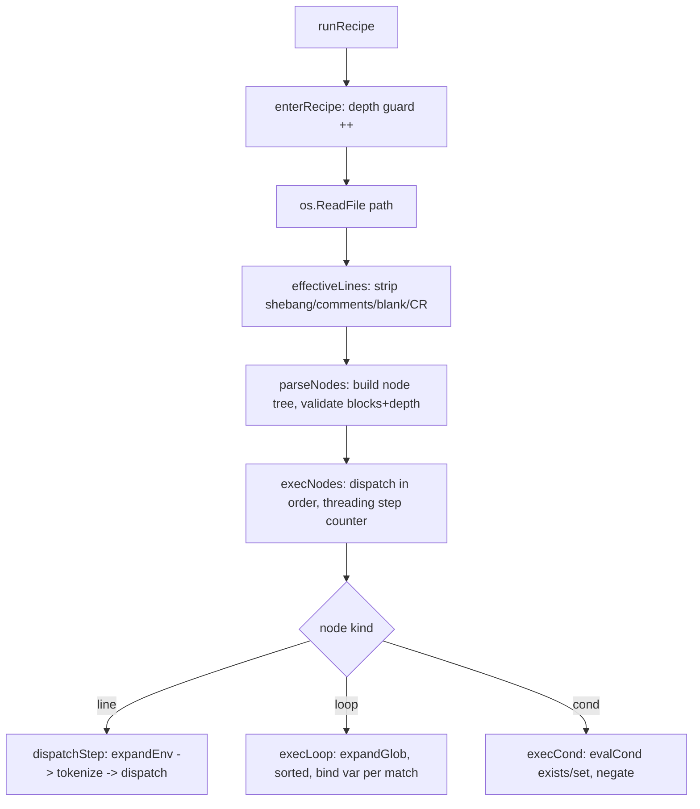
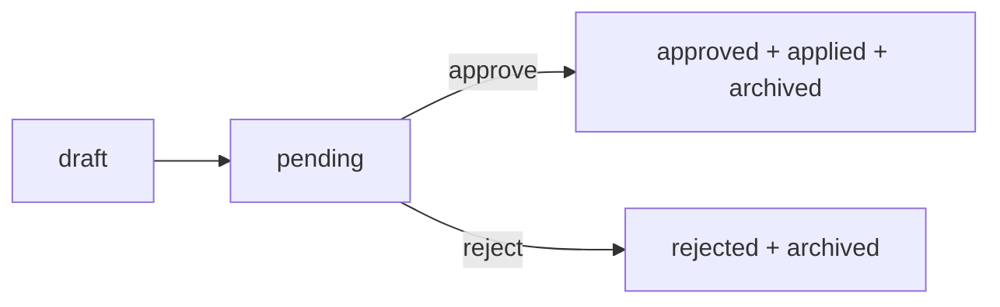

# `da run` (recipe DSL) + `da review` (proposal review) + the proposal/fold-back model

**Scope:** exhaustive, source-grounded reference for `da run` and `da review` in
`~/proj-docs/dot-agents` (module `github.com/AGOrcha/dot-agents`), plus the
proposal + fold-back fold-back-to-proposal model that feeds the review loop.
Written for designing an artifact-driven omp swarm that drives the dot-agents
inner loop.

Everything below is cited to `path:line`, the exact struct/field, or the exact
command + flag. Behaviors marked **[live-verified]** were exercised against a
binary I built from source (`go build -o /tmp/da-swarm/da-src ./cmd/da`) at repo
HEAD `917908d4` (VERSION `0.4.2`).

---

## 0. CRITICAL: shipped-binary vs repo-source divergence

The installed Homebrew binary is **`da version 0.4.2`** (`/opt/homebrew/bin/da`)
and it **predates** three command families that exist in the repo source at HEAD
(all committed, `git status` clean):

| Surface | Installed `da` 0.4.2 | Repo source (HEAD) |
|---|---|---|
| `da run` (recipe DSL) | **absent** — `unknown command "run"` **[live-verified]** | present, `commands/run.go`, registered `commands/root.go:222` |
| `da review users …` / `da review audit …` (RBAC/audit admin) | **absent** — falls through to `da review` help **[live-verified]** | present, `commands/review_admin.go`, wrapped via `withReviewAdmin` `commands/root.go:213` |
| `da eval …` | **absent** — `unknown command "eval"` **[live-verified]** | present, `rootEvalCmd()` `commands/root.go:221` |
| `da review show/approve/reject` (proposal surface) | present **[live-verified]** | present, `commands/review.go` |

- The shipped recipes themselves flag this: they carry the note *"Requires `da
  run` (0.5.0+; the 0.4.2 binary lacks it — devs: `go run ./cmd/da run
  .agents/recipes/kg-ingest.da`)"* (`.agents/recipes/kg-ingest.da`,
  `.agents/recipes/kg-link.da`, `.agents/recipes/kg-link-bulk.da`). So `da run`
  ships in **0.5.0+**; a swarm running against a stock 0.4.2 install must build
  from source (`go run ./cmd/da` or `go build ./cmd/da`) to use recipes or the
  admin surface.
- The recipe design spec status line confirms it is live in source:
  *"shipped — `da run <file>` is live (`commands/run.go`, registered
  `commands/root.go:222`)"* (`.agents/workflow/specs/da-recipe-scripts/design.md:3`).

---

# PART A — `da run` (the recipe DSL)

## A.1 What a recipe is

A **recipe** is a line-oriented, deterministic, cross-platform sequence of `da`
subcommand invocations, dispatched **in-process** (no shell). It is the
"mechanical floor" of orchestration; the Workflow engine is the "programmable
ceiling" (`commands/run.go:129-136`, design D3). Recipes conventionally use the
`.da` extension and live under `.agents/recipes/*.da` and `src/share/recipes/*.da`.

Design authority: `.agents/workflow/specs/da-recipe-scripts/design.md` (status:
shipped; graduated from proposal `.agents/proposals/da-shebang-scriptability.md`).

## A.2 Command signature & flags

Built by `newRunCmd(dispatch)` (`commands/run.go:46-71`); public entry
`NewRunCmd()` uses the production dispatcher (`commands/run.go:40-42`).

```
da run <file> [flags]
```

- `Use: "run <file>"`, `Args: ExactArgsWithHints(1, "Provide the path to a .da recipe file.")`
  (`commands/run.go:48,62`) — exactly one positional arg (the recipe path).
- **No local flags** of its own. It honors the global persistent flags from
  `root.go` — most importantly `-n/--dry-run` (`commands/run.go:63-68`). Other
  globals (`-f/--force`, `--json`, `-v/--verbose`, `-y/--yes`) are not consumed by
  `run` itself but are inherited by each dispatched step's fresh command tree.
- Help/examples (`commands/run.go:50-61`) **[live-verified]**:
  ```
  da run path/to/recipe.da   # all platforms (Windows, macOS, Linux)
  ./recipe.da                # POSIX only: chmod +x + #!/usr/bin/env -S da run
  ```

## A.3 Execution pipeline (top to bottom)

`RunE` → `runRecipe(path, dispatch)` (`commands/run.go:63-68,110-127`):



1. **`enterRecipe()`** (`commands/run.go:88-104`) — recursion-depth guard (see A.9).
2. **`os.ReadFile(path)`** (`commands/run.go:117`) — a missing file returns the
   raw `os` error (`TestRunRecipe_FileNotFound`, `run_test.go:360-365`).
3. **`effectiveLines(content)`** (`commands/run.go:470-486`) — drops the shebang,
   `#` comments, and blank lines; strips a trailing `\r` first (CRLF safety).
4. **`parseNodes(lines)`** (`commands/run.go:174-180`) — builds the node tree and
   validates block structure + nesting cap **before any dispatch** (fail before
   side effects).
5. **`execNodes(nodes, dispatch, &step)`** (`commands/run.go:302-321`) — walks the
   tree in order, threading a monotonic `step` counter.

## A.4 Grammar (line-oriented, extends D2 with D7/D8)

Grammar summary in the spec: `.agents/workflow/specs/da-recipe-scripts/design.md:143-150`.

```
recipe      := line*
line        := shebang | comment | blank | command | block
shebang     := "#!" ...                         (only line 0; ignored)
comment     := (whitespace)* "#" ...            (ignored, any line)
blank       := (whitespace)*                    (ignored)
command     := <da-args>                         (tokenized, dispatched as `da <args>`)
block       := for-block | if-block
for-block   := "for" <VAR> "in" <PATTERN>  line*  "end"
if-block    := "if" ["not"] <pred> <arg>   line*  "end"
pred        := "exists" | "set"
```

### A.4.1 Shebang, comments, blank lines (`effectiveLines`, D2/R2)

`commands/run.go:470-486`:
- A leading `#!` line is dropped (it is a `#`-prefixed line — the filter is
  literally "trimmed line starts with `#`", `run.go:480`).
- **Any** line whose first non-whitespace char is `#` is a comment and dropped
  (not just line 0). A `#` **inside** a line is NOT a comment
  (`TestEffectiveLines_InlinePoundNotComment`, `run_test.go:41-47`:
  `skills new my-skill --project my#proj` survives intact).
- Blank / whitespace-only lines are dropped (`run.go:476-478`).
- A trailing `\r` is stripped from every line first (`run.go:474`) so a CRLF
  (Windows) recipe dispatches clean tokens, no stray `\r` on the last token (R4;
  `TestEffectiveLines_StripsTrailingCR` `run_test.go:59-68`,
  `TestRunRecipe_CRLFDispatchesCleanTokens` `run_test.go:228-247`).

### A.4.2 Tokenization (`tokenize`, D5)

`commands/run.go:510-543` — a **minimal shell-like quoted-field splitter**, NOT a
shell. Rules (`run.go:504-509`):
- Space/tab **outside quotes** delimits tokens.
- Content inside single `'` or double `"` quotes is literal (spaces included).
- The quote characters themselves are stripped from the token.
- An **empty quoted span** (`""` or `''`) still emits an empty-string token
  (`TestTokenize_EmptyDoubleQuotedArg`/`EmptySingleQuotedArg` `run_test.go:139-149`;
  positional-preserving `TestTokenize_EmptyQuotedArgBetween` `run_test.go:151-156`).
- A quote adjacent to a word joins: `--project="my project"` → single token
  `--project=my project` (`TestTokenize_QuotesAdjacentToWords` `run_test.go:116-121`).
- `"` is literal inside `'…'` and vice-versa (`run_test.go:123-135`).
- An **unterminated quote is a hard error**, not a silent token
  (`run.go:539-541`; `TestTokenize_UnterminatedDoubleQuote`/`Single`
  `run_test.go:158-175`). **[live-verified]** error text:
  `unterminated quote in recipe line: "kg link add \"unterminated"`.
- NO glob expansion, variable substitution, pipes, or redirects in tokenize
  (`run.go:500-502`).

### A.4.3 Environment substitution (`expandEnv`, D6/R6)

`commands/run.go:440-442` — `os.Expand(line, os.Getenv)`:
- Supports `$VAR` and `${VAR}` (`TestExpandEnv` `run_test.go:431-502`).
- Undefined variable → empty string (Getenv default) (`run.go:433-434`).
- **Quote-blind and runs on the whole raw line BEFORE tokenization** — a recipe
  is not a shell, so single quotes do NOT suppress expansion (`run.go:434-436`;
  `dispatchStep` calls `tokenize(expandEnv(line))` `run.go:455`).
- **v1 = named env vars only.** Positional args (`$1`, `$@`) are NOT supported;
  `os.Getenv("1")` is `""` so `$1` silently expands empty (`run.go:438-439`).
- **Footgun (documented in `scaffold-plan.da`):** because expansion is quote-blind
  and an unset var → `""`, a `--flag "${UNSET}"` passes an *empty* flag value
  rather than falling back to a command default. And a value containing a literal
  `"` breaks tokenization of that line. Keep values free of literal double quotes.

### A.4.4 `for <VAR> in <PATTERN> … end` — mechanical loop (D7)

Parse: `parseForHeader` (`commands/run.go:251-267`); exec: `execLoop`
(`commands/run.go:329-352`).
- Header shape: `for <var> in <pattern>` — needs ≥4 fields, `fields[0]=="for"`,
  `fields[2]=="in"`; `<pattern>` is the verbatim remainder after `" in "`, kept
  **un-expanded** at parse time (`run.go:254-262`).
- At exec, `execLoop` env-expands then glob-resolves the pattern **once** at loop
  entry (`expandGlob(expandEnv(l.pattern))` `run.go:330`), `sort.Strings`es the
  matches for cross-OS determinism (`run.go:334`), and runs the body once per
  match with `<VAR>` bound via `os.Setenv` (`run.go:343-349`).
- **Empty match set = body runs zero times** — a folder with no matching files is
  a clean no-op, not an error (`run.go:325-326`;
  `TestRunRecipe_ForLoopEmptyGlobRunsBodyZeroTimes` `run_test.go:800-809`).
  **[live-verified]**: `for` over a glob with no matches → the following step
  still runs, exit 0.
- The loop variable's **prior value is restored** after the loop (defer,
  `run.go:335-342`; `TestRunRecipe_ForLoopRestoresLoopVar` `run_test.go:811-824`).
- The iteration set is **filesystem STATE captured up front** — it cannot grow
  from what the body does (bounded, deterministic; spec D7).
- A malformed header (e.g. `for` with no `in`) is NOT recognized as a block; it
  falls through to normal dispatch and fails loudly (`run.go:249-250`;
  `TestParseForHeader_RejectsMalformed` `run_test.go:999-1008`).
- An **invalid loop-var name** (e.g. `for a=b in …`) makes `os.Setenv` fail →
  `execLoop` errors (`run.go:344-346`; `TestRunRecipe_LoopVarWithEqualsErrors`
  `run_test.go:1035-1044`).

### A.4.5 `if [not] <pred> <arg> … end` — data-driven conditional (D8)

Parse: `parseIfHeader` (`commands/run.go:272-297`); exec: `execCond`
(`commands/run.go:357-369`), predicate: `evalCond` (`commands/run.go:374-390`).
- Two predicates only (`run.go:284`):
  - **`exists <glob>`** — true iff the env-expanded pattern matches ≥1 path
    (`evalCond` `run.go:375-381`).
  - **`set <NAME…>`** — one or more space-separated names; true iff **every** named
    env var is non-empty; whitespace-only counts as unset (`run.go:382-389`;
    `TestRunRecipe_IfSetMultiVarRequiresAllNonEmpty` `run_test.go:917-936` — one
    empty var → whole guard false → body skipped).
- **`not`** negates the predicate (`run.go:280-282,362-364`;
  `TestRunRecipe_IfNotNegatesPredicate` `run_test.go:906-915`).
- **No predicate over a command's exit status** — outcome branching stays skill /
  Workflow territory, the preserved D3 line (`run.go:158-161`, spec D9). Recipes
  branch only on *inputs* (filesystem/env before the step), never on *results*.
- Malformed `if` → not a block, falls through to dispatch and fails
  (`run.go:269-271`; `TestParseIfHeader_RejectsMalformed` `run_test.go:1010-1019`).
- **[live-verified]**: `if set DEMO_DIR` with the var set ran the body; unset →
  body skipped, exit 0.

### A.4.6 Recursive glob `base/**/<filepat>` (`expandGlob`, D7)

`commands/run.go:400-430`:
- Patterns **without** `**` delegate to `filepath.Glob` unchanged (`run.go:401-402`;
  `TestExpandGlob_NoDoublestarDelegatesToGlob` `run_test.go:964-974`).
- A single `**` segment means "this directory and any descendant":
  `base/**/<filepat>` matches `<filepat>` against the **basename** of every file
  under `base` at any depth, base's own children included (`run.go:392-398`,
  walk `run.go:417-428`).
- Only the **first** `**` is honored; the tail is a filename pattern (no embedded
  `/`) (`run.go:398-399,409-412`).
- Missing base → empty set (`run.go:397`;
  `TestExpandGlob_MissingBaseIsEmpty` `run_test.go:976-984`). Filesystem errors
  during the walk are skipped, mirroring Glob's ignore-errors contract
  (`run.go:418-420`). A bad `tail` pattern returns `ErrBadPattern`
  (`run.go:413-414`; `TestExpandGlob_BadPatternAndDefaults` `run_test.go:1046-1063`).
- **[live-verified]**: `for F in ${DIR}/**/*.md` over a tree
  (`x.md`, `y.md`, `sub/z.md`) iterated all three (including the subdir).

### A.4.7 Block structure, `end`, and the depth cap (D10)

Parser: `parseBlock`/`tryOpenBlock`/`openBlockBody`
(`commands/run.go:186-246`). Validated **before** dispatch (any structural error
aborts with zero side effects, `run.go:171-172`).
- A lone `end` closes the nearest open block (`run.go:191-196`); a dangling `end`
  at depth 0 errors: `recipe: 'end' without a matching 'for' or 'if'`
  (`run.go:192-194`; `TestParseNodes_EndWithoutOpenerErrors` `run_test.go:874-878`).
- An unterminated block errors: `recipe %q: unterminated block (missing 'end')`
  (`run.go:209-211`; `TestParseNodes_UnterminatedBlockErrors` `run_test.go:868-872`).
- **Nesting cap = 2** (`const maxBlockNesting = 2`, `run.go:137`). `for` and `if`
  blocks share it. Exceeding it errors at parse time:
  `recipe %q: block nesting exceeds the depth cap of %d` (`run.go:242-243`;
  `TestParseNodes_NestingExceedsCapErrors` `run_test.go:860-866`,
  `TestParseNodes_NestedIfDepthCapErrors` `run_test.go:1065-1072`). Two-level nests
  are legal (`TestRunRecipe_NestedBlocksWithinCap` `run_test.go:846-858`); the
  shipped recipes honor this as `if→for` (`kg-ingest.da`) and `if→if`
  (`kg-link.da`).

## A.5 Fail-fast + error contract (D4/R3)

- `execNodes` returns on the first non-zero step; subsequent steps never dispatch
  (`run.go:302-321`). `execLoop` aborts mid-iteration on failure
  (`TestRunRecipe_ForLoopFailFastAbortsMidIteration` `run_test.go:826-844`:
  fail on b.md → a.md ran, c.md + trailing `kg warm` never run).
- `dispatchStep` wraps any tokenize-or-dispatch error as
  `step %d (%q) failed: %w` where the step index counts **only effective
  (dispatched) lines** and the quoted text is the **ORIGINAL un-expanded** source
  line (`run.go:454-462`). Keeping the un-expanded line is security-load-bearing:
  expanded values may contain secrets (`$TOKEN`), so error messages never echo
  them (`run.go:448-452`; `TestDispatchStep_EnvVarNoLeak` `run_test.go:522-547`).
- **[live-verified]** exact messages:
  - `✗ Error: step 2 ("nosuchcmd foo") failed: unknown command "nosuchcmd" for "da"`
  - `✗ Error: step 2 ("kg link add \"unterminated") failed: unterminated quote in recipe line: …`
    (the comment + blank line before did NOT increment the step index).
- `%w` wrapping preserves `errors.Is`/`errors.As`, so exit-code-carrying and typed
  sentinel errors survive fail-fast wrapping (`run.go:452-453`;
  `TestRunRecipe_WrappedErrorPreservesIdentity` `run_test.go:324-346`). A failing
  recipe exits non-zero (`da run` propagates the error → process exit 1
  **[live-verified]**).
- No opt-in continue-on-error (deferred, spec D4/§6).

## A.6 `--dry-run` propagation (D11)

`withDryRun` (`commands/run.go:80-84`), wired in `RunE` (`run.go:63-68`):
- Each recipe step dispatches through a **fresh command tree**
  (`defaultDispatcher` `run.go:32-36`), so per-step flag state is clean; a `-n` on
  the `da run` invocation would NOT otherwise reach the steps and a mutating
  recipe would apply for real (`run.go:73-79`).
- `da run --dry-run <recipe>` (or the global `-n`) prepends `--dry-run` to **every**
  dispatched step's args (`run.go:81-83`;
  `TestWithDryRun_PrependsDryRunFlag` `run_test.go:1076-1082`,
  `TestNewRunCmd_DryRunFlagPropagatesToEveryStep` `run_test.go:1084-1098`).
- Steps that ignore `-n` are unaffected (every command accepts the global flag); a
  nested `da run` step inherits it transitively (spec D11). Without `-n`, steps
  dispatch unchanged (`TestNewRunCmd_NoDryRunDispatchesUnchanged` `run_test.go:1100-1110`).
- **Caveat inherited from the steps:** dry-run is only as honest as each
  sub-command's `-n` handling. Several `da workflow` client commands are recorded
  as NOT honoring `-n` (e.g. `obs-da-start-task-dryrun-not-honored.md`,
  `obs-foldback-create-dryrun-has-side-effects.md` in `~/.agents/proposals/`), so a
  recipe's `--dry-run` preview can still mutate if a step ignores it.
- Usage pattern (from `kg-link-bulk.da`):
  `KG_LINK_MANIFEST=links.tsv da run .agents/recipes/kg-link-bulk.da --dry-run`.

## A.7 Recursion guard (self-invocation / cycles)

- `const maxRecipeDepth = 32` (`run.go:18`); depth carried across the process
  boundary via env var `DA_RECIPE_DEPTH` (`recipeDepthEnv`, `run.go:24`) so the
  guard holds for both in-process and shebang-exec recursion (`run.go:20-23`).
- `enterRecipe` (`run.go:88-104`): reads the depth, errors when `>= 32`, else bumps
  it and returns a restore closure (deferred, fully unwinds — env var left as it
  was; `TestRunRecipe_RecursionGuardStops` `run_test.go:401-425` asserts no leak).
- **[live-verified]** error at the deepest level:
  `recipe recursion limit (32) exceeded — a recipe is invoking `da run` on itself or a cycle exists`
  (the fail-fast wrapper prepends `step 1 (…) failed:` once per nesting level, so
  the surfaced message stacks ~32 deep).

## A.8 Cross-platform execution (D12/R4/R5)

- **In-process, no shell** (`defaultDispatcher` builds `NewRootCommand()` and
  `Execute()`s it, `run.go:32-36`). No `sh -c`; `da` already owns platform
  handling (`internal/platform`), so `da run <file>` behaves identically on
  Windows/macOS/Linux (spec D5/R4/D12).
- **Shebang direct-exec is POSIX-only:** `#!/usr/bin/env -S da run` + `chmod +x`
  lets `./recipe.da` run directly (R5). Windows has no shebang mechanism → invoke
  `da run <file>` there; the recipe *content* is portable either way
  (`run.go:53-57`, spec D12). Acceptance test `TestShebangRecipe_Acceptance`
  (`run_test.go:722-768`) builds the binary, chmods a `.da`, and asserts it runs on
  the macos/linux/windows CI matrix.

## A.9 Design-decision + requirement matrix (spec `da-recipe-scripts/design.md`)

| ID | Decision / Requirement | Where enforced |
|---|---|---|
| D1 | Entrypoint `da run <file>`; shebang `#!/usr/bin/env -S da run` | `run.go:46-71` |
| D2 | Line-oriented; shebang/`#`/blank ignored | `effectiveLines` `run.go:470-486` |
| D3 | Mechanical/deterministic only; judgment → skills | whole design; no outcome branch |
| D4/R3 | Fail-fast: first non-zero step aborts, names step+line, non-zero exit | `dispatchStep`/`execNodes` `run.go:302-321,454-462` |
| D5 | In-process dispatch, no shell; quoted-field tokenize | `defaultDispatcher`/`tokenize` `run.go:32-36,510-543` |
| D6/R6 | Env-var substitution only (`$VAR`/`${VAR}`), before tokenize | `expandEnv` `run.go:440-442` |
| D7 | Mechanical `for … in <glob> … end`; static, sorted, empty=no-op; recursive `**` | `execLoop`/`expandGlob` `run.go:329-352,400-430` |
| D8 | Shallow `if [not] exists/set … end`; data/state predicate | `parseIfHeader`/`evalCond` `run.go:272-297,374-390` |
| D9 | Preserved D3 line: no branching on OUTCOMES | design §8 |
| D10 | Depth cap = 2 (`maxBlockNesting`) | `openBlockBody` `run.go:137,242-243` |
| D11 | `da run --dry-run` propagates `--dry-run` to every step | `withDryRun` `run.go:80-84` |
| D12 | Cross-platform; shebang POSIX-only, Windows uses `da run <file>` | `run.go:53-57` |
| R1 | Each effective line executes as `da <args>` in order | `execNodes` |
| R2 | Shebang/`#`/blank ignored | `effectiveLines` |
| R4 | Identical on macOS/Linux/Windows, no shell | in-process dispatch + acceptance test |
| R5 | Executable `.da` runs directly (POSIX) | acceptance test `run_test.go:722-768` |
| OQ1 | Env-substitution only for v1; no positional args | resolved, spec §5 |
| OQ2 | Shipped recipes under `src/share/recipes/*.da`, chmod 0755 | resolved, spec §5 |
| OQ3 | Fixed-shape sequences; no outcome branching (loops+input-preds now in) | resolved+amended, spec §5/§8 |

## A.10 Shipped recipe examples (verbatim structure)

Two homes exist: **`src/share/recipes/`** (packaged/distributed) and
**`.agents/recipes/`** (dogfood).

### `src/share/recipes/checkpoint-advance.da` (the iteration-close spine)
```
#!/usr/bin/env -S da run
# checkpoint-advance.da — mechanical iteration-close spine: checkpoint, then advance.
workflow checkpoint --message "${DA_CHECKPOINT_MSG}"
workflow advance "${DA_PLAN}" --task "${DA_TASK}" --status "${DA_STATUS}"
```
Env: `DA_CHECKPOINT_MSG`, `DA_PLAN`, `DA_TASK`, `DA_STATUS` (`pending|in_progress|completed`).

### `src/share/recipes/scaffold-plan.da` (plan + first-task bootstrap)
```
#!/usr/bin/env -S da run
workflow plan create ${PLAN_ID} --title "${PLAN_TITLE}" --summary "${PLAN_SUMMARY}" --success-criteria "${PLAN_SUCCESS_CRITERIA}" --verification-strategy "${PLAN_VERIFICATION_STRATEGY}"
workflow task add ${PLAN_ID} --id ${TASK_ID} --title "${TASK_TITLE}" --notes "${TASK_NOTES}"
workflow plan update ${PLAN_ID} --status active --focus ${TASK_ID}
```
Env (all required — quote-blind, unset → empty flag, not a default): `PLAN_ID`,
`PLAN_TITLE`, `PLAN_SUMMARY`, `PLAN_SUCCESS_CRITERIA`, `PLAN_VERIFICATION_STRATEGY`,
`TASK_ID`, `TASK_TITLE`, `TASK_NOTES`. Fixed at exactly one plan + one first task
(D3: no loop over a dynamic task count). Mirrors the canonical "Author plan" flow in
`docs/concepts/workflow-artifact-model.md`.

### `.agents/recipes/kg-ingest.da` (recursive folder-tree ingestion — `if→for`)
```
if set KG_DIR
  for F in ${KG_DIR}/**/*.md
    kg ingest "${F}" --type markdown
  end
  for F in ${KG_DIR}/**/*.markdown
    kg ingest "${F}" --type markdown
  end
  for F in ${KG_DIR}/**/*.txt
    kg ingest "${F}" --type text
  end
  for F in ${KG_DIR}/**/*.pdf
    kg ingest "${F}" --type pdf
  end
  kg warm
end
```
- One type-scoped loop per source kind; `**` matches the whole tree; a type with
  no files is a clean no-op. Whole body guarded by `if set KG_DIR` so an unset
  `KG_DIR` is a TRUE no-op (the glob never walks `/`). Paths quoted so tree
  entries with spaces stay one token.
- Deliberately ends at `kg warm`; `kg postprocess` (FTS/flows/communities) is
  CRG-toolchain-coupled and excluded to keep the recipe portable (exit 0 everywhere).

### `.agents/recipes/kg-link.da` (one note→symbol link — `if→if`)
```
if set KG_NOTE_ID KG_SYMBOL
  if set KG_LINK_KIND
    kg link add ${KG_NOTE_ID} "${KG_SYMBOL}" --kind ${KG_LINK_KIND}
  end
  if not set KG_LINK_KIND
    kg link add ${KG_NOTE_ID} "${KG_SYMBOL}"
  end
  kg link list ${KG_NOTE_ID}
end
```
- Multi-var `if set KG_NOTE_ID KG_SYMBOL` guards against `kg link add`'s
  empty-qualified-name footgun (both must be non-empty). The `if set` / `if not
  set` pair implements optional-flag defaulting **without** outcome branching.

### `.agents/recipes/kg-link-bulk.da` (manifest batch — `if→if exists`)
```
if set KG_LINK_MANIFEST
  if exists ${KG_LINK_MANIFEST}
    kg link import "${KG_LINK_MANIFEST}"
  end
end
```
- `if set` + `if exists` → unset **or** missing manifest is a clean no-op.
  `kg link import` applies every valid row (idempotent upsert), reports bad rows,
  exits non-zero if any failed. Dry-runnable end-to-end via `da run --dry-run`.

---

# PART B — `da review` (proposal review + admin)

Registered at `commands/root.go:213` as `withReviewAdmin(NewReviewCmd())`:
`review.go` owns the **proposal** surface; `review_admin.go` owns the **admin**
(users/audit) surface.

```
da review                       # list pending proposals (default RunE)
├── show <id>                    # print a pending proposal (YAML)
├── approve <id>                 # apply + refresh + archive a pending proposal
├── reject <id> [--reason ...]   # archive a pending proposal as rejected
├── users   (admin, source-only) # RBAC user management
│   ├── add <email> --role R
│   ├── list [--json]
│   ├── remove <email>
│   └── set-role <email> --role R
└── audit   (admin, source-only) # hash-chained audit log
    ├── tail [--limit N] [--json]  (alias: view)
    ├── verify                     (no token; CI gate)
    ├── repair                     (admin)
    └── prune --before-year YYYY   (admin)
```

The default `da review` help (`review.go:61-63`) **[live-verified]**: *"Lists and
applies queued shared-workflow proposals stored under ~/.agents/proposals. This
is the approval surface for shared preference and rule changes that should not be
applied silently."*

## B.1 `da review` (list) — `runReviewList`

`review.go:70-72,116-133`. `Args: NoArgsWithHints(...)`.
- Calls `config.ListPendingProposals()` and prints each pending proposal's `ID`,
  `Type`, `Action`, `Target`, and one-line `Rationale` (`review.go:126-131`).
- Empty → `No pending proposals.` (`review.go:121-123`) **[live-verified]** (the
  live run reported "No pending proposals" even though `~/.agents/proposals/` holds
  20 `.md` files — because the queue only counts `.yaml` schema proposals with
  `status: pending`; see D.1).
- **No `--json` handler** in `runReviewList` (the global `--json` flag exists but
  list ignores it — output is the human table only).

## B.2 `da review show <id>` — `runReviewShow`

`review.go:75-85,135-151`. `Args: ExactArgsWithHints(1, "Pass the proposal ID from `da review`.")`.
- `LoadProposal(id)` → `ValidateProposal` → prints the full proposal as YAML
  (`review.go:136-149`).
- Missing proposal → `proposal not found` (`ErrProposalNotFound`)
  **[live-verified]**.

## B.3 `da review approve <id>` — `runReviewApprove` (the apply/fold-back pipeline)

`review.go:87-97,153-204`. `Args: ExactArgsWithHints(1, ...)`. Uses
`stdReviewDeps{}` (`review.go:40-53`). Sequence (`review.go:164-203`):

1. `LoadProposal(id)` (`review.go:164`).
2. `ValidateProposal` (`review.go:168`).
3. Status gate: must be `pending`, else
   `proposal %q is %s, not pending` (`review.go:171-173`).
4. `ProposalTargetPath(proposal.Target)` (`review.go:175`).
5. `captureProposalRollback(targetPath, deps)` — snapshots the target's current
   bytes (or absence) and returns a restore closure (`review.go:179,236-259`).
6. **`deps.ApplyProposal(proposal)`** — writes/removes the target under
   `~/.agents/` (`review.go:184`; see C.5).
7. **`deps.RunRefresh("")`** — re-links **all** managed projects from `~/.agents/`
   (`review.go:51-53,187`); a refresh failure triggers `restore()` and returns
   `refresh after apply: %w` (`review.go:187-190`).
8. `config.MarkProposalReviewed(proposal, "approved", "")` (`review.go:192`).
9. **`deps.ArchiveProposal(proposal)`** — moves the proposal to
   `~/.agents/proposals/archived/` (`review.go:193`); on failure, `restore()` and
   return (`review.go:193-196`).
10. `ui.Success("Proposal approved")` + the ID (`review.go:201-202`).

- **Journaling:** a deferred `journalReview` records a `TierReview →
  durable_delta` event; `ok` flips true only after the archive lands, else an
  input-only failed event is emitted (`review.go:153-162,302-313`). Best-effort,
  never fatal (`review.go:266-268`).
- **[live-verified]** `da review approve does-not-exist -n` → `proposal not found`
  (fails at LoadProposal before any apply).
- **GOTCHA — approve/reject do NOT honor `--dry-run`.** `runReviewApprove`/
  `runReviewReject` have **no** dry-run branch (`review.go:153-234`); the global
  `-n` is silently accepted but ignored, so `da review approve <valid-id> -n`
  applies + refreshes + archives **for real**. A swarm must not treat `-n` as a
  safe preview here.

## B.4 `da review reject <id> [--reason ...]` — `runReviewReject`

`review.go:99-110,206-234`. Adds `--reason string` (`review.go:110`).
- `LoadProposal` → `ValidateProposal` → pending gate → `MarkProposalReviewed(…,
  "rejected", reason)` → `ArchiveProposal` (`review.go:216-229`).
- **No apply, no refresh** (both journal flags stay false, `review.go:207-214`).
  The proposal is archived as rejected with the reason recorded.

## B.5 `captureProposalRollback` (fail-safe apply)

`review.go:239-259`: if the target exists, snapshots its bytes and returns a
closure that `MkdirAll`+`WriteFile`s them back; if absent, returns a closure that
`Remove`s whatever the apply created. This makes approve atomic-ish: a
post-apply refresh/archive failure restores the pre-image.

## B.6 Admin surface (source-only; `review_admin.go`)

Attached by `withReviewAdmin` (`review_admin.go:129-132`). This is R5's RBAC +
hash-chained audit log (`review_admin.go:1-19`). Shared persistent flags on the
`users`/`audit` groups (`reviewAdminOpts.registerFlags` `review_admin.go:143-148`):
- `--users-file` (default `~/.config/da/review/users.yaml`, honoring `$XDG_CONFIG_HOME`)
- `--audit-log` (default `.agents/active/review/audit.log.jsonl`, `review_admin.go:42`)
- `--token` (default `$DA_REVIEW_TOKEN`, `review_admin.go:47,169-174`)

### `da review users` (`review_admin.go:177-271`)
| Subcommand | Flags | Behavior |
|---|---|---|
| `add <email> --role R` | `--role` (required: `reviewer`\|`admin`\|`readonly`) | Mints a bearer token, persists **only** its argon2id hash, prints the plaintext **once** (`runReviewUsersAdd` `review_admin.go:418-465`; print-once = OQ1). `--json` envelope `reviewUserAddJSON` is the sole place the token appears (`review_admin.go:393-398`). |
| `list [--json]` | — | Lists users; hash truncated, never plaintext (`review_admin.go:224-237,467-503`). |
| `remove <email>` | — | Deletes user; their token stops authenticating immediately. Refuses to orphan the last admin (`wouldOrphanAdmins` `review_admin.go:946-964`). |
| `set-role <email> --role R` | `--role` (required) | Changes role, keeps token; refuses to demote the last admin. |

- Every mutation runs the **fail-closed audited pipeline** `runReviewUsersMutation`
  (`review_admin.go:775-820`): `[load → mutate → save → audit]` under the
  `agentslock` file lock on the users file (same lock the review HTTP service
  takes, so CLI and service serialize). If the audit append fails, the users file
  is rolled back to its pre-image and the command fails — no unaudited mutation
  survives (spec R6, `review_admin.go:884-908`).
- **Bootstrap:** the first admin against an empty users file runs as the synthetic
  `bootstrap` actor (no admin exists yet to authenticate; `review_admin.go:56-58,822-833`).
  Otherwise the `--token`/`$DA_REVIEW_TOKEN` must resolve to a user holding the
  admin permission (`authenticateReviewAdmin` `review_admin.go:835-862`).

### `da review audit` (`review_admin.go:273-379`)
| Subcommand | Flags | Token? | Behavior |
|---|---|---|---|
| `tail` (alias `view`) | `--limit N` (0=all) | admin | Show records newest-last (`runReviewAuditTail` `review_admin.go:591-627`). |
| `verify` | — | **none** | Read-only integrity attestation; exits non-zero on the first chain break; usable as a CI gate (`runReviewAuditVerify` `review_admin.go:629-656`). `TornAppend` is a **hard failure** (fail-closed; byte-indistinguishable from a forged tail record). |
| `repair` | — | admin | Re-anchors the head only after a benign torn-append (exactly one clean, correctly-chained record ahead of anchor); any other divergence is never repaired (`review_admin.go:339-354,658-681`). |
| `prune --before-year YYYY` | `--before-year` (required) | admin | Compacts rotated year-archives strictly before the year; the active log is untouched; a corrupt archive is left in place + reported. Writes **no** audit record (archive maintenance, not an R6 mutation; `review_admin.go:691-714`). |

---

# PART C — the proposal model (`internal/config/proposals.go`)

## C.1 The `config.Proposal` schema

`internal/config/proposals.go:16-29`:
```go
type Proposal struct {
    SchemaVersion int    `yaml:"schema_version"`  // MUST == 1
    ID            string `yaml:"id"`
    Status        string `yaml:"status"`          // draft|pending|approved|rejected
    Type          string `yaml:"type"`            // rule|skill|hook|setting
    Action        string `yaml:"action"`          // add|modify|remove
    Target        string `yaml:"target"`          // repo-relative logical path under ~/.agents/
    Rationale     string `yaml:"rationale"`        // required, non-empty
    Content       string `yaml:"content"`          // required for add/modify; empty for remove
    CreatedAt     string `yaml:"created_at"`       // required (RFC3339)
    CreatedBy     string `yaml:"created_by"`       // required (e.g. model id)
    ReviewedAt    string `yaml:"reviewed_at"`
    ReviewReason  string `yaml:"review_reason"`
}
```

### `ValidateProposal` rules (`proposals.go:116-155`)
- `schema_version` MUST be `1` (`proposals.go:117-119`).
- `id` required (non-empty trimmed) (`proposals.go:120-122`).
- `status` ∈ `{draft, pending, approved, rejected}` (`proposals.go:123-125`).
- `type` ∈ `{rule, skill, hook, setting}` (`proposals.go:126-128`).
- `action` ∈ `{add, modify, remove}` (`proposals.go:129-131`).
- `target` valid (see C.3) (`proposals.go:132-134`).
- `rationale` required (`proposals.go:135-137`).
- `content` required for `add`/`modify`; MUST be empty for `remove` (`proposals.go:138-147`).
- `created_at`, `created_by` required (`proposals.go:148-153`).

### Real example (`~/.agents/proposals/archived/proposal-routing-rule.yaml`)
```yaml
schema_version: 1
id: proposal-routing-rule
status: approved
type: rule
action: add
target: rules/dot-agents/proposal-routing.md
rationale: 'The current proposal system is hardcoded to ~/.agents/proposals/ …'
content: |-
    # Proposal Routing
    …
created_at: "2026-04-20T21:00:00Z"
created_by: claude-sonnet-4-6
reviewed_at: "2026-04-21T15:31:14Z"
review_reason: ""
```

## C.2 Directory layout

- Base: `ProposalsDir() = AgentsHome()/proposals` (`proposals.go:36-38`).
- Archive: `ArchivedProposalsDir() = ProposalsDir()/archived` (`proposals.go:40-42`).
- File path: `ProposalPath(id) = ProposalsDir()/<id>.yaml` (`proposals.go:44-46`);
  archived: `ArchivedProposalPath(id) = archived/<id>.yaml` (`proposals.go:48-50`).
- `AgentsHome()` = `~/.agents` (honoring `$AGENTS_HOME` — used throughout tests via
  `t.Setenv("AGENTS_HOME", …)`).

## C.3 Target path resolution + validation

`ValidateProposalTarget` (`proposals.go:157-178`), `ProposalTargetPath`
(`proposals.go:180-185`):
- Targets are **logical, forward-slash, repo-relative** paths (e.g.
  `rules/dot-agents/proposal-routing.md`).
- **Rejected:** empty, absolute paths, volume-prefixed, `/`-rooted (slash
  semantics on every OS, `proposals.go:166-169`), and parent traversal (`..` or
  `../…`, `proposals.go:174-176`).
- Resolves to `filepath.Join(AgentsHome(), filepath.Clean(target))` — always under
  `~/.agents/` (`proposals.go:184`).

## C.4 Lifecycle



- `ListPendingProposals` scans `ProposalsDir()`, loads every `*.yaml`, and returns
  only those with `status == "pending"`, sorted by ID (`proposals.go:68-103`).
  **Non-`.yaml` files and subdirectories are skipped** (`proposals.go:88-90`).
- `MarkProposalReviewed(p, status, reason)` sets `Status`, `ReviewedAt`
  (`time.Now().UTC().RFC3339`), `ReviewReason` (`proposals.go:223-227`).
- `ArchiveProposal(p)` writes the (reviewed) proposal to `archived/<id>.yaml` and
  removes the original (`proposals.go:208-221`).

## C.5 Apply semantics (`ApplyProposal`, `proposals.go:187-206`)

- `add`/`modify` → `MkdirAll(dir)` + `WriteFile(targetPath, []byte(Content), 0644)`
  (`proposals.go:193-197`).
- `remove` → `os.Remove(targetPath)` (missing = ok) (`proposals.go:198-202`).
- Approve then calls `RunRefresh("")` so the applied `~/.agents/` change is
  re-linked into every managed project.

## C.6 Who creates `.yaml` (schema) proposals

- **`da workflow prefs set-shared <key> <value>`** — queues a **pending** `rule`
  proposal targeting `.agents/workflow/preferences.yaml` rather than mutating
  directly (`commands/workflow/prefs.go:482-504`), then prints *"Run 'da review' to
  approve and apply."* (`prefs.go:505`). This is the canonical programmatic
  producer of a `da review`-consumable proposal.
- **Hand-authored** `~/.agents/proposals/<id>.yaml` following the schema (the
  archived examples were authored this way).

---

# PART D — the proposal / fold-back model (two tracks)

There are **two distinct "proposal" tracks** with different file shapes, homes,
and consumers. Confusing them is the single biggest gotcha here.

## D.1 Track 1 — structured config proposals (`.yaml`, consumed by `da review`)

- Shape: `config.Proposal` schema (C.1), `~/.agents/proposals/<id>.yaml`.
- Consumer: `da review show/approve/reject` (`ListPendingProposals` reads **only**
  `.yaml` with `status: pending`).
- Effect of approve: writes a file under `~/.agents/` (`rules/…`, `skills/…`,
  `hooks/…`, `settings/…`) + refresh (C.5).
- **This is the only track `da review` sees.** Because the live
  `~/.agents/proposals/` currently holds only `.md` files, `da review` reports
  "No pending proposals" **[live-verified]** despite 20 markdown proposals present.

## D.2 Track 2 — fold-back observation proposals (`obs-*.md`, human-reviewed)

- Produced by **`da workflow fold-back create … --propose`**
  (`commands/workflow/cmd.go:956-974`; `--propose` flag `cmd.go:971`).
- `createProposalFoldBack` (`commands/workflow/delegation.go:599-625`) writes a
  **markdown file with YAML frontmatter** to
  `~/.agents/proposals/obs-<ts>.md` (or `obs-<slug>.md` when `--slug` given,
  `delegation.go:602-604`). Frontmatter type `foldBackProposalFrontmatter`
  (`commands/workflow/types.go:281-287`):
  ```yaml
  ---
  title: 'Fold-back: <plan-id>'
  observation: <observation text>
  plan_id: <plan-id>
  task_id: <task-id>   # omitempty
  created_at: <RFC3339>
  ---
  <observation body>
  ```
  Real example (`~/.agents/proposals/obs-da-start-task-dryrun-not-honored.md`,
  `obs-foldback-create-dryrun-has-side-effects.md`).
- **These `.md` files are NOT in the `da review` queue** (that only reads `.yaml`).
  They are the *human-review* observation track: an agent surfaces a loop
  observation, a human triages it into a spec/plan/lesson or a formal `.yaml`
  proposal later.
- The fold-back artifact's `routed_to` field records `proposal:obs-<name>.md`
  (`delegationProposalRoutePfx` = `"proposal:"`, `delegation.go:110,623`);
  `proposalAbsPathFromRoutedTo` resolves it back under
  `AgentsHome()/proposals/…` with traversal guards (`delegation.go:376-385`).
- `fold-back create` other routes (not `--propose`): inline task-note
  (`task_note:<plan>/<task>`) or plan-summary — these edit `TASKS.yaml`/plan notes
  in the repo, not `~/.agents/proposals/`. `--propose` on an **existing**
  slug-scoped fold-back is rejected: *"--propose is not valid when updating an
  existing slug-scoped fold-back"* (`delegation.go:495-497`).
- **GOTCHA:** `fold-back create --dry-run` is recorded as NOT side-effect-free in
  at least one observation (`obs-foldback-create-dryrun-has-side-effects.md`),
  though the current tests assert dry-run writes nothing
  (`foldback_test.go:548-564,693-698`). Verify on the target binary before
  relying on `-n` here.

## D.3 The proposal-routing rule (which track to use)

From the approved rule `proposal-routing-rule.yaml` (target
`rules/dot-agents/proposal-routing.md`):
- **Global** (affects shared `~/.agents/`) → `~/.agents/proposals/<id>.yaml`
  (formal schema), processed by `da review approve`.
- **Project-local** (one repo) → `.agents/proposals/<id>.md` (markdown, no schema);
  **NOT** processed by `da review` today.
- Decision heuristic: *"if this repo were removed from dot-agents management,
  would this proposal still matter?"* Yes → global; No → project-local.
- Explicitly **not** proposals: stable specs → `workflow/specs/<id>/design.md`;
  plans → `workflow/plans/<id>/`; **loop observations → `active/fold-back/` then
  `workflow fold-back create`**; lessons → `.agents/lessons/<name>/LESSON.md`.
- The `.agents/proposals/` dir (repo-scoped) holds mostly `.md` design/observation
  docs (`obs-*.md` = observations); it also holds one `.yaml`
  (`kg-ideate-skill.yaml`). The graduated `da-shebang-scriptability.md` → recipe
  spec is the canonical "proposal graduates into a spec+plan" example.

## D.4 How pending proposals surface in the workflow

- **`da workflow orient`** renders a `# Pending Proposals` section with the count
  (`commands/workflow/state.go:751-756,868`; count via
  `countPendingWorkflowProposals` → `ListPendingProposals` `state.go:504-510`).
- **`da workflow` health** warns `N pending proposal(s) need review`
  (`commands/workflow/health.go:31,44-46`).
- **`da workflow drift`/`sweep`** flag **stale** pending proposals (older than
  `--proposal-days`, default 30) via `driftStaleProposalPhase`
  (`commands/workflow/drift.go:20,118-133`) and the read-only
  `flag_stale_proposals` sweep action (`sweep.go:26,76-83`; no confirmation, never
  deletes).

---

# Swarm-relevant hooks

A swarm agent (a DAG of subagents coordinated via shared files) drives the
dot-agents inner loop non-interactively. Practical hooks:

## Non-interactive invocation contract
- **Build first.** On a stock host the installed `da` is 0.4.2 and lacks `run`,
  the review admin surface, and `eval`. Use a source build:
  `go build -o <bin> ./cmd/da` (or `go run ./cmd/da …`). Point every swarm agent
  at that binary. (Recipes call this "0.5.0+".)
- **Batch da operations with a recipe.** `da run <file>` is the deterministic way
  to fan a fixed sequence of `da` steps across agents identically — no bash-isms,
  no per-agent re-derivation, cross-platform. Author the recipe once, ship it as a
  reviewable `.da` artifact, and have every worker invoke the same file. Wire
  values via **env vars only** (`$VAR`/`${VAR}`), set in the child process env
  before dispatch (the swarm's shared-file layer supplies the values; the recipe
  reads them). Quote every interpolated path/arg (`"${F}"`) — expansion is
  quote-blind and pre-tokenization.
- **Loop over shared-state files mechanically.** `for F in <dir>/**/*.<ext> … end`
  turns "process every artifact a producer wrote to a folder" into one bounded,
  sorted, deterministic pass (recursive `**`, empty = no-op). This is exactly the
  batch-over-produced-files pattern a swarm needs (see `kg-ingest.da`).
- **Guard on presence, not outcome.** `if set VAR` / `if exists <glob>` /
  `if not …` let a recipe skip a body when an upstream artifact/flag is absent — a
  clean no-op instead of an error. Multi-var `if set A B` requires all non-empty.
  **You cannot branch on a step's exit status** (D3/D9) — that stays in the swarm's
  orchestration layer (skills/Workflow), and recipes stay **fail-fast**: the first
  non-zero step aborts and the process exits non-zero, naming `step N ("<line>")`.
- **Preview with `--dry-run`.** `da run --dry-run <file>` prepends `--dry-run` to
  every step (D11), so a swarm can dry-run a whole batch before committing — *but*
  honesty is per-command: some `da workflow` client commands ignore `-n` (see the
  `obs-*` observations), so dry-run is not a guarantee of zero writes.
- **Recursion/JSON gotchas:** `da run` self-invocation is capped at depth 32
  (`DA_RECIPE_DEPTH`); a cycle fails loudly. `da run` has no `--json` output of its
  own — parse each step's own output. `da review` (list) and approve also ignore
  `--json`/`-n` in the ways noted above.

## Recipes for the inner loop specifically
- **iteration-close spine:** `src/share/recipes/checkpoint-advance.da`
  (`workflow checkpoint` → `workflow advance`) is the shippable mechanical spine a
  worker runs at close; env `DA_CHECKPOINT_MSG`/`DA_PLAN`/`DA_TASK`/`DA_STATUS`.
- **plan bootstrap:** `src/share/recipes/scaffold-plan.da`
  (`plan create` → `task add` → `plan update --status active --focus`); all env
  required (unset → empty flag, not a default).
- **KG warm-up before a session:** `kg-ingest.da` (ingest a tree + `kg warm`) so
  KG queries have fresh content; `kg-link.da`/`kg-link-bulk.da` for note→symbol
  links a skill/agent already decided.
- Recipes are the **mechanical floor**; judgment/fan-out stays in skills and the
  Workflow engine. A skill may call a recipe for its mechanical spine.

## Proposals / fold-back feeding the workflow
- **Two tracks, do not conflate:**
  1. `~/.agents/proposals/<id>.yaml` (schema `config.Proposal`, `status: pending`)
     → the ONLY thing `da review` sees. Produced by `da workflow prefs set-shared`
     or hand-authored. Approve = apply-to-`~/.agents/` + refresh-all-projects +
     archive.
  2. `~/.agents/proposals/obs-*.md` (markdown + frontmatter) → produced by
     `da workflow fold-back create --propose`; the human-review observation track,
     NOT in the `da review` queue.
- **Swarm producer side:** a worker that discovers a cross-cutting improvement
  during the loop calls `da workflow fold-back create --plan <p> [--task <t>]
  --observation "…" --propose [--slug <s>] [--json]` to durably record it as
  `obs-<slug|ts>.md`. For a *shared config* change (a preference), use
  `da workflow prefs set-shared` to queue a reviewable `.yaml`.
- **Swarm consumer/gate side:** `da review` (list, `--json` NOT honored — parse the
  table) shows pending `.yaml` proposals; `da review show <id>` prints the YAML;
  `da review approve <id>` / `reject <id> --reason "…"` decide them. **Approve is
  not a dry-run-safe op** (no `-n` handling) and triggers a global refresh — a
  swarm should gate approvals behind an explicit human/decision step, never fire
  them speculatively.
- **Surfacing hooks for the DAG:** `da workflow orient` (`# Pending Proposals`
  count, `--json`), workflow health (`N pending proposal(s) need review`), and
  `da workflow drift`/`sweep` (stale >30d, `flag_stale_proposals`, read-only)
  give a swagent the signal for when a review gate should run.
- **Fold-back → durable artifact routing** (the actual "fold-back model"): a loop
  observation routes to (a) an inline `TASKS.yaml`/plan note (default,
  `task_note:<plan>/<task>`), or (b) a `~/.agents/proposals/obs-*.md`
  (`--propose`, `routed_to: proposal:obs-*.md`); `--slug` makes it create-or-update
  (one tagged line/file per slug). This is how ephemeral loop signal becomes a
  reviewable, versionable artifact that later graduates into a spec/plan/lesson or
  a formal `.yaml` proposal.
